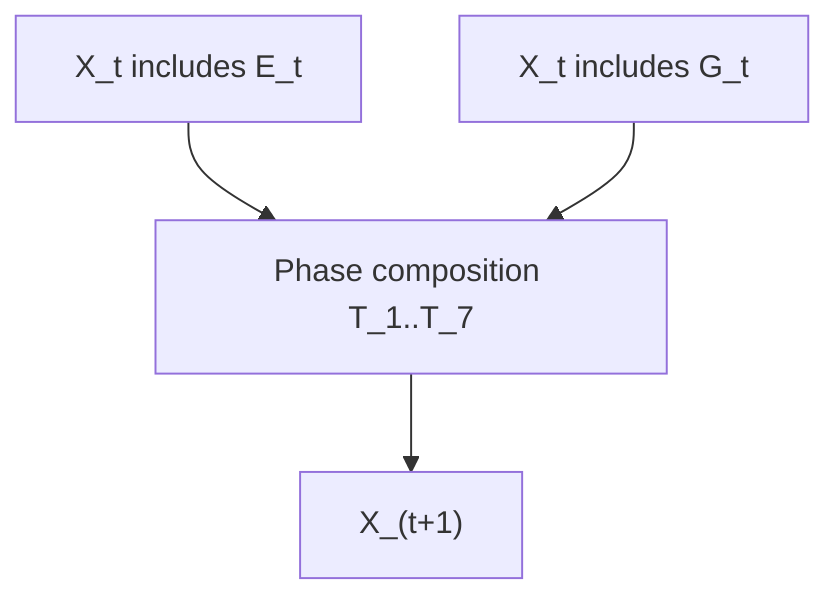

# Mathematical Framework

This document formalizes the Plant-Herbivore Interaction & Defense Simulator (PHIDS) as a coupled hybrid dynamical system. In this model, discrete entity transitions within a data-oriented Entity-Component-System (ECS) are strictly synchronized with continuous field updates executing across double-buffered cellular automata layers.

## 1. Global State Representation

Let the global state of the biotope at discrete time step (tick) $t$ be defined as:

$$
\mathcal{X}_t = (\mathcal{E}_t, \mathcal{G}_t, \mathcal{P}_t)
$$

where:
- $\mathcal{E}_t$ represents the set of discrete biological entities (flora and herbivore swarms) managed by the ECS spatial hash.
- $\mathcal{G}_t$ represents the continuous, vectorized environmental lattice fields (e.g., plant energy distributions, signal concentrations, toxin fields).
- $\mathcal{P}_t$ is the static bundle of configuration parameters, including inter-species diet compatibility matrices and defensive interaction rules.

The deterministic progression of the system is the ordered composition of distinct phase operators:

$$
\mathcal{X}_{t+1} = \mathcal{T}_{telemetry} \circ \mathcal{T}_{signaling} \circ \mathcal{T}_{interaction} \circ \mathcal{T}_{lifecycle} \circ \mathcal{T}_{flow\_field} (\mathcal{X}_t)
$$

This phase ordering is not arbitrary; it enforces causal relationships (e.g., swarms move based on *current* plant energy, signaling occurs based on *post-movement* herbivore presence).

## 2. Flora Lifecycle and Symbiotic Dynamics

The state of flora entities evolves through a local, bounded integration process.

### 2.1 Bounded Growth

For a flora entity $i$ of species $j$, the energy reserve $E_{i,j}$ increases linearly per time step up to a physiological maximum:

$$
E_{i,j}^{t+1} = \min\left(E_{i,j}^t + E_{base,j} \frac{g_j}{100}, \; E_{max,j}\right)
$$

where $g_j$ is the species-specific growth rate.

### 2.2 Reproduction & Dispersion

Reproduction is gated by both an energetic threshold (the parent must survive the expenditure) and a deterministic tick interval.
Offspring dispersion is modeled by a localized kernel:
- **Calm conditions:** Sampling within a bounded annulus ($r_{min} \le r \le r_{max}$).
- **Wind-active conditions:** A Gaussian kernel shifted by the local wind vector.

### 2.3 Symbiotic Relay Networks

Flora may establish bidirectional mycorrhizal links with neighbors. These links bypass atmospheric diffusion, transferring signals via graph-based propagation at a fixed velocity $t_g$.

## 3. Global Flow-Field and Swarm Navigation

To circumvent the computational constraints of $O(N^2)$ pathfinding, PHIDS calculates a unified, continuous guidance surface per tick, which herbivore swarms then sample locally.

### 3.1 Flow Field Generation

The scalar field $F_t(x,y)$ driving chemotactic movement is a weighted superposition of attractive caloric energy and repulsive toxins:

$$
F_t(x,y) = \alpha E_t(x,y) - \beta \max_k T_{k,t}(x,y)
$$

Where:
- $E_t(x,y)$ is the aggregate flora energy.
- $T_{k,t}(x,y)$ are the concentration layers of the various defensive toxins.

### 3.2 Swarm Advection and Behavior

A swarm selects its target transition from its local Moore neighborhood $\mathcal{N}(x,y)$:

$$
(x',y') = \operatorname*{arg\,max}_{(u,v) \in \mathcal{N}(x,y)} F_t(u,v)
$$

This baseline gradient-ascent is overridden by biological responses:
1. **Capacity Repulsion:** If tile population exceeds $C_{max}$, swarms engage in a brief random walk to model physical jostling.
2. **Anchoring:** If a swarm co-locates with an energy-rich, diet-compatible plant, movement is suppressed to prioritize feeding.

## 4. Herbivore Interaction and Metabolic Attrition

Feeding and population dynamics are resolved locally via O(1) spatial-hash lookups.

### 4.1 Diet-Gated Consumption

Energy transferred from plant $j$ to swarm $i$ with population $N_i$ and velocity $v_i$ is bounded by the plant's available energy and the swarm's consumption rate $r_i$:

$$
\Delta E_{i\leftarrow j} = \min\left( \frac{r_i}{\max(1, v_i)} N_i, \; E_j \right)
$$
The velocity denominator accounts for reduced feeding dwell-time when moving rapidly.

### 4.2 Metabolism, Reproduction, and Mitosis

Swarms continuously deplete energy proportional to $N_i$. Deficits manifest as immediate casualties rather than delayed starvation events.
Conversely, if surplus energy exceeds baseline requirements ($E > N_i E_{min,i}$), it is converted into new individuals based on reproductive cost $\rho_i$. If $N_i$ reaches the configured split threshold, the entity undergoes mitosis, bifurcating into two independent swarms.

## 5. Induced Defense and Signaling Diffusion

Induced defenses translate herbivore presence into local toxic and volatile chemical fields.

### 5.1 Trigger Evaluation

For a given plant, local herbivore populations are evaluated against a specified minimum $n_{i,min}$. If triggered, a `SubstanceComponent` initiates a synthesis countdown. Upon activation, it emits toxins or volatile signals.

### 5.2 Reaction-Diffusion Formulation

For airborne signaling substance $s$, the concentration $C_s$ diffuses and decays according to a discrete update:

$$
C_s^{t+1} = C_s^t + \Delta t \left( D_s \nabla_h^2 C_s^t + Q_s^t - \lambda_s C_s^t \right)
$$

Where:
- $D_s$ is the diffusion coefficient.
- $\nabla_h^2$ represents the application of an isotropic Gaussian convolution kernel.
- $Q_s^t$ is the source term from active plant emitters and root-network relay deposits.
- $\lambda_s$ is the clearance/decay coefficient.

To preserve numerical sparsity and eliminate subnormal floating-point operations, any concentration $C_s^{t+1} < \varepsilon$ is explicitly truncated to zero. Toxin layers bypass this atmospheric diffusion, remaining localized to the emitting plant coordinate to model surface tissue defenses.

## 6. Analytical Foundations and Architectural Justification

The PHIDS engine heavily relies on specific theoretical and mathematical models. Here we elaborate on the rationale for those choices, contextualizing them within standard simulation methodologies and acknowledging alternative approaches.

### 6.1 The Reaction-Diffusion System

The model employs a discrete reaction-diffusion framework (Section 5.2) to simulate the dispersion of airborne signals (Volatile Organic Compounds or VOCs).

**Theoretical Basis:**
Reaction-diffusion equations are parabolic partial differential equations standardly utilized in physics and chemistry to describe how the concentration of one or more substances distributed in space changes under the influence of two processes:
1.  **Local chemical reactions** (the source term $Q_s^t$ and decay $\lambda_s C_s^t$).
2.  **Diffusion** which causes the substances to spread out over a surface in space (the Laplacian $\nabla_h^2 C_s^t$).

This mathematical model is famous for its application by Alan Turing to describe morphogenesis—the chemical patterns underlying biological structures like animal stripes. In atmospheric and ecological modeling, it provides a highly accurate macroscopic representation of aerosol or chemical plume dispersion without the need to calculate the trajectory of individual molecules.

**Alternative Concepts Considered:**
- **Agent-Based Particle Systems:** One alternative is to spawn thousands of "scent particles" as independent ECS entities that undergo Brownian motion.
    - *Why it was rejected:* While highly granular, tracking thousands of volatile particles fundamentally violates the performance constraints of the simulation loop, precipitating an $O(N)$ explosion in memory and processing time per tick.
    - *Advantage of our choice:* By vectorizing the concentration into a continuous grid layer and applying SciPy's highly optimized 2D convolution (`scipy.signal.convolve2d`), we achieve mathematical accuracy in macro-dispersion in bounded $O(1)$ time relative to the number of herbivores.

### 6.2 Global Chemotactic Flow Field

Herbivore swarms navigate the grid via a unified scalar guidance field (Section 3), evaluating discrete Moore neighborhoods.

**Theoretical Basis:**
This implementation represents a discretized form of **chemotaxis**—the movement of an organism in response to a chemical stimulus. By generating a superposition of positive and negative potentials (attractants and repellents), we create a unified **gradient field**. The swarm's behavior (Gradient Ascent) mirrors how bacterial clusters or simple cellular organisms move toward higher concentrations of food sources.

**Alternative Concepts Considered:**
- **A* (A-Star) or Dijkstra Pathfinding:** Calculating an optimal, obstacle-avoidant path from every swarm to the nearest food source.
    - *Why it was rejected:* Classic pathfinding scales poorly. Calculating paths for hundreds of swarms across a dynamic grid per tick would bottleneck the CPU. Furthermore, herbivore swarms lack "global knowledge" of the map; their navigation is inherently local and sensory-driven.
    - *Advantage of our choice:* The unified Flow Field is calculated exactly *once* per tick via Numba JIT compilation. Every swarm simply samples its immediate adjacent cells. This perfectly mimics biological sensory constraints while maintaining extreme computational efficiency.

### 6.3 Discrete Time Steps vs. Continuous Solvers

The model evolves in strictly synchronized discrete time intervals ($\Delta t$).

**Theoretical Basis:**
By relying on double-buffering and discrete integer ticks, the system guarantees **mathematical determinism**. A given starting state will *always* result in the exact same output trace.

**Alternative Concepts Considered:**
- **Continuous-Time Ordinary Differential Equation (ODE) Solvers:** Using Runge-Kutta methods to solve the continuous changes in population and energy.
    - *Why it was rejected:* While ODE solvers (like the classic continuous Lotka-Volterra equations) are perfect for abstract population models, they struggle to incorporate the localized, spatially-heterogeneous events core to PHIDS (e.g., a specific plant being eaten at coordinate (4, 12)).
    - *Advantage of our choice:* Cellular Automata and ECS updates provide the discrete spatial granularity necessary for spatial ecology while maintaining the strict determinism required for a replayable scientific instrument.

