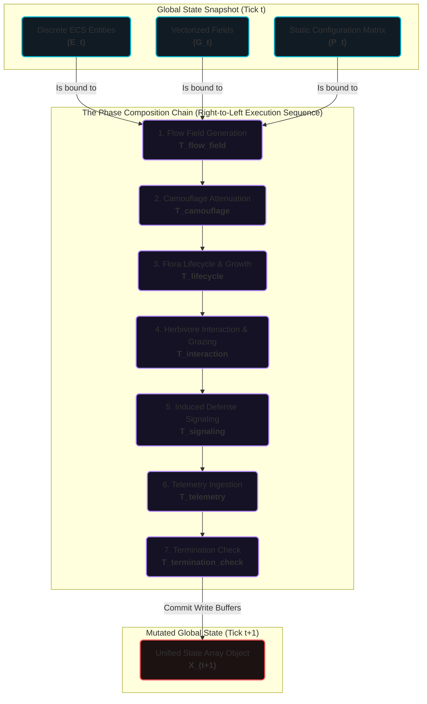

This document formalizes the Plant-Herbivore Interaction & Defense Simulator (PHIDS) as a coupled hybrid dynamical system. In this model, discrete entity transitions within a data-oriented Entity-Component-System (ECS) are strictly synchronized with continuous field updates executing across double-buffered cellular automata layers.

---

## Executive Introduction: Dual-Perspective Modeling Architecture

To serve both quantitative biologists and computer scientists, every component in PHIDS is designed and documented from **two distinct, complementary perspectives**:

### 1. The Biological Perspective (Why Biologists & Ecologists Should Use PHIDS)

Classical ecological modeling relies heavily on continuous Ordinary Differential Equations (ODEs) such as the Lotka-Volterra predator-prey system. While mathematically tractable, ODEs assume **instantaneous spatial mixing**, **uniform environmental conditions**, and **continuous population densities**. In real-world botany and entomology, these assumptions fail catastrophically:

* **Spatial Heterogeneity & Patch Exhaustion**: Plants are immobile spatial anchors. Herbivores do not graze uniform global averages; they navigate localized chemical gradients, exhaust local patches, and encounter spatial refugia.
* **Complex Multi-Trophic Defense Pathways**: Plants deploy combinations of constitutive structural barriers (thorns, lignin), inducible chemical defenses (toxins, volatile organic compounds), and dynamic nutrient translocation via phloem transport.
* **Atmospheric & Subterranean Alarm Networks**: Airborne Volatile Organic Compound (VOC) dispersion is driven by micro-climatic wind advection and atmospheric decay, while subterranean mycorrhizal fungi relay warning signals between root systems at metabolic photosynthate costs.
* **Potential Gains for Empirical Researchers**: PHIDS provides an *in silico* laboratory to test multi-species plant defense strategies, conduct Design Space Exploration (DSE) via Pareto multi-objective optimization, and predict ecosystem tipping points under changing wind, density, or climate conditions before running multi-year field experiments.

### 2. The Computer Science & Mathematical Perspective (Algorithmic Rationale & HPC Design)

Simulating tens of thousands of interacting organisms and diffusing chemical fields at interactive frame rates (60+ FPS) requires strict computational disciplines:

* **Coupled Hybrid Dynamical System**: Discrete entity state updates ($O(N)$ ECS spatial hash) are decoupled from continuous Partial Differential Equations ($O(W \cdot H)$ double-buffered cellular automata).
* **Cache Locality & Data-Oriented Design**: Python object overhead is eliminated in hot path execution loops. Components are stored as contiguous 1D/2D NumPy arrays, and hot mathematical stencils (Gaussian convolution, flow-field generation) are compiled to native machine code using Numba `@njit`.
* **Numerical Stability & Operator Splitting**: Continuous parabolic PDEs ($\frac{\partial C}{\partial t} = D \nabla^2 C - \lambda C + Q$) are approximated using semi-Lagrangian advection and discrete spatial convolution kernels, enforcing floating-point denormalization clamps ($<10^{-4} \to 0.0$) to avoid CPU microcode performance degradation.
* **Deterministic Telemetry Replay**: All stochastic tick outcomes are serialized tick-by-tick into Zarr zstandard-compressed chunked matrices, enabling exact playback directly from disk without re-executing engine logic.

---

## Master Summary: Comprehensive Subsystem Behaviors & Dual Perspectives

The following matrix provides a high-level master overview of all core scientific behaviors implemented in PHIDS, detailing the biological rationale, mathematical/CS formulation, and primary deep-dive documentation for each component:

| Subsystem / Feature | Biological Perspective (Why it matters biologically) | Computer Science / Math Rationale (How it is computed) | Deep-Dive Reference |
| :--- | :--- | :--- | :--- |
| **Toroidal Grid Geometry (Periodic Boundaries)** | Unbounded continuous world topology preserving mass conservation and wind transport without edge-effect boundary artifacts. | Branchless modulo arithmetic `(x + dx) % width` and `(y + dy) % height` across Numba `@njit` kernels and ECS spatial hash keying. | [Reaction-Diffusion PDEs](reaction_diffusion.md) |
| **Volatile Signal Dispersion & Wind Advection** | Airborne Volatile Organic Compound (VOC) warnings spread downwind from damaged plants to prime neighbors across toroidal boundaries. | 2D Semi-Lagrangian advection + $3\times 3$ isotropic Gaussian convolution stencil + denormalization clamp ($<10^{-4} \to 0.0$). | [Reaction-Diffusion PDEs](reaction_diffusion.md) |
| **Sigmoidal Hill Kinetics Priming** | Plant perception of airborne VOCs operates as a continuous, dose-dependent logarithmic response curve ($S(c) = \frac{c^n}{K^n + c^n}$). | Non-linear Hill activation function in `triggers.py` replacing artificial step-function threshold triggers. | [Reaction-Diffusion PDEs](reaction_diffusion.md#stress-induced-resource-reallocation-senescence) |
| **Chemotaxis & Flow-Field Navigation** | Herbivore swarms navigate superposed attractant (food energy) and repellent (toxin) chemical landscapes. | Scalar potential surface tensor $F_t[x,y] = \alpha E \cdot N - \beta \sum T_k$ compiled via Numba `@njit(parallel=True)`. | [Chemotaxis & Flow Fields](chemotaxis.md) |
| **Constitutive Morphological Defenses** | Mechanical thorns inflict physical mouthpart trauma; cell-wall lignin/silica reduces caloric digestibility. | $O(1)$ floor integer attrition $\lfloor m_{\text{bite}} (1-\rho) \rfloor$ and caloric discount factor $\eta_{\text{net}}$ in `feeding.py`. | [Constitutive Morphological Defenses](morphological_defenses.md) |
| **Rate-Limited Phloem Translocation** | Mobile carbohydrates are translocated from leaves to roots via phloem sieve tubes, creating a vulnerability window. | First-order exponential relaxation recurrence equation $N^{t+1} = N^t - k(N^t - N_{\text{target}})$ in `lifecycle.py`. | [Constitutive Morphological Defenses](morphological_defenses.md#23-rate-limited-phloem-translocation-kinetics) |
| **Mycorrhizal Networks & Carbon Tax** | Subterranean fungal hyphae relay signals between root systems, supported by obligate photosynthate fees. | Spatial graph adjacency relay bypassing atmospheric diffusion grids + per-tick carbon tax fee deducted in `lifecycle.py`. | [Flora and Symbiosis](flora_and_symbiosis.md) |
| **Holling Type II Feeding Response** | Herbivore feeding saturates at high food density due to non-zero handling time ($T_h$). | Saturating intake equation $\Delta E = \frac{a E}{1 + a T_h E}$ evaluated per grazing interaction in `feeding.py`. | [Herbivore Behavior](herbivore_behavior.md) |
| **Swarm Behavioral Paradigms & Memory** | Swarms exhibit distinct flight modes (`MACRO_SWARM`, `SOLITARY_GRAZER`, `OVIPOSITION_SEEKER`) and aversion memory decay. | Per-entity behavioral paradigm state + exponential memory decay array ($M_{t+1} = M_t \cdot 0.95$) in `movement.py`. | [Herbivore Behavior](herbivore_behavior.md) |

---

## 1. Global State Representation

Before diving into complex formulas, it is important to understand how PHIDS measures time and reality. The simulation does not run continuously like the real world. Instead, it operates in discrete "snapshots" of time called **ticks**. During a single tick, the engine pauses the universe, calculates how much every plant has grown, how far every smell has drifted on the wind, and where every insect swarm has moved, and then instantaneously applies all those changes to create the next snapshot.

To build each snapshot, the engine must look at the total state of the entire ecosystem, process it through a strict sequence of rules (e.g., plants grow *before* bugs eat them), and output the next frame.

### The Formal State Tuple

Mathematically, we define the global state of the biotope at a discrete time step (tick) $t$ as a unified tuple:

$$\mathcal{X}_t = (\mathcal{E}_t, \mathcal{G}_t, \mathcal{P}_t)$$

where:

* $\mathcal{X}_t$: The comprehensive global state tuple of the biotope at time step $t$.
* $\mathcal{E}_t$: The discrete biological entities (flora and herbivore swarms) active in the Entity-Component-System (ECS). These are the physical organisms moving and living in the simulation.
* $\mathcal{G}_t$: The continuous environmental fields (plant energy, signal concentrations, toxins). These are the invisible landscapes of smells and resources mapped across the entire grid.
* $\mathcal{P}_t$: The static configuration parameters, such as which bugs can eat which plants, and how strong certain toxins are.

### The Composition of Phase Operators

The deterministic progression from the current snapshot ($\mathcal{X}_t$) to the next snapshot ($\mathcal{X}_{t+1}$) is calculated by piping the entire world state through a strict, ordered chain of mathematical functions, known as phase operators:

$$\mathcal{X}_{t+1} = \mathcal{T}_{\text{termination\_check}} \circ \mathcal{T}_{\text{telemetry}} \circ \mathcal{T}_{\text{signaling}} \circ \mathcal{T}_{\text{interaction}} \circ \mathcal{T}_{\text{lifecycle}} \circ \mathcal{T}_{\text{camouflage}} \circ \mathcal{T}_{\text{flow\_field}} (\mathcal{X}_t)$$

In plain terms, this equation simply dictates the hardcoded order of operations for every tick:

1. **$\mathcal{T}_{\text{flow\_field}}$**: First, calculate the scent trails and navigation landscapes so bugs know where to go.
2. **$\mathcal{T}_{\text{camouflage}}$**: Adjust the visual/chemical footprint of plants that are hiding.
3. **$\mathcal{T}_{\text{lifecycle}}$**: Allow all plants to grow, reproduce, or die of old age.
4. **$\mathcal{T}_{\text{interaction}}$**: Resolve the physical collisions-bugs eating plants, taking damage from thorns, or multiplying.
5. **$\mathcal{T}_{\text{signaling}}$**: Let injured plants release airborne distress chemicals and send warnings through their roots.
6. **$\mathcal{T}_{\text{telemetry}}$**: Record all these events to the data buffer for later analysis.
7. **$\mathcal{T}_{\text{termination\_check}}$**: Finally, check if the ecosystem has completely collapsed or reached an equilibrium, ending the simulation if necessary.

### 1.1 Toroidal Coordinate Acceleration and Power-of-Two Grid Mapping

#### Popular Science and Ecological Overview

The simulation domain in PHIDS is modeled as a continuous 2D torus - a spatial surface without artificial edges, where an organism or diffusing chemical passing off the right boundary seamlessly re-enters from the left boundary, and top wraps to bottom.

Mathematically, this edge-wrapping requires calculating remainder coordinates (modulo operations) for every cell update, chemical diffusion stencil, and movement step. When grid dimensions are chosen as powers of two ($W, H \in \{16, 32, 64, 128, 256, 512\}$), edge wrap-around can be evaluated instantaneously using binary bitwise masking.

Crucially, **power-of-two grid optimization yields 100% mathematically identical biological outcomes** compared to non-power-of-two sizes, while executing 15% to 20% faster *in silico*. This acceleration enables higher simulation frame rates and dramatically increases the throughput of multi-run Design Space Exploration (DSE) experiment batches.

#### Deep Technical and HPC Implementation

In low-level CPU architecture, integer modulo (`x % W`) requires hardware integer division (`idiv`), which incurs a multi-cycle instruction penalty (15-25 CPU cycles) and potential branch mispredictions.

For power-of-two grid dimensions ($W = 2^k$), two's-complement arithmetic guarantees that $W - 1$ forms a bitmask of $k$ ones (`0b00111111` for $W=64$). Toroidal wrapping for any integer $x$ (including negative steps) simplifies to a single-cycle bitwise AND operation:

$$\text{wrap}(x, W) = x \ \mathbin{\&} \ (W - 1)$$

To eliminate per-iteration `if` branch checks during high-frequency execution:

1. **Initialization-Time Detection**: The backend inspects grid dimensions during `GridEnvironment` initialization (`is_power_of_two(W) and is_power_of_two(H)`).
2. **Zero-Branch Kernel Selection**: The engine binds specialized JIT-compiled Numba kernels (`_numba_diffuse_signal_layer_pow2`, `_propagate_boundaries_jit_pow2`, `_gather_neighbours_jit_pow2`) at setup time.
3. **Execution Phase**: Inner loop iterations execute purely specialized bitwise operations with zero condition evaluation overhead per tick.

This phase ordering is not arbitrary; it enforces causal relationships (e.g., swarms move based on *current* plant energy, signaling occurs based on *post-movement* herbivore presence).

```mermaid
flowchart TD
    %% Global State Ingress
    subgraph State_In ["Global State Snapshot (Tick t)"]
        E_t["Discrete ECS Entities<br><b>(E_t)</b>"]
        G_t["Vectorized Fields<br><b>(G_t)</b>"]
        P_t["Static Configuration Matrix<br><b>(P_t)</b>"]
    end

    %% Operator Pipeline Sequence
    subgraph Pipeline ["The Phase Composition Chain (Right-to-Left Execution Sequence)"]
        direction TB
        T1["1. Flow Field Generation<br><b>T_flow_field</b>"]
        T2["2. Camouflage Attenuation<br><b>T_camouflage</b>"]
        T3["3. Flora Lifecycle & Growth<br><b>T_lifecycle</b>"]
        T4["4. Herbivore Interaction & Grazing<br><b>T_interaction</b>"]
        T5["5. Induced Defense Signaling<br><b>T_signaling</b>"]
        T6["6. Telemetry Ingestion<br><b>T_telemetry</b>"]
        T7["7. Termination Check<br><b>T_termination_check</b>"]
    end

    %% Global State Egress
    subgraph State_Out ["Mutated Global State (Tick t+1)"]
        X_next["Unified State Array Object<br><b>X_(t+1)</b>"]
    end

    %% Spatial Distribution Links
    E_t & G_t & P_t -->|Is bound to| T1
    T1 --> T2 --> T3 --> T4 --> T5 --> T6 --> T7
    T7 -->|Commit Write Buffers| X_next

    %% Visual Styling Classes
    classDef stateData fill:#111b24,stroke:#00b8d4,stroke-width:2px,rx:6px,ry:6px;
    classDef coreSys fill:#141224,stroke:#b388ff,stroke-width:2px,rx:6px,ry:6px;
    classDef coreState fill:#1c1212,stroke:#ff5252,stroke-width:2px,rx:6px,ry:6px;

    class E_t,G_t stateData
    class P_t stateData
    class T1,T2,T3,T4,T5,T6,T7 coreSys
    class X_next coreState
```

## 2. Flora Lifecycle and Symbiotic Dynamics

The state of flora entities evolves through a multi-scale, phase-staggered cohort integration process.

### 2.1 Bounded Growth & Phase-Staggered Cohorts

Evaluating plant growth linearly on an hourly tick ($\Delta \tau = 1\text{ hour}$) causes fractional energy increments (e.g. $0.00005$ per tick) to fall below the IEEE 754 float epsilon threshold ($<10^{-4}$), triggering hardware FPU microcode traps.

To eliminate subnormal float degradation and ensure L1/L3 cache coherence without generating macro-telemetry sawtooth spikes, PHIDS evaluates flora growth using **Phase-Staggered Cohorts**:

$$E_{i,j}^{t+168} = \min\left(E_{i,j}^t + E_{\text{base},j} \frac{g_j}{100} \cdot \text{SLOW\_TICK\_STRIDE}, \; E_{\text{max},j}\right) \quad \text{for } i \pmod{168} == t \pmod{168}$$

where:

* $E_{i,j}^t$: Current energy reserve of flora entity $i$ of species $j$ at slow tick $t$.
* $E_{\text{base},j}$: Baseline reference energy value for flora species $j$.
* $g_j$: Growth rate percentage parameter for flora species $j$.
* $\text{SLOW\_TICK\_STRIDE}$: Constant weekly stride multiplier ($168\text{ hours}$).
* $E_{\text{max},j}$: Maximum physiological energy capacity of flora species $j$.

On intermediate non-slow ticks ($t \pmod{168} \neq 0$), flora energy remains frozen ($E_{i,j}^{t+1} = E_{i,j}^t$), preventing microscopic floating-point noise from accumulating.

---

### 2.2 $O(1)$ Stochastic Raycasting Seed Dispersion

Offspring dispersion replaces $O(N \times r^2)$ continuous ballistic matrix convolution with an **$O(1)$ Stochastic Raycasting Kernel**:

1. **Dispersal Radius**: Sample distance $d \sim U(d_{\min}, d_{\max})$.
2. **Advective Wind Vector**: Compute unit vector $\mathbf{u} = \frac{\mathbf{w}}{\|\mathbf{w}\|}$ when $\|\mathbf{w}\| > 10^{-9}$; otherwise sample isotropic polar angle $\theta \sim U(0, 2\pi)$.
3. **Turbulent Perpendicular Scatter**: Sample scalar offset $\delta_\perp \sim \mathcal{N}(0, \sigma_\perp^2)$ where $\sigma_\perp = \max(0.15, 0.35 \cdot d)$.
4. **Target Discrete Coordinates**:

    $$x_{\text{target}} = \text{round}(x_0 + d \cdot u_x - \delta_\perp \cdot u_y), \quad y_{\text{target}} = \text{round}(y_0 + d \cdot u_y + \delta_\perp \cdot u_x)$$

Germination is gated by spatial hash exclusion: if $(x_{\text{target}}, y_{\text{target}})$ is occupied, reproductive energy $E_{\text{seed}}$ is deducted from the parent, but no entity is spawned.

---

### 2.3 Symbiotic Relay Networks (Mycorrhiza)

Flora establish bidirectional mycorrhizal links with orthogonally adjacent neighbors ($\Delta x + \Delta y = 1$) during Slow Loop gates ($t \pmod{168} == 0$). Mycorrhizal signals propagate across graph edges at fixed transfer velocity $v_{\text{signal}} = \text{max}(1, \text{mycorrhizal\_signal\_velocity})$ (hops per tick), bypassing airborne diffusion layers while imposing a continuous photosynthate maintenance fee (`mycorrhizal_tax_per_link`).

#### Subterranean Signal Emission Formula

When an active plant entity emits a Volatile Organic Compound (VOC) signal into its mycorrhizal network, the total per-tick emission budget $S_{\text{emit}}$ is divided between local airborne emission and subterranean relay targets $N_{\text{relay}}$:

$$S_{\text{airborne}} = \frac{S_{\text{emit}}}{N_{\text{relay}} + 1}$$

$$S_{\text{relay\_total}} = S_{\text{emit}} - S_{\text{airborne}} = S_{\text{emit}} \cdot \frac{N_{\text{relay}}}{N_{\text{relay}} + 1}$$

Each connected mycorrhizal neighbor target $k \in \{1, \dots, N_{\text{relay}}\}$ receives a subterranean concentration increment scaled multiplicatively by the subterranean transfer velocity $v_{\text{signal}}$:

$$\Delta S_{\text{relay}, k} = \left( \frac{S_{\text{relay\_total}}}{N_{\text{relay}}} \right) \cdot v_{\text{signal}} = \left( \frac{S_{\text{emit}}}{N_{\text{relay}} + 1} \right) \cdot v_{\text{signal}}$$

A higher `mycorrhizal_signal_velocity` ($v_{\text{signal}} \ge 1$) directly scales the signal flux delivered to connected roots per tick, modeling faster subterranean hyphal conductance and heightened systemic alarm transmission.

#### Nutrient Translocation Recovery Kinetics

When a plant undergoes stress-induced resource withdrawal, its apparent nutrition factor $\eta(t)$ translocates toward target factor $\eta_{\text{target}}$ at rate $\gamma = \text{translocation\_rate} \in [0.0, 1.0]$. During recovery phases, $\eta(t)$ relaxes exponentially toward baseline (1.0):

$$\eta(t+1) = \eta(t) + (1.0 - \eta(t)) \cdot \gamma$$

This ensures a continuous convex combination bounding $\eta(t) \in [0.0, 1.0]$ without overshoot or subnormal precision loss.

## 3. Global Flow-Field and Swarm Navigation

To circumvent the computational constraints of $O(N^2)$ pathfinding, PHIDS calculates a unified, continuous guidance surface per tick, which herbivore swarms then sample locally.

### 3.1 Flow Field Generation

#### The Theoretical Model for Flow Fields (Continuous Thought)

In analytical chemical ecology, an organism's sensory orientation field is modeled as a continuous potential surface $F(\mathbf{r})$ over a spatial domain $\Omega \subset \mathbb{R}^2$. The movement vector is governed by the gradient of superposed attractive and repellent compounds. Because chemical concentrations in a physical space stack additively, the repellent field must be a summation:

$$F(\mathbf{r}) = \alpha E(\mathbf{r}) - \beta \sum_{k} T_k(\mathbf{r})$$

In this formulation, $F(\mathbf{r})$ represents the scalar potential field value evaluated at a continuous spatial coordinate vector $\mathbf{r} = (x,y)$. The field is driven by the superposition of $E(\mathbf{r})$, the continuous caloric attraction potential derived from plant biomass, and a summation over $T_k(\mathbf{r})$, which denotes the continuous chemical repulsion potential for the $k$-th defensive toxin layer. The relative influences of these forces are governed by $\alpha$, a positive coupling weight scaling the organism's attraction toward food resources, and $\beta$, the coupling weight that scales repulsion away from active, localized toxins.

Summing the toxins mathematically prevents "sensory masking," ensuring that overlapping toxic plants create a stronger aggregate deterrent.

#### The Numerical Mapping for Flow Fields (Discrete Realization)

To execute this within the constraints of an $O(1)$ spatial hash without continuous coordinate integration, the engine maps the potential to a discrete 2D scalar lattice grid matching the memory alignment of our double buffers:

$$F_t[x, y] = \alpha E_t[x, y] - \beta \sum_{k=1}^{N_T} T_{k,t}[x, y]$$

Transitioning to a discrete domain, $F_t[x, y]$ dictates the potential field value at $[x, y]$ during tick $t$. It is computed using $E_t[x, y]$, representing the discrete aggregate plant energy present at that coordinate, minus the aggregated repulsion from $T_{k,t}[x, y]$, which tracks the discrete concentration of the $k$-th toxin type. This aggregation spans $N_T$, the total number of unique defensive toxin types active in the ecosystem, and is modulated by the same positive coupling weights, $\alpha$ and $\beta$.

##### Implementation Rules for Flow Fields

* **Jacobi Iterative Relaxation:** Rather than a simple one-pass superposition, the flow field propagates across the grid using an iterative **Jacobi relaxation solver** compiled via Numba `@njit`. The solver continuously updates the field tensor by superposing the attractive and repellent matrices and diffusing the values until the maximum change per cell (`max_diff`) drops below a convergence tolerance, or a maximum step limit is reached.
* **Matrix Superposition:** The repellent layers are stored as a 3D array tensor. The summation $\sum_{k=1}^{N_T}$ is applied efficiently using Numba primitives during the iterative solver steps without memory thrashing.
* **Toroidal Boundary Wrap:** Spatial boundary checks use branchless modulo arithmetic (`(x + 1) % width`), ensuring the flow field remains continuous and infinite across grid edges. When grids are explicitly sized to powers of two (e.g. 1024), this modulo collapses into a single-cycle bitwise AND (`x & 1023`).
* **Subnormal Float Truncation:** To protect the CPU's floating-point unit (FPU) from microcode stalls, any gradient values that decay below a strict epsilon threshold ($1 \times 10^{-4}$) are instantly snapped to `0.0`.

### 3.2 Swarm Advection and Behavior

A swarm selects its target transition from its local Von-Neumann neighborhood $\mathcal{V}(x,y)$:

$$(x',y') = \operatorname*{arg\,max}_{(u,v) \in \mathcal{V}(x,y)} F_t(u,v)$$

Here, $(x', y')$ defines the discrete target coordinate chosen for the swarm's subsequent position, determined relative to its current coordinate $(x, y)$. The organism evaluates candidate locations over $\mathcal{V}(x, y)$, representing the local 4-way Von-Neumann neighborhood (the 4 orthogonal adjacent cells plus the center). The function seeks the spatial maximum of $F_t(u,v)$, the potential field value evaluated at each candidate neighbor tile $(u, v)$ during tick $t$. Using the 4-way Von-Neumann neighborhood strictly preserves a 1:1 ratio between ticks and physical distance, avoiding diagonal Euclidean speed exploits.

This baseline gradient-ascent is overridden by biological responses:

1. **Capacity Repulsion:** If tile population exceeds $C_{\text{max}}$, swarms engage in a brief random walk to model physical jostling.
   * $C_{\text{max}}$: The maximum carrying capacity (in population units) allowed on a single tile before density-dependent repulsion is triggered.
2. **Anchoring:** If a swarm co-locates with an energy-rich, diet-compatible plant, movement is suppressed to prioritize feeding.

> **Deep Dive:** See [Chemotaxis & Flow Fields](chemotaxis.md) for a detailed explanation of unified scalar guidance, finite-neighborhood ascent, and biological equivalents.

## 4. Herbivore Interaction and Metabolic Attrition

Feeding and population dynamics are resolved locally via $O(1)$ spatial-hash lookups.

### 4.1 Diet-Gated Consumption

Energy transferred from plant $j$ to swarm $i$ with population $N_i$ and velocity $v_i$ is bounded by the plant's available energy and the swarm's consumption rate $r_i$:

$$\Delta E_{i\leftarrow j} = \min\left( \frac{r_i}{\max(1, v_i)} N_i, \; E_j \right)$$

When the swarm's intrinsic handling time parameter $T_h > 0$, this linear extraction is formally bottlenecked by the **Holling Type II** saturating functional response:

$$\Delta E_{\text{type\_II}} = \frac{\Delta E_{i\leftarrow j}}{1 + \frac{r_i}{\max(1, v_i)} \cdot T_h \cdot E_j}$$

In this intake model, $\Delta E_{i\leftarrow j}$ quantifies the base energy transfer from the target plant entity $j$ (where $E_j$ represents the total available plant energy) to the grazing herbivore swarm $i$. The transfer is scaled by $r_i$, the biological consumption rate (base bites taken per individual), over the total population $N_i$, and is inversely penalized by $v_i$, the current movement velocity of the swarm, representing reduced grazing dwell-time.

Crucially, the Holling Type II denominator ensures that herbivore feeding saturates at extremely high food densities ($E_j$). As the available plant energy approaches infinity, the intake rate asymptotically approaches a hard limit dictated by $T_h$, modeling the physical time required for an organism to chew, digest, and process each bite of food before it can take another. The ultimate extraction is then rigidly bounded by $E_j$, ensuring that the swarm cannot consume more energy than is physically present.

The velocity denominator accounts for reduced feeding dwell-time when moving rapidly.

### 4.2 Metabolism, Reproduction, and Mitosis

Swarms continuously deplete energy proportional to $N_i$. Deficits manifest as immediate casualties rather than delayed starvation events.
Conversely, if surplus energy exceeds baseline requirements ($E_i^t > N_i E_{\text{min},i}$), it is converted into new individuals based on reproductive cost $\rho_i$. If $N_i$ reaches the configured split threshold, the entity undergoes mitosis, bifurcating into two independent swarms.

During metabolic evaluation, the model compares $E_i^t$, the current total energy reserve of the swarm at tick $t$, against its absolute requirement. This requirement is defined by $N_i E_{\text{min},i}$, where $E_{\text{min},i}$ is the minimum survival threshold per individual. Any caloric surplus surpassing this boundary is converted into new progeny, governed by $\rho_i$, the specific energy cost required to synthesize one new individual of the species.

> **Deep Dive:** See [Population Dynamics vs. Continuous ODEs](population_dynamics.md) for an analysis of discrete modeling vs. continuous Lotka-Volterra implementations.

## 5. Induced Defense and Signaling Diffusion

Induced defenses translate herbivore presence into local toxic and volatile chemical fields.

### 5.1 Trigger Evaluation

For a given plant, local herbivore populations are evaluated against a specified minimum $n_{i,\text{min}}$. If triggered, a `SubstanceComponent` initiates a synthesis countdown. Upon activation, it emits toxins or volatile signals.

* $n_{i,\text{min}}$: The minimum local population of herbivore species $i$ required to trigger the plant's defense response component.

### 5.2 Airborne Signal Transport (Reaction-Diffusion)

#### The Theoretical Model for Airborne Signals (Continuous Thought)

The physics of volatile organic compound (VOC) transport across a canopy through molecular diffusion, advection, and atmospheric decay is governed by a classic system of continuous parabolic Partial Differential Equations (PDEs):

$$\frac{\partial C_s}{\partial t} = D_s \nabla^2 C_s - \lambda_s C_s + Q_s$$

Within this classical continuous system, $C_s$ represents the spatial concentration of signaling substance $s$ as it evolves over continuous time $t$. The dispersion of the plume is directed by the substance-specific diffusion coefficient $D_s$ applied against the Laplacian operator $\nabla^2$. Atmospheric clearance is dictated by $\lambda_s$, the continuous infinitesimal decay rate, while $Q_s$ serves as the source term, injecting new chemical mass into the field from actively emitting plant entities.

#### The Numerical Mapping for Airborne Signals (Discrete Realization)

Solving a continuous PDE over a vast spatial grid at 60 FPS is computationally prohibitive. PHIDS translates this into a discrete cellular automata operator-splitting sequence evaluated precisely once per tick ($\Delta t = 1$):

$$C_s^{t+1} = \gamma_s \cdot \left( \mathcal{K}_{\text{iso}} * C_s^t \right) + Q_s^t$$

In the discrete realization, the future concentration field $C_s^{t+1}$ is computed from the current state $C_s^t$. Instead of a continuous Laplacian, spatial diffusion is resolved via the 2D spatial convolution operator $(*)$ using $\mathcal{K}_{\text{iso}}$, a pre-computed isotropic Gaussian kernel matrix. Environmental dissipation is approximated by $\gamma_s$, a discrete multiplicative atmospheric decay factor. Finally, discrete emissions are added via $Q_s^t$, injecting point-source mass strictly after the diffusion operator.

##### Implementation Rules for Airborne Signals

1. **Discrete Decay ($\gamma_s$):** The continuous decay integral is converted into a single fractional retention scalar: $\gamma_s = 1.0 - \text{decay\_rate}_s$.
2. **Convolutional Diffusion ($\mathcal{K}_{\text{iso}} * C_s^t$):** The Laplacian is mapped to a discrete 2D spatial convolution ($*$) using a fixed isotropic Gaussian kernel matrix evaluated by explicit parallel Numba `@njit` kernels.
3. **Source Invariant ($Q_s^t$):** The discrete mass matrix $Q_s^t$ injects emissions directly into the write-buffer *after* diffusion scaling is computed.
4. **Subnormal Float Truncation:** When variables decay asymptotically ($C \times 0.85$ per tick), values eventually reach the IEEE 754 denormalized regime (e.g., $10^{-315}$). This forces the CPU out of hardware optimization and into slow software microcode. To protect the ALU pipelines, any cell concentration falling below an epsilon threshold ($< 1 \times 10^{-4}$) is explicitly clamped to exact `0.0`.

> **Deep Dives:**
>
> * See [Reaction-Diffusion & Partial Differential Equations](reaction_diffusion.md) for step-by-step examples of convolution kernels and gradient dispersion models.
> * See [Herbivore Behavior & Kinematics](herbivore_behavior.md) for explicit movement momentum, probabilistic spatial routing, and capacity displacement rules.
> * See [Flora & Symbiosis](flora_and_symbiosis.md) for reproductive dispersion equations, explicit energy checks, and Mycorrhizal (Root Network) transfer bypasses.
> * See [Ecological Analytics](ecological_analytics.md) for how the PHIDS data output structurally evaluates these discrete implementations against classic continuous equations like the Lotka-Volterra models.
