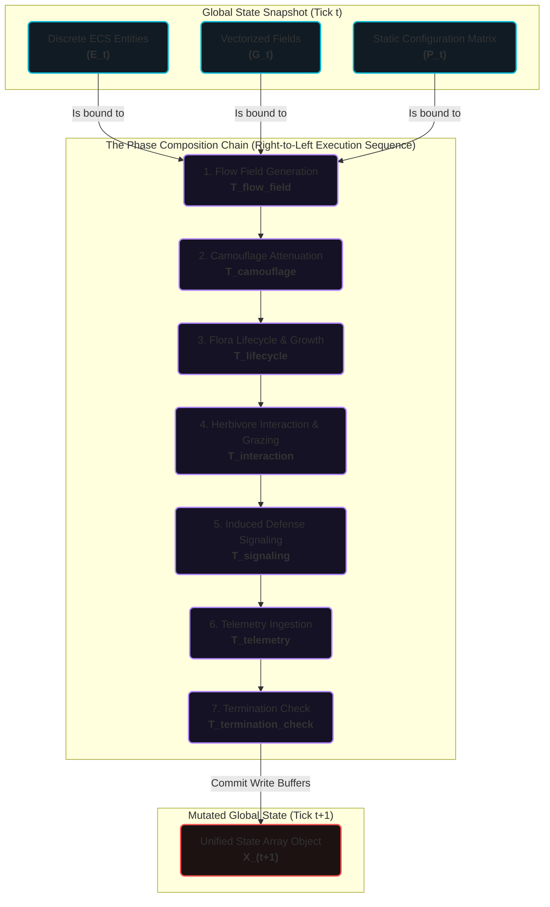

This document formalizes the Plant-Herbivore Interaction & Defense Simulator (PHIDS) as a coupled hybrid dynamical system. In this model, discrete entity transitions within a data-oriented Entity-Component-System (ECS) are strictly synchronized with continuous field updates executing across double-buffered cellular automata layers.

---

## Executive Introduction: Dual-Perspective Modeling Architecture

To serve both quantitative biologists and computer scientists, every component in PHIDS is designed and documented from **two distinct, complementary perspectives**:

### 1. The Biological Perspective (Why Biologists & Ecologists Should Use PHIDS)

Classical ecological modeling relies heavily on continuous Ordinary Differential Equations (ODEs) such as the Lotka-Volterra predator-prey system. While mathematically tractable, ODEs assume **instantaneous spatial mixing**, **uniform environmental conditions**, and **continuous population densities**. In real-world botany and entomology, these assumptions fail catastrophically:

* **Spatial Heterogeneity & Patch Exhaustion**: Plants are immobile spatial anchors. Herbivores do not graze uniform global averages; they navigate localized chemical gradients, exhaust local patches, and encounter spatial refugia.
* **Complex Multi-Trophic Defense Pathways**: Plants deploy combinations of constitutive structural barriers (thorns, lignin), inducible chemical defenses (toxins, volatile organic compounds), and dynamic nutrient translocation via phloem transport.
* **Atmospheric & Subterranean Alarm Networks**: Airborne Volatile Organic Compound (VOC) dispersion is driven by micro-climatic wind advection and atmospheric decay, while subterranean mycorrhizal fungi relay warning signals between root systems at metabolic photosynthate costs.
* **Potential Gains for Empirical Researchers**: PHIDS provides an *in silico* laboratory to test multi-species plant defense strategies, conduct Design Space Exploration (DSE) via Pareto multi-objective optimization, and predict ecosystem tipping points under changing wind, density, or climate conditions before running multi-year field experiments.

### 2. The Computer Science & Mathematical Perspective (Algorithmic Rationale & HPC Design)

Simulating tens of thousands of interacting organisms and diffusing chemical fields at interactive frame rates (60+ FPS) requires strict computational disciplines:

* **Coupled Hybrid Dynamical System**: Discrete entity state updates ($O(N)$ ECS spatial hash) are decoupled from continuous Partial Differential Equations ($O(W \cdot H)$ double-buffered cellular automata).
* **Cache Locality & Data-Oriented Design**: Python object overhead is eliminated in hot path execution loops. Components are stored as contiguous 1D/2D NumPy arrays, and hot mathematical stencils (Gaussian convolution, flow-field generation) are compiled to native machine code using Numba `@njit`.
* **Numerical Stability & Operator Splitting**: Continuous parabolic PDEs ($\frac{\partial C}{\partial t} = D \nabla^2 C - \lambda C + Q$) are approximated using semi-Lagrangian advection and discrete spatial convolution kernels, enforcing floating-point denormalization clamps ($<10^{-4} \to 0.0$) to avoid CPU microcode performance degradation.
* **Deterministic Telemetry Replay**: All stochastic tick outcomes are serialized tick-by-tick into Zarr zstandard-compressed chunked matrices, enabling exact playback directly from disk without re-executing engine logic.

---

## Master Summary: Comprehensive Subsystem Behaviors & Dual Perspectives

The following matrix provides a high-level master overview of all core scientific behaviors implemented in PHIDS, detailing the biological rationale, mathematical/CS formulation, and primary deep-dive documentation for each component:

| Subsystem / Feature | Biological Perspective (Why it matters biologically) | Computer Science / Math Rationale (How it is computed) | Deep-Dive Reference |
| :--- | :--- | :--- | :--- |
| **Volatile Signal Dispersion & Wind Advection** | Airborne Volatile Organic Compound (VOC) warnings spread downwind from damaged plants to prime neighbors. | 2D Semi-Lagrangian advection + $3\times 3$ isotropic Gaussian convolution stencil + denormalization clamp ($<10^{-4} \to 0.0$). | [reaction_diffusion.md](reaction_diffusion.md) |
| **Sigmoidal Hill Kinetics Priming** | Plant perception of airborne VOCs operates as a continuous, dose-dependent logarithmic response curve ($S(c) = \frac{c^n}{K^n + c^n}$). | Non-linear Hill activation function in `triggers.py` replacing artificial step-function threshold triggers. | [reaction_diffusion.md](reaction_diffusion.md#stress-induced-resource-reallocation-senescence) |
| **Chemotaxis & Flow-Field Navigation** | Herbivore swarms navigate superposed attractant (food energy) and repellent (toxin) chemical landscapes. | Scalar potential surface tensor $F_t[x,y] = \alpha E \cdot N - \beta \sum T_k$ compiled via Numba `@njit(parallel=True)`. | [chemotaxis.md](chemotaxis.md) |
| **Constitutive Morphological Defenses** | Mechanical thorns inflict physical mouthpart trauma; cell-wall lignin/silica reduces caloric digestibility. | $O(1)$ floor integer attrition $\lfloor m_{\text{bite}} (1-\rho) \rfloor$ and caloric discount factor $\eta_{\text{net}}$ in `feeding.py`. | [morphological_defenses.md](morphological_defenses.md) |
| **Rate-Limited Phloem Translocation** | Mobile carbohydrates are translocated from leaves to roots via phloem sieve tubes, creating a vulnerability window. | First-order exponential relaxation recurrence equation $N^{t+1} = N^t - k(N^t - N_{\text{target}})$ in `lifecycle.py`. | [morphological_defenses.md](morphological_defenses.md#23-rate-limited-phloem-translocation-kinetics) |
| **Mycorrhizal Networks & Carbon Tax** | Subterranean fungal hyphae relay signals between root systems, supported by obligate photosynthate fees. | Spatial graph adjacency relay bypassing atmospheric diffusion grids + per-tick carbon tax fee deducted in `lifecycle.py`. | [flora_and_symbiosis.md](flora_and_symbiosis.md) |
| **Holling Type II Feeding Response** | Herbivore feeding saturates at high food density due to non-zero handling time ($T_h$). | Saturating intake equation $\Delta E = \frac{a E}{1 + a T_h E}$ evaluated per grazing interaction in `feeding.py`. | [herbivore_behavior.md](herbivore_behavior.md) |
| **Swarm Behavioral Paradigms & Memory** | Swarms exhibit distinct flight modes (`MACRO_SWARM`, `SOLITARY_GRAZER`, `OVIPOSITION_SEEKER`) and aversion memory decay. | Per-entity behavioral paradigm state + exponential memory decay array ($M_{t+1} = M_t \cdot 0.95$) in `movement.py`. | [herbivore_behavior.md](herbivore_behavior.md) |

---

## 1. Global State Representation

Let the global state of the biotope at discrete time step (tick) $t$ be defined as:

$$\mathcal{X}_t = (\mathcal{E}_t, \mathcal{G}_t, \mathcal{P}_t)$$

where:

* $\mathcal{X}_t$: The comprehensive global state tuple of the biotope at time step $t$.
* $\mathcal{E}_t$: The set of discrete biological entities (flora and herbivore swarms) active in the spatial hash of the Entity-Component-System (ECS).
* $\mathcal{G}_t$: The continuous, vectorized environmental lattice fields representing plant energy, signal concentrations, and toxins.
* $\mathcal{P}_t$: The static configuration parameters (such as the inter-species diet compatibility matrix and plant defense parameters).

The deterministic progression of the system is the ordered composition of distinct phase operators:

$$\mathcal{X}_{t+1} = \mathcal{T}_{\text{termination\_check}} \circ \mathcal{T}_{\text{telemetry}} \circ \mathcal{T}_{\text{signaling}} \circ \mathcal{T}_{\text{interaction}} \circ \mathcal{T}_{\text{lifecycle}} \circ \mathcal{T}_{\text{camouflage}} \circ \mathcal{T}_{\text{flow\_field}} (\mathcal{X}_t)$$

Where:

* $\mathcal{T}_{\text{flow\_field}}$: Generates the unified navigation potential landscape.
* $\mathcal{T}_{\text{camouflage}}$: Adjusts the apparent attractiveness of camouflage-enabled flora.
* $\mathcal{T}_{\text{lifecycle}}$: Evaluates flora growth, reproduction, and natural mortality rules.
* $\mathcal{T}_{\text{interaction}}$: Resolves grazing, energy transfer, mechanical damage, and attrition.
* $\mathcal{T}_{\text{signaling}}$: Computes diffusion, decay, and mycorrhizal transport of volatile substances.
* $\mathcal{T}_{\text{telemetry}}$: Ingests current state variables into the Zarr replay buffers.
* $\mathcal{T}_{\text{termination\_check}}$: Determines whether biotope survival or time bounds have been reached.

This phase ordering is not arbitrary; it enforces causal relationships (e.g., swarms move based on *current* plant energy, signaling occurs based on *post-movement* herbivore presence).

```mermaid
flowchart TD
    %% Global State Ingress
    subgraph State_In ["Global State Snapshot (Tick t)"]
        E_t["Discrete ECS Entities<br><b>(E_t)</b>"]
        G_t["Vectorized Fields<br><b>(G_t)</b>"]
        P_t["Static Configuration Matrix<br><b>(P_t)</b>"]
    end

    %% Operator Pipeline Sequence
    subgraph Pipeline ["The Phase Composition Chain (Right-to-Left Execution Sequence)"]
        direction TB
        T1["1. Flow Field Generation<br><b>T_flow_field</b>"]
        T2["2. Camouflage Attenuation<br><b>T_camouflage</b>"]
        T3["3. Flora Lifecycle & Growth<br><b>T_lifecycle</b>"]
        T4["4. Herbivore Interaction & Grazing<br><b>T_interaction</b>"]
        T5["5. Induced Defense Signaling<br><b>T_signaling</b>"]
        T6["6. Telemetry Ingestion<br><b>T_telemetry</b>"]
        T7["7. Termination Check<br><b>T_termination_check</b>"]
    end

    %% Global State Egress
    subgraph State_Out ["Mutated Global State (Tick t+1)"]
        X_next["Unified State Array Object<br><b>X_(t+1)</b>"]
    end

    %% Spatial Distribution Links
    E_t & G_t & P_t -->|Is bound to| T1
    T1 --> T2 --> T3 --> T4 --> T5 --> T6 --> T7
    T7 -->|Commit Write Buffers| X_next

    %% Visual Styling Classes
    classDef stateData fill:#111b24,stroke:#00b8d4,stroke-width:2px,rx:6px,ry:6px;
    classDef coreSys fill:#141224,stroke:#b388ff,stroke-width:2px,rx:6px,ry:6px;
    classDef coreState fill:#1c1212,stroke:#ff5252,stroke-width:2px,rx:6px,ry:6px;

    class E_t,G_t stateData
    class P_t stateData
    class T1,T2,T3,T4,T5,T6,T7 coreSys
    class X_next coreState
```

## 2. Flora Lifecycle and Symbiotic Dynamics

The state of flora entities evolves through a multi-scale, modulo-gated integration process.

### 2.1 Bounded Growth & Multi-Scale Modulo-Gating

Evaluating plant growth linearly on an hourly tick ($\Delta \tau = 1\text{ hour}$) causes fractional energy increments (e.g. $0.00005$ per tick) to fall below the IEEE 754 float epsilon threshold ($<10^{-4}$), triggering hardware FPU microcode traps. 

To eliminate subnormal float degradation and ensure L1/L3 cache coherence, PHIDS evaluates flora growth on the **Slow Loop (Weekly Stride / 168 Ticks)**:

$$E_{i,j}^{t+168} = \min\left(E_{i,j}^t + E_{\text{base},j} \frac{g_j}{100} \cdot \text{SLOW\_TICK\_STRIDE}, \; E_{\text{max},j}\right) \quad \text{for } t \pmod{168} == 0$$

where:

* $E_{i,j}^t$: Current energy reserve of flora entity $i$ of species $j$ at slow tick $t$.
* $E_{\text{base},j}$: Baseline reference energy value for flora species $j$.
* $g_j$: Growth rate percentage parameter for flora species $j$.
* $\text{SLOW\_TICK\_STRIDE}$: Constant weekly stride multiplier ($168\text{ hours}$).
* $E_{\text{max},j}$: Maximum physiological energy capacity of flora species $j$.

On intermediate non-slow ticks ($t \pmod{168} \neq 0$), flora energy remains frozen ($E_{i,j}^{t+1} = E_{i,j}^t$), preventing microscopic floating-point noise from accumulating.

---

### 2.2 $O(1)$ Stochastic Raycasting Seed Dispersion

Offspring dispersion replaces $O(N \times r^2)$ continuous ballistic matrix convolution with an **$O(1)$ Stochastic Raycasting Kernel**:

1. **Dispersal Radius**: Sample distance $d \sim U(d_{\min}, d_{\max})$.
2. **Advective Wind Vector**: Compute unit vector $\mathbf{u} = \frac{\mathbf{w}}{\|\mathbf{w}\|}$ when $\|\mathbf{w}\| > 10^{-9}$; otherwise sample isotropic polar angle $\theta \sim U(0, 2\pi)$.
3. **Turbulent Perpendicular Scatter**: Sample scalar offset $\delta_\perp \sim \mathcal{N}(0, \sigma_\perp^2)$ where $\sigma_\perp = \max(0.15, 0.35 \cdot d)$.
4. **Target Discrete Coordinates**:
   $$x_{\text{target}} = \text{round}(x_0 + d \cdot u_x - \delta_\perp \cdot u_y), \quad y_{\text{target}} = \text{round}(y_0 + d \cdot u_y + \delta_\perp \cdot u_x)$$

Germination is gated by spatial hash exclusion: if $(x_{\text{target}}, y_{\text{target}})$ is occupied, reproductive energy $E_{\text{seed}}$ is deducted from the parent, but no entity is spawned.

---

### 2.3 Symbiotic Relay Networks (Mycorrhiza)

Flora establish bidirectional mycorrhizal links with orthogonally adjacent neighbors ($\Delta x + \Delta y = 1$) during Slow Loop gates ($t \pmod{168} == 0$). Mycorrhizal signals propagate across graph edges at fixed velocity $t_g$ (hops per tick), bypassing airborne diffusion layers while imposing a continuous photosynthate maintenance fee (`mycorrhizal_tax_per_link`).

## 3. Global Flow-Field and Swarm Navigation

To circumvent the computational constraints of $O(N^2)$ pathfinding, PHIDS calculates a unified, continuous guidance surface per tick, which herbivore swarms then sample locally.

### 3.1 Flow Field Generation

#### The Theoretical Model for Flow Fields (Continuous Thought)

In analytical chemical ecology, an organism's sensory orientation field is modeled as a continuous potential surface $F(\mathbf{r})$ over a spatial domain $\Omega \subset \mathbb{R}^2$. The movement vector is governed by the gradient of superposed attractive and repellent compounds. Because chemical concentrations in a physical space stack additively, the repellent field must be a summation:

$$F(\mathbf{r}) = \alpha E(\mathbf{r}) - \beta \sum_{k} T_k(\mathbf{r})$$

Where:

* $F(\mathbf{r})$: The scalar potential field value at spatial coordinate vector $\mathbf{r} = (x,y)$.
* $E(\mathbf{r})$: The continuous caloric attraction potential field derived from plant energy sources (resource biomass).
* $T_k(\mathbf{r})$: The continuous chemical repulsion potential field (concentration) for defensive toxin layer $k$.
* $\alpha$: The positive coupling weight scaling attraction toward food resources.
* $\beta$: The positive coupling weight scaling repulsion away from active toxins.

Summing the toxins mathematically prevents "sensory masking," ensuring that overlapping toxic plants create a stronger aggregate deterrent.

#### The Numerical Mapping for Flow Fields (Discrete Realization)

To execute this within the constraints of an $O(1)$ spatial hash without continuous coordinate integration, the engine maps the potential to a discrete 2D scalar lattice grid matching the memory alignment of our double buffers:

$$F_t[x, y] = \alpha E_t[x, y] - \beta \sum_{k=1}^{N_T} T_{k,t}[x, y]$$

Where:

* $F_t[x, y]$: The discrete potential field value at grid coordinate cell $[x, y]$ at tick $t$.
* $E_t[x, y]$: The discrete aggregate plant energy present at coordinate $[x, y]$ at tick $t$.
* $T_{k,t}[x, y]$: The discrete concentration of toxin type $k$ at coordinate $[x, y]$ at tick $t$.
* $N_T$: The total number of unique defensive toxin types/species tracked in the simulation.
* $\alpha, \beta$: The positive coupling weight scalars.

##### Implementation Rules for Flow Fields

1. **Matrix Superposition:** The repellent layers are stored as a 3D array tensor. The term $\sum_{k=1}^{N_T}$ is implemented as a vectorized `np.sum(toxins, axis=0)` call inside a Numba `@njit(parallel=True)` block, efficiently collapsing the axis without memory thrashing.

### 3.2 Swarm Advection and Behavior

A swarm selects its target transition from its local Moore neighborhood $\mathcal{N}(x,y)$:

$$(x',y') = \operatorname*{arg\,max}_{(u,v) \in \mathcal{N}(x,y)} F_t(u,v)$$

Where:

* $(x', y')$: The discrete target coordinate chosen for the swarm's next position.
* $(x, y)$: The current discrete coordinate of the swarm entity.
* $\mathcal{N}(x, y)$: The local Moore neighborhood representing the 8 surrounding cells and the current cell.
* $F_t(u,v)$: The potential field value at candidate neighbor tile $(u, v)$ at tick $t$.

This baseline gradient-ascent is overridden by biological responses:

1. **Capacity Repulsion:** If tile population exceeds $C_{\text{max}}$, swarms engage in a brief random walk to model physical jostling.
   * $C_{\text{max}}$: The maximum carrying capacity (in population units) allowed on a single tile before density-dependent repulsion is triggered.
2. **Anchoring:** If a swarm co-locates with an energy-rich, diet-compatible plant, movement is suppressed to prioritize feeding.

> **Deep Dive:** See [Chemotaxis & Flow Fields](chemotaxis.md) for a detailed explanation of unified scalar guidance, finite-neighborhood ascent, and biological equivalents.

## 4. Herbivore Interaction and Metabolic Attrition

Feeding and population dynamics are resolved locally via $O(1)$ spatial-hash lookups.

### 4.1 Diet-Gated Consumption

Energy transferred from plant $j$ to swarm $i$ with population $N_i$ and velocity $v_i$ is bounded by the plant's available energy and the swarm's consumption rate $r_i$:

$$\Delta E_{i\leftarrow j} = \min\left( \frac{r_i}{\max(1, v_i)} N_i, \; E_j \right)$$

Where:

* $\Delta E_{i\leftarrow j}$: The total energy quantity transferred from plant entity $j$ to herbivore swarm $i$ during the grazing interaction.
* $r_i$: The consumption rate parameter (base bites taken per individual) of herbivore species $i$.
* $v_i$: The current movement velocity of swarm $i$ (acting as a penalty to grazing dwell-time when moving fast).
* $N_i$: The current population count of individuals in swarm $i$.
* $E_j$: The current energy reserve of plant entity $j$.

The velocity denominator accounts for reduced feeding dwell-time when moving rapidly.

### 4.2 Metabolism, Reproduction, and Mitosis

Swarms continuously deplete energy proportional to $N_i$. Deficits manifest as immediate casualties rather than delayed starvation events.
Conversely, if surplus energy exceeds baseline requirements ($E_i^t > N_i E_{\text{min},i}$), it is converted into new individuals based on reproductive cost $\rho_i$. If $N_i$ reaches the configured split threshold, the entity undergoes mitosis, bifurcating into two independent swarms.

Where:

* $E_i^t$: The current total energy reserve of herbivore swarm $i$ at tick $t$.
* $E_{\text{min},i}$: The minimum survival energy threshold per individual for herbivore species $i$.
* $\rho_i$: The energy cost required to produce one new individual of herbivore species $i$.

> **Deep Dive:** See [Population Dynamics vs. Continuous ODEs](population_dynamics.md) for an analysis of discrete modeling vs. continuous Lotka-Volterra implementations.

## 5. Induced Defense and Signaling Diffusion

Induced defenses translate herbivore presence into local toxic and volatile chemical fields.

### 5.1 Trigger Evaluation

For a given plant, local herbivore populations are evaluated against a specified minimum $n_{i,\text{min}}$. If triggered, a `SubstanceComponent` initiates a synthesis countdown. Upon activation, it emits toxins or volatile signals.

* $n_{i,\text{min}}$: The minimum local population of herbivore species $i$ required to trigger the plant's defense response component.

### 5.2 Airborne Signal Transport (Reaction-Diffusion)

#### The Theoretical Model for Airborne Signals (Continuous Thought)

The physics of volatile organic compound (VOC) transport across a canopy through molecular diffusion, advection, and atmospheric decay is governed by a classic system of continuous parabolic Partial Differential Equations (PDEs):

$$\frac{\partial C_s}{\partial t} = D_s \nabla^2 C_s - \lambda_s C_s + Q_s$$

Where:

* $C_s$: Concentration of signaling substance $s$.
* $t$: Continuous time.
* $D_s$: Diffusion coefficient for signaling substance $s$.
* $\nabla^2$: The continuous Laplacian operator modeling spatial diffusion (dispersion).
* $\lambda_s$: The continuous infinitesimal decay rate governing atmospheric clearance of substance $s$.
* $Q_s$: The continuous mass emission function (source term) from active plants.

#### The Numerical Mapping for Airborne Signals (Discrete Realization)

Solving a continuous PDE over a vast spatial grid at 60 FPS is computationally prohibitive. PHIDS translates this into a discrete cellular automata operator-splitting sequence evaluated precisely once per tick ($\Delta t = 1$):

$$C_s^{t+1} = \gamma_s \cdot \left( \mathcal{K}_{\text{iso}} * C_s^t \right) + Q_s^t$$

Where:

* $C_s^{t+1}$: The discrete concentration field of signaling substance $s$ at time step $t+1$.
* $C_s^t$: The discrete concentration field of signaling substance $s$ at time step $t$.
* $\gamma_s$: The discrete multiplicative atmospheric decay factor.
* $\mathcal{K}_{\text{iso}}$: The pre-computed isotropic Gaussian convolution kernel matrix.
* $*$: The 2D spatial convolution operator.
* $Q_s^t$: The discrete point source mass injection (emission) at time step $t$.

##### Implementation Rules for Airborne Signals

1. **Discrete Decay ($\gamma_s$):** The continuous decay integral is converted into a single fractional retention scalar: $\gamma_s = 1.0 - \text{decay\_rate}_s$.
2. **Convolutional Diffusion ($\mathcal{K}_{\text{iso}} * C_s^t$):** The Laplacian is mapped to a discrete 2D spatial convolution ($*$) using a fixed isotropic Gaussian kernel matrix via `scipy.signal.convolve2d`.
3. **Source Invariant ($Q_s^t$):** The discrete mass matrix $Q_s^t$ injects emissions directly into the write-buffer *after* diffusion scaling is computed.
4. **Subnormal Float Truncation:** When variables decay asymptotically ($C \times 0.85$ per tick), values eventually reach the IEEE 754 denormalized regime (e.g., $10^{-315}$). This forces the CPU out of hardware optimization and into slow software microcode. To protect the ALU pipelines, any cell concentration falling below an epsilon threshold ($< 1 \times 10^{-4}$) is explicitly clamped to exact `0.0`.

> **Deep Dives:**
>
> * See [Reaction-Diffusion & Partial Differential Equations](reaction_diffusion.md) for step-by-step examples of convolution kernels and gradient dispersion models.
> * See [Herbivore Behavior & Kinematics](herbivore_behavior.md) for explicit movement momentum, probabilistic spatial routing, and capacity displacement rules.
> * See [Flora & Symbiosis](flora_and_symbiosis.md) for reproductive dispersion equations, explicit energy checks, and Mycorrhizal (Root Network) transfer bypasses.
> * See [Ecological Analytics](ecological_analytics.md) for how the PHIDS data output structurally evaluates these discrete implementations against classic continuous equations like the Lotka-Volterra models.
