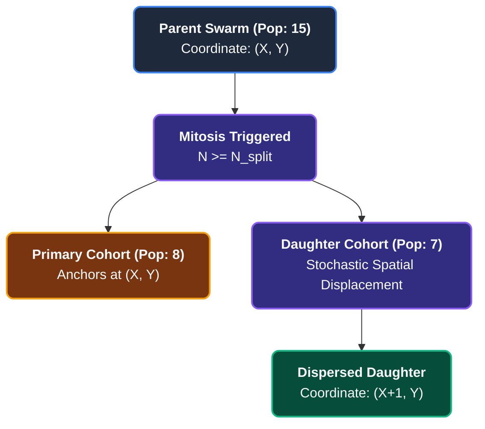

Herbivore swarms within PHIDS consume resources, metabolize energy, reproduce, and undergo density-dependent population scaling. This deep dive explains how those behaviors are modeled as discrete events evaluated locally on the spatial hash.

## Biological Context

Organisms require a baseline caloric intake (maintenance metabolism) to survive and fuel reproductive output (surplus metabolism). Rather than treating "starvation" as a binary switch that kills an entire swarm after $k$ ticks without food, biological decline is smooth. A population shrinks proportionately as available calories fall short of total maintenance demands.

When a population discovers abundant resources, it metabolizes the surplus energy into offspring. If the localized population density exceeds biological capacity limits, the group fractures and disperses (mitosis).

## The Mathematical Model

Instead of modeling the populations of foxes and rabbits continuously via Ordinary Differential Equations (ODEs) across an entire ecosystem, PHIDS evaluates every localized swarm $i$ at position $(x, y)$ independently during tick $t$.

### 1. Metabolic Attrition

In a natural ecosystem, starvation is not a delayed, all-or-nothing event. A swarm of 100 insects needs a strict number of calories every day just to keep their collective hearts beating and wings flapping. If they only find enough food to support 90 insects, 10 insects will immediately perish.

To model this, swarms continuously deplete their stored energy ($E_i$) proportional to their population size ($N_i$).

Let $m_i$ be the species-specific metabolic upkeep rate per individual per tick.

$$
\text{Total Upkeep} = N_i \cdot m_i
$$

If $E_i < \text{Total Upkeep}$, the swarm suffers an **Energy Deficit**. Deficits manifest as immediate casualties.

#### I. Implementation Mechanics

When a herbivore swarm suffers from an energy deficit (due to metabolic maintenance costs outstripping resource ingestion on a barren tile), the engine converts this floating-point energy deficit into discrete organism deaths.

The core calculation uses an aggressive ceiling function approach. The base death count is calculated via floor division: `int(deficit // swarm.energy_min)`. Immediately following this, the engine applies a protective rounding check:

```python
# Absolute clearing of energy debt
casualties = int(deficit // swarm.energy_min)
if casualties * swarm.energy_min < deficit:
    casualties += 1  # Ceil operation forced
```

If any fractional deficit remains un-cleared by the base floor division, the engine intentionally increments the casualties by one, sacrificing an extra individual to completely wipe out the debt.

#### II. Why It Is Solved This Way

If the engine used standard rounding or pure floor division, fractional energy deficits would be carried over across ticks as floating-point state variables attached to the swarm. Over long execution spans, tracking fractional "ghost debt" across thousands of swarms introduces precision leaks, floating-point drift, and breaks the fundamental closed-system conservation laws of the biotope.

#### III. The Historical/Continuous Alternative

Continuous models treat population counts as floating-point numbers, allowing a swarm to comfortably contain $14.234$ individuals. In an entity engine, fractional individuals break system logic; an entity must have concrete, integer-valued components to interact clearly with discrete logic gates.

#### IV. Computational Improvement

* **Complexity:** Executes as a basic $O(1)$ arithmetic check.
* **State Minimization:** By guaranteeing that no fractional energy debt is carried forward to the next tick, the engine completely removes the need to track, store, or serialize sub-individual fractional states. This reduces the feature footprint of the swarm component struct, ensuring it fits cleanly into highly efficient structured arrays optimized for direct memory cache operations.

#### V. Biological Modeling Realism

* **Strict Thermodynamic Conservation:** Energy cannot be synthesized out of nothing. If an engine allows a swarm to carry debt without paying an immediate survival penalty, it is essentially allowing organisms to survive on "ghost energy" that doesn't exist in the biotope.
* **Starvation Threshold Penalties:** Enforcing an aggressive ceiling function on starvation deaths accurately models the biological vulnerability of stressed colonies. When a collective swarm faces an energetic deficit, the structural cost of maintaining cohesion means that fractional shortages trigger rapid, cascading failure among the weakest individuals. This ensures that starvation curves remain sharp, punitive, and biologically authentic.

If $N_i \le 0$, the entity is scheduled for garbage collection at the end of the phase.

### 2. Reproduction from Surplus

If the swarm secures enough energy to fulfill its baseline viability ($E_{base} = N_i \cdot E_{min,i}$), the remaining *surplus* energy is converted into new individuals.

Let $c_i$ be the reproductive cost per offspring ($E_{min,i} \cdot \rho_i$, where $\rho_i$ is a divisor).

$$
\Delta N_i = \left\lfloor \frac{\max(0, E_i - E_{base})}{c_i} \right\rfloor
$$

### 3. Mitosis

Cellular division within a macroscopic swarm occurs when the cluster population reaches $N_i \ge N_{split}$, prompting a physical bifurcation into two discrete ECS entities that share the parent's accumulated energy.

#### I. Structural Bifurcation Mechanics

During the interaction and lifecycle phase, any swarm whose population strictly violates the biological carrying capacity threshold ($N_i \ge N_{\text{split}}$) triggers an immediate cellular division event. The parent swarm fractures its population array and energetic reserve into two distinct structural entities (e.g., bifurcating a parent of 15 into cohorts of 7 and 8 individuals).

To prevent catastrophic spatial overlap, the engine subjects the daughter swarm to an immediate stochastic displacement routine ($\mathcal{W}_{\text{random}}(x_0, y_0)$). This operation translates the newly spawned offspring to a stochastically sampled adjacent coordinate within the local Von Neumann neighborhood prior to committing the entity to the ECS world matrix.

#### II. Avoiding Spatial Convergence Loops

Within the strict confines of a discrete, grid-based Entity-Component-System (ECS), co-locating two distinct entities possessing identical spatial keys in the same temporal frame inevitably induces system conflicts. Absent immediate forced dispersal, the interaction loops would evaluate the swarms as independent entities occupying the same ecological niche, forcing the engine to resolve infinite re-coalescence cycles or recursively re-evaluate density constraints on a singular coordinate, rapidly stalling the execution pipeline.

#### III. The Failings of Continuous Repulsion

Naive continuous mathematical frameworks assume that a population splits perfectly in-place, temporarily occupying an infinitesimal singularity, with eventual separation governed by the slow integration of continuous repulsive Partial Differential Equations (PDEs). This approach is computationally devastating at scale and biologically inaccurate for macroscopic grazing herds.

#### IV. Architectural and Array Optimization

By enforcing immediate stochastic displacement, PHIDS reduces complex path-finding and collision-avoidance resolution down to a unified $O(1)$ computation. Consequently, the engine entirely bypasses the need for expensive post-split "entity un-stacking" passes, which traditionally demand $O(N \log N)$ spatial sorting or $O(N^2)$ Euclidean cross-checks to disentangle overlapping agents. This mutation is executed inline within the active transformation buffer, guaranteeing optimal memory coherency.

#### V. Biological Modeling Realism

* **Kin Competition and Local Overgrazing:** In real-world plant-herbivore dynamics, reproducing insects or micro-pathogens do not occupy the exact same physical space as their parental colony without causing catastrophic local resource failure.
* **Dispersal Phase:** Forcing an immediate step into an adjacent cell models an *active dispersal phase*. It ensures that offspring immediately attempt to exploit neighboring vegetation resources, realistically simulating the outward expansion of a foraging front across a plant canopy or meadow.

## 4. Formal Numerical Example of Mitosis

To concretize this metabolic calculus, consider a discrete swarm composed of 10 herbivore individuals characterized by a baseline baseline upkeep $m_i = 1.0$ and a reproduction cost $c_i = 5.0$. During the feeding phase, the swarm fully consumes a plant entity, elevating its total energy pool $E_i$ to 35.0 units.

In the subsequent metabolism phase, the swarm must pay its survival upkeep ($10 \times 1.0 = 10.0$), leaving a net surplus of 25.0 energy units ($35.0 - 10.0 = 25.0$). This surplus is routed strictly into reproductive synthesis, converting into exactly 5 new offspring ($\lfloor 25.0 / 5.0 \rfloor = 5$).

The swarm concludes the integration tick with an updated population of 15 and 0.0 remaining surplus energy. Should the species configuration define a mitosis threshold $N_{split} = 15$, this population triggers immediate cellular division. The swarm bifurcates into two distinct cohorts of 7 and 8 individuals respectively. To prevent a catastrophic spatial re-merge, the primary swarm retains the parental coordinate while the daughter swarm undergoes stochastic displacement to an adjacent cell to initiate active spatial dispersal.



## Alternatives & Omissions

### Omission of Individual Chronological Aging (Senescence)

In classic individual-based ecological models (IBMs), each organism tracks an explicit chronological birth date $t_0$ and accumulates senescent mortality or physiological decay as $t - t_0$ increases. In PHIDS, individual chronological aging is intentionally omitted from the core engine loop.

#### 1. Biological Rationale & Swarm Averaging

* **Ergodic Swarm Dynamics:** PHIDS models herbivores at the swarm scale ($N \ge 1$). In aggregate populations, individual birth dates and age distributions reach a stationary steady state. Physiological traits (metabolic upkeep $m_i$, feeding rate, and base natural mortality) reflect the **cohort average** across the swarm. Individual senescence averages out across large numbers of organisms ($N \gg 1$).
* **Time-Scale Hierarchy:** Ecological outbreaks, defense induction cycles, and foraging movement typically unfold over seasonal time horizons (days to weeks). On these time scales, population turnover via starvation attrition and surplus reproduction dominates over gradual individual senescent decline.

#### 2. High-Performance Computing (HPC) Rationale

* **Data-Oriented Contiguity:** Tracking individual birth timestamps for $N$ organisms within a swarm breaks contiguous array memory layout in the Entity-Component-System (ECS). It would force $O(N)$ dynamic memory allocations inside Numba `@njit` JIT loops.
* **Cache Efficiency:** Keeping `SwarmComponent` structs fixed-size ($O(\text{entities})$ instead of $O(\text{organisms})$) preserves SIMD vectorization and cache locality during spatial hashing and flow field evaluation.

#### 3. How Aging Could Be Incorporated (Design Alternatives)

If a scientific scenario requires explicit age-dependent behavior (e.g., declining motility in aging adults or age-dependent mortality), PHIDS provides three architecturally compatible extension patterns:

1. **Mean Swarm Age Component (Scalar Approximation):**
   Add a single float32 scalar `mean_age` to `SwarmComponent` ($+4\text{ Bytes/entity}$). On each tick, $\text{mean\_age} \leftarrow \text{mean\_age} + \Delta t$. Upon reproduction or split, the new mean age is updated via weighted arithmetic mean:
   $$
   A_{\text{new}} = \frac{N_{\text{parent}} \cdot A_{\text{parent}} + \Delta N \cdot 0}{N_{\text{parent}} + \Delta N}
   $$
   This enables age-dependent speed or upkeep decay at zero allocation overhead.
2. **Weibull Cohort Mortality Rate ($\mu_{\text{age}}$):**
   Model senescent mortality at the swarm level using a Weibull hazard function $\mu(A) = \frac{k}{\lambda}\left(\frac{A}{\lambda}\right)^{k-1}$. The age-dependent casualties per tick are subtracted directly from population $N_i$ during metabolic attrition passes without tracking individual entity instances.
### Continuous-Time ODE Solvers (Lotka-Volterra)

The classic Lotka-Volterra predator-prey (here: herbivore-plant) equations ($\frac{dx}{dt} = \alpha x - \beta xy$) model the rate of change of continuous populations.

* *Why rejected:* ODEs treat populations as perfectly mixed, homogeneous continuous variables ($x = 42.5$ rabbits). They cannot capture discrete, localized spatial events, such as a specific herd of 10 herbivores navigating around a toxic plant at coordinate $(4, 12)$.
* *Our advantage:* The discrete ECS formulation provides the spatial granularity required for physical movement, local chemical triggers, and density-dependent crowding (e.g., cell capacity repulsion) while preserving mathematical determinism.
