# Reaction-Diffusion & Partial Differential Equations

The dispersion of Volatile Organic Compounds (VOCs)—airborne signals used by flora to warn neighbors of herbivore attacks—is mathematically modeled in PHIDS using a discrete Reaction-Diffusion system.

## Biological and Physical Context

In nature, when a plant is damaged, it releases chemical compounds into the surrounding air. The concentration of these chemicals decreases as they spread outwards, a process driven by random molecular motion (diffusion) and air currents (advection). Simultaneously, these compounds naturally degrade or react with atmospheric elements over time (decay).

To simulate this without tracking billions of individual molecules, physics and chemistry employ **Partial Differential Equations (PDEs)**—specifically, Reaction-Diffusion equations.

## The Mathematical Model

The continuous parabolic PDE describing this phenomenon for a substance concentration $C$ is:

$$
\frac{\partial C}{\partial t} = D \nabla^2 C - \lambda C + Q
$$

Where:

- $\frac{\partial C}{\partial t}$: The change in concentration over time.
- $D \nabla^2 C$: The diffusion term (Laplacian operator), describing how the substance spreads from areas of high concentration to low concentration.
- $\lambda C$: The decay term, representing the natural degradation of the chemical.
- $Q$: The source term, representing actively emitting plants.

### Discretization for Cellular Automata

Because PHIDS operates on a discrete grid with discrete time steps (\Delta t), we cannot solve the continuous PDE directly. Instead, we approximate it using a two-step computational fluid dynamics approach:

#### I. Implementation Mechanics

The biotope layer (`src/phids/engine/core/biotope.py`) handles volatile organic compounds (VOCs) and chemical signals using a two-tier operator loop.

**Step 1: Semi-Lagrangian Advection (Wind)**
For every cell, the engine traces a trajectory backward in time along a localized wind vector field to determine the upstream concentration, interpolating the value from the read buffer. If the per-cell wind vector is $\mathbf{u} = (u_x, u_y)$, the advected concentration at cell $(x, y)$ is sampled from $(x - u_x, y - u_y)$ in the previous tick's read-buffer.

$$
\tilde{C}^{t}(x,y) = C^t(x - u_x, y - u_y)
$$

**Step 2: Isotropic Gaussian Convolution**
The engine applies a discrete convolution step using a strictly odd-sized Gaussian kernel (3x3 by default). The kernel creation routine (`_make_gaussian_kernel()`) enforces this structural constraint via an explicit check:

```python
if size % 2 == 0:
    raise ValueError("Kernel size must be odd to maintain central symmetry.")
```

Let the advected 2D grid matrix of signal concentration at tick $t$ be $\tilde{C}^t$. The update for tick $t+1$ becomes:

$$
C^{t+1} = \gamma \cdot (\mathcal{K}_{iso} * \tilde{C}^t) + Q^t
$$

Where:
- $\mathcal{K}_{iso}$ is an odd-sized Gaussian blur kernel (e.g., $3 \times 3$).
- $*$ denotes the 2D discrete convolution.
- $\gamma$ is the decay factor (e.g., $0.85$, meaning 15% dissipates per tick).
- $Q^t$ is the matrix where cells containing active emitting plants have their concentration increased by a fixed emission rate.

```mermaid
flowchart LR
    subgraph Step_1 ["Step I: Semi-Lagrangian Wind Advection"]
        A["Target Grid Cell (x, y)"] -->|Trace Backward in Time| B["Upwind Coordinates<br>(x - u*dt, y - v*dt)"]
        B -->|Bilinear Interpolation| C["Interpolated Signal Concentration Value<br><i>from Read Buffer (State_Read)</i>"]
    end

    subgraph Step_2 ["Step II: Center-Symmetric Diffusion & Cleansing"]
        C --> D["Apply Odd-Sized Symmetric Gaussian Kernel<br><i>(3x3 Centered Convolution Matrix)</i>"]
        D --> E["Apply Substance Cleansing Factor<br><i>Subtract Lambda Coefficient * Concentration</i>"]
        E --> F{"Value Below Truncation<br>Bound (Value < epsilon)?"}
        F -- Yes --> G["Hard Snap Grid Cell to Zero<br><i>Removes Floating-Point Underflows</i>"]
        F -- No --> H["Write Concentration to Write Buffer<br><i>State_Write(x, y)</i>"]
    end

    %% Class Allocations
    classDef stateData fill:#111b24,stroke:#00b8d4,stroke-width:2px,rx:6px,ry:6px;
    classDef coreSys fill:#141224,stroke:#b388ff,stroke-width:2px,rx:6px,ry:6px;
    classDef shortcut fill:#112214,stroke:#00e676,stroke-width:2px,rx:6px,ry:6px;

    class A,B,C,D stateData
    class E,H coreSys
    class F,G shortcut
```



#### II. Why It Is Solved This Way

Pure isotropic diffusion models chemical spread as a series of perfectly expanding, concentric circular uniform bubbles. In real-world ecosystems, wind completely alters this landscape.

Furthermore, from a numerical computing standpoint, applying an even-sized convolution kernel to a discrete grid introduces a sub-pixel spatial phase shift on every single tick. Over hundreds of simulation frames, this asymmetry causes the chemical signals to unnaturally drift down and to the right, corrupting the biological fidelity of the paths.

#### III. The Historical/Continuous Alternative

The traditional method uses an explicit finite-difference upwind scheme to solve the continuous advection-diffusion equation:

$$
\frac{\partial C}{\partial t} + \vec{u} \cdot \nabla C = D \nabla^2 C
$$

Explicit schemes are bound by the strict Courant-Friedrichs-Lewy (CFL) stability condition:

$$
\Delta t \le \frac{\Delta x}{|\vec{u}|}
$$

If the wind speed spikes unexpectedly in a scenario, an explicit alternative collapses numerically, causing infinite chemical concentration spikes and system crashes.

#### IV. Computational Improvement

* **Complexity:** The semi-Lagrangian approach is *unconditionally stable*. It allows the simulation engine to utilize significantly larger time steps (\Delta t) without risk of numerical explosion, maintaining stable $O(W \times H)$ grid passes regardless of wind velocity.
* **Kernel Minimization:** Restricting the convolution step to a tight, center-symmetric 3x3 kernel reduces the memory footprint and limits array cache misses. This keeps the execution pipeline bound to the immediate L1/L2 cache lines of modern processor cores during vectorization.

#### V. Biological Modeling Realism

* **Anisotropic Plant Communication:** Plants communicate via airborne volatile organic compounds (VOCs)—such as releasing green leaf volatiles or jasmonates when chewed by herbivores to prime defensive enzyme synthesis in neighboring flora.
* **Realistic Signal Plumes:** By pairing wind-driven advection with symmetric diffusion, PHIDS accurately models directional, elongated chemical plumes. Downwind plants receive early warning signals and synthesize defenses long before upwind plants register any threat, perfectly mirroring canopy-level micro-climate communication patterns observed in forest ecology.

## Numerical Example

Imagine a $3 \times 3$ grid segment. The center cell $(1,1)$ contains a plant actively emitting a signal.

**Tick 0:**

$$
C^0 =
\begin{bmatrix}
0 & 0 & 0 \\
0 & 100 & 0 \\
0 & 0 & 0
\end{bmatrix}
$$

Assume a simplified discrete Laplacian convolution kernel $\mathcal{K}$ that distributes 20% of a cell's value to its 4 orthogonal neighbors, keeping 20% in the center. Assume decay factor $\gamma = 0.9$ and no new emission ($Q=0$).

**Tick 1 (After Convolution):**

$$
\mathcal{K} * C^0 =
\begin{bmatrix}
0 & 20 & 0 \\
20 & 20 & 20 \\
0 & 20 & 0
\end{bmatrix}
$$

**Tick 1 (After Decay $\gamma = 0.9$):**

$$
C^1 =
\begin{bmatrix}
0 & 18 & 0 \\
18 & 18 & 18 \\
0 & 18 & 0
\end{bmatrix}
$$

The signal has dispersed outward while losing 10% of its total mass to decay.

## Subnormal Float Mitigation

When solving diffusion equations computationally, the tails of the Gaussian distribution approach zero infinitely but never reach it. This creates matrices filled with "subnormal" floats (e.g., `1e-300`). Processors struggle to calculate arithmetic with subnormals, causing severe CPU bottlenecks.

To maintain performance, PHIDS strictly enforces **matrix sparsity** by clamping small values. After the decay step:

$$
C^{t+1}[C^{t+1} < \varepsilon] = 0
$$

Where $\varepsilon$ is a configurable threshold (e.g., `1e-4`).

## Alternatives Considered

- **Agent-Based Scent Particles:** We could spawn individual ECS entities representing "scent particles" that move randomly.
    - *Why rejected:* Tracking millions of particles per tick destroys the $O(1)$ scaling constraint of the engine.
    - *Our advantage:* By vectorizing the concentration into a continuous grid layer and applying `scipy.signal.convolve2d`, we achieve mathematically accurate macro-dispersion in bounded time, regardless of how much substance is emitted.
