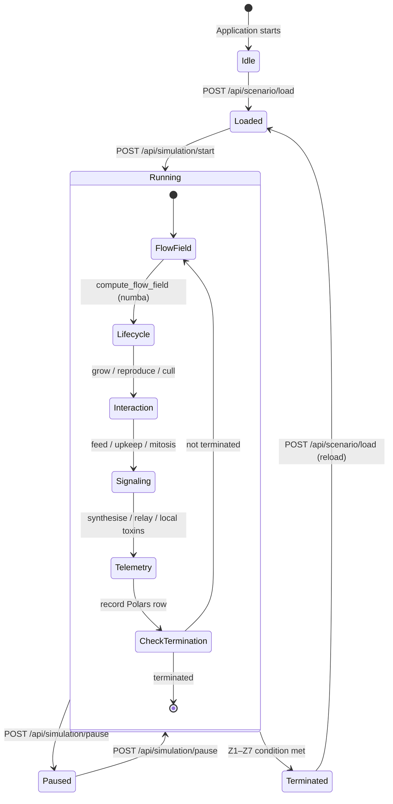

# Engine Execution

The core execution loop of PHIDS updates ecological state deterministically. The progression of phases occurs in a fixed sequence, guaranteeing that later phases observe the finalized side effects of earlier computations.

## The Simulation Tick Order

The `SimulationLoop.step()` method executes the following components consecutively:

1. **Flow-Field Generation**: Utilizes Numba JIT compilation to compute the singular global guidance gradient based on plant energy and toxic zones.
2. **Camouflage Attenuation**: Post-processes the flow-field by masking the gradient for flora utilizing camouflage traits.
3. **Lifecycle (`run_lifecycle`)**: Updates flora-centric state. Handles resource growth, deterministic mycorrhizal propagation, threshold culling, and interval-gated reproduction logic.
4. **Interaction (`run_interaction`)**: Determines swarm behavior. Checks spatial hash for crowding (inducing repelled dispersal), executes flow-field gradient sampling, performs localized feeding, and manages the continuous deficit attrition and mitosis algorithms.
5. **Signaling (`run_signaling`)**: Converts herbivore presence into substance triggers. Manages the synthesis countdowns, aftereffects, emits substances into the double-buffered grid, and processes local toxic casualties.
6. **Observation**: Records telemetry output and checks global termination conditions.

## Entity Component System (ECS) & Spatial Hashing

Entities in PHIDS are lightweight, data-only records lacking encapsulated logic. System functions iterate over specific intersections of component types.

### O(1) Locality Resolution
To avoid catastrophic $O(N^2)$ distance polling, `ECSWorld` maintains a Spatial Hash—a dictionary mapping $(x,y)$ coordinates to the sets of residing `entity_id`s. When an herbivore feeds, it queries the spatial hash at its immediate coordinate to retrieve co-located flora, completely negating the need for global proximity iterations.

### Active Garbage Collection
Entities whose population or energy levels degrade past viable thresholds are unregistered from the Spatial Hash immediately. At the conclusion of system iterations, `ECSWorld.collect_garbage()` permanently deletes these entities, recovering resources and ensuring clean state space for subsequent ticks.

