# Engine Execution

The core execution loop of PHIDS updates ecological state deterministically. The progression of phases occurs in a fixed sequence, guaranteeing that later phases observe the finalized, double-buffered side effects of earlier computations.

## The Simulation Tick Order

The `SimulationLoop.step()` method executes the following components consecutively, forming a single discrete timeframe ($\Delta t$):

1. **Flow-Field Generation**: Utilizes Numba JIT compilation to compute the singular global guidance gradient based on plant energy and toxic zones.
2. **Camouflage Attenuation**: Post-processes the flow-field by masking the gradient for flora utilizing camouflage traits.
3. **Lifecycle (`run_lifecycle`)**: Updates flora-centric state. Handles resource growth, deterministic mycorrhizal propagation, threshold culling, and interval-gated reproduction logic.
4. **Interaction (`run_interaction`)**: Determines swarm behavior. Checks the spatial hash for crowding (inducing repelled dispersal), executes flow-field gradient sampling, performs localized feeding, and manages the continuous deficit attrition and mitosis algorithms.
5. **Signaling (`run_signaling`)**: Converts herbivore presence into substance triggers. Manages the synthesis countdowns, aftereffects, emits substances into the double-buffered grid, and processes local toxic casualties.
6. **Telemetry Logging**: Records a metrics snapshot of the current state and appends the tick data to the telemetry recorder and replay buffer.
7. **Termination Check**: Evaluates configured extinction, energy, and population threshold limits to check if simulation termination conditions have been met.

## Entity Component System (ECS) & Spatial Hashing

Entities in PHIDS are lightweight, data-only records lacking encapsulated logic. System functions iterate over specific intersections of component types, separating memory allocation from logic execution. This ensures maximum cache coherence and rapid loop traversal.

### $O(1)$ Locality Resolution

To avoid catastrophic $O(N^2)$ distance polling, `ECSWorld` maintains a Spatial Hash-a dictionary mapping $(x,y)$ coordinates to the sets of residing `entity_id`s. When an herbivore feeds, or a plant checks for grazing pressure, it queries the spatial hash at its immediate coordinate to retrieve co-located entities. This completely negates the need for global proximity iterations across the map.

### Active Garbage Collection

Entities whose population or energy levels degrade past viable thresholds are unregistered from the Spatial Hash immediately, removing them from subsequent spatial lookups within the same tick. To prevent "ghost" entities from being queried by subsequent system phases in the same tick, `ECSWorld.collect_garbage()` is executed immediately at the end of (or inline within) each individual system phase (Lifecycle, Interaction, and Signaling) to permanently delete dead entities and reclaim memory resources. This prevents memory overhead and lookup pollution typical in naive ECS implementations.

```mermaid
flowchart LR
    %% External Application States
    subgraph App_Control ["Application Master State Controller"]
        Idle(["Idle Space"]) -->|POST /api/scenario/load| Loaded(["Scenario Loaded"])
        Loaded -->|POST /api/simulation/start| Running[["RUNNING HOT LOOP"]]
        Running -->|POST /api/simulation/pause| Paused(["Simulation Paused"])
        Paused -->|POST /api/simulation/pause or /start| Running
        Running -->|Termination Condition Met| Terminated(["Terminated State"])
        Terminated -->|POST /api/simulation/reset| Loaded
    end

    %% Internal Hot Loop Pass Execution
    subgraph Loop_Step ["Granular In-Tick Operational Ordering (SimulationLoop.step)"]
        direction TB
        S1["1. Compute Vector Guidance Field<br><i>flow_field.py @njit Pass</i>"] --> S2
        S2["2. Attenuate Camouflage Profiles<br><i>Mask Flora Guidance Gradients</i>"] --> S3
        
        S3["3. Execute Flora Lifecycle Pass<br><i>Resource Growth & Threshold Culling<br><b>ECSWorld.collect_garbage() (Plants)</b></i>"] --> S4
        S4["4. Run Interaction Dynamics<br><i>Spatial Hash Grazing, Attrition & Mitosis<br><b>ECSWorld.collect_garbage() (Plants & Swarms)</b></i>"] --> S5
        S5["5. Evaluate Inductions & Signaling<br><i>Reaction-Diffusion & Toxic Casualties<br><b>ECSWorld.collect_garbage() (Toxin Casualties)</b></i>"] --> S6
        
        S6["6. Telemetry Logging Output<br><i>Appends Record to Polars Data Block & Replay</i>"] --> S7
        S7["7. Termination Check<br><i>Evaluates stop conditions for next tick</i>"]
    end

    %% Immediate Mid-Tick Eviction Substrate
    subgraph Spatial_Hash_Substrate ["Stage 1: Immediate Spatial Invalidation"]
        SH_Evict[["O(1) Instant Hash Eviction<br><i>Unregister Dead Entity IDs from Coordinates</i>"]]
    end

    %% Mid-tick death trigger hooks linking to immediate eviction
    S3 -.->|Biomass Depletion / Decay| SH_Evict
    S4 -.->|Starvation / Grazing| SH_Evict
    S5 -.->|Lethal Toxic Damage| SH_Evict

    %% Eviction loop effects bypassing subsequent system phases
    SH_Evict -.->|Removes entity from lookup pool| S4
    SH_Evict -.->|Removes entity from lookup pool| S5

    %% Causal Link to Engine Core
    Running ==>|Spins Continuous Tick Core| S1
    S7 -->|Loop Back if Invariants Hold| S1

    %% Class Allocations
    classDef peripheral fill:#181818,stroke:#9e9e9e,stroke-width:2px,rx:6px,ry:6px;
    classDef coreSys fill:#141224,stroke:#b388ff,stroke-width:2px,rx:6px,ry:6px;
    classDef stateData fill:#111b24,stroke:#00b8d4,stroke-width:2px,rx:6px,ry:6px;
    classDef hazard fill:#1c1212,stroke:#ff5252,stroke-width:2px,rx:6px,ry:6px;
    classDef shortcut fill:#112214,stroke:#00e676,stroke-width:2px,rx:6px,ry:6px;

    class Idle,Loaded,Paused,Terminated peripheral
    class Running,S1,S2,S3,S4,S5,S6,S7 coreSys
    class SH_Evict shortcut
```

