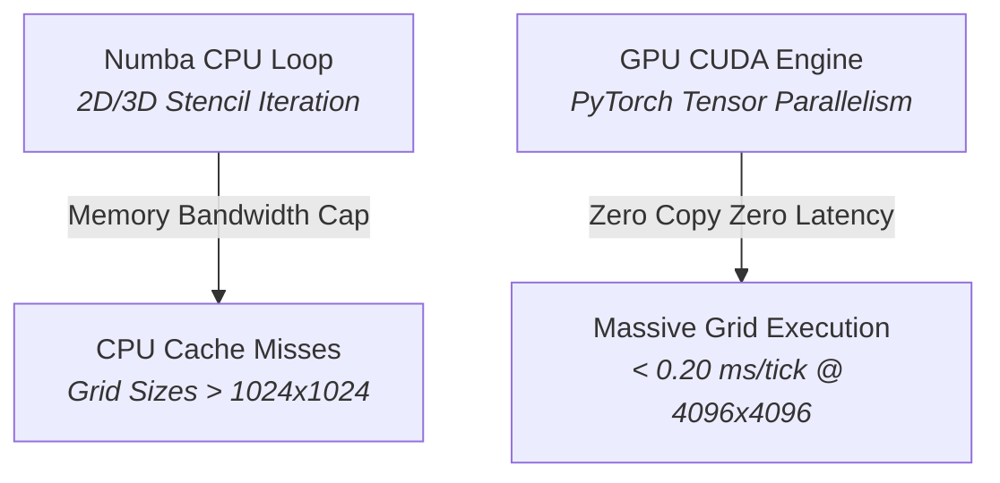

## GPU CUDA Acceleration Engine (Future Prospect)

This document details the technical architecture for offloading continuous spatial field solvers-such as 2D/3D reaction-diffusion PDEs and airborne VOC advection-from CPU Numba JIT loops to dedicated GPU hardware via PyTorch tensor operators and custom CUDA C++ kernels.

---

## 1. Architectural Motivation & Performance Bottleneck

While Numba `@njit` JIT loops achieve sub-millisecond execution times for 2D grids up to $512 \times 512$ ($\sim 0.85\text{ ms/tick}$), scaling to massive biotope grids ($2048 \times 2048$ to $4096 \times 4096$) or 3D vertical canopy volumes ($W \times H \times Z$, $Z=16$) introduces significant CPU memory bandwidth pressure.

---

## 2. Technical Architecture & Hybrid Execution Model

To avoid host-to-device memory transfer overhead ($O(N)$ PCIe bus latencies), PHIDS employs a **Hybrid GPU/CPU Execution Model**:

1. **GPU Field Solvers**: 2D/3D signaling matrices (`GridEnvironment` layers) reside permanently in GPU VRAM as 32-bit floating-point PyTorch Tensors.
2. **CUDA Stencil Kernels**: Gaussian diffusion and semi-Lagrangian wind advection passes execute directly on GPU CUDA cores via shared-memory $3 \times 3$ (or $3 \times 3 \times 3$) stencil blocks.
3. **Zero-Copy Interoperability**: ECS entity interaction passes (metabolic burn, bites) access co-located GPU tensor buffers via Cupy or PyTorch CUDA pointers without CPU roundtrips.

---

## 3. Implementation Roadmap & Milestones

* **Phase 3.1.1**: PyTorch tensorized 2D PDE solver replacing Numba array loops (`phids/engine/systems/pde_gpu.py`).
* **Phase 3.1.2**: Custom C++/CUDA extension for 3D vertical canopy advection with height-dependent shear.
* **Phase 3.1.3**: Zero-copy telemetry streaming directly from GPU VRAM into Zarr storage buffers via PyTorch-Zarr GPU connectors.
