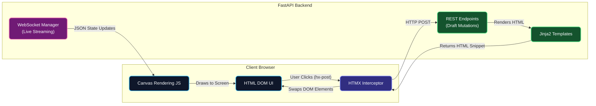

PHIDS operates as a headless FastAPI backend, equipped with RESTful configuration surfaces, high-throughput WebSockets for live state streaming, and an embedded server-rendered dashboard powered by HTMX and Jinja.

## API Boundary

The simulator exposes operational boundaries required to drive experiments programmatically without relying on the browser UI. The primary simulation controls include:

- `POST /api/scenario/load`: Ingests a validated `SimulationConfig`, destroying any running execution loops and staging the system for initialization.
- `POST /api/simulation/start|pause`: Toggles execution state of the live simulation loop.
- `PUT /api/simulation/wind`: Injects meteorological forcing dynamics into the environment layers while the simulation runs.

## Draft vs Live State

PHIDS establishes a strict barrier between the simulation currently under construction and the simulation actively executing. This prevents configuration adjustments from inadvertently modifying active scientific experiments mid-run.

- **`DraftState`**: A persistent, mutable scenario configuration stored on the server and auto-saved to `data/draft_autosave.json`. This is heavily edited via the UI endpoints (e.g., toggling diet matrix compatibility, modifying reproduction bounds, adding species). Disk persistence ensures draft configurations survive Uvicorn process reloads and server restarts. Modifying the Draft State has zero ecological impact on any running live model.
- **`SimulationLoop` (Live Runtime)**: Created only when the operator explicitly "loads" the draft configuration into the engine. Once initialized, the runtime strictly divorces from the Draft State.

## UI Control Center (HTMX + Jinja)

The administrative control center intentionally avoids the complexity of a Single Page Application (SPA) like React or Vue. By leveraging HTMX, server-side Jinja templates directly replace DOM fragments in response to user events.

This dual-channel architecture strictly isolates administrative interactions from ecological rendering. When an operator edits the `DraftState` (e.g., adding a new plant species), the interaction is handled by standard HTTP POST requests. HTMX intercepts the form submission, sends it to the FastAPI REST endpoint, and Jinja2 returns a tiny HTML snippet to seamlessly update the UI without reloading the page. Conversely, the live visual representation of the simulation is updated via JSON payloads over a WebSocket directly to the client's `<canvas>`, preventing the massive memory overhead that would occur if we tried to represent thousands of entities as HTML DOM elements.

### Unified Primary Action Control Button

Execution controls in the dashboard toolbar are consolidated into a single primary action button (`#sim-main-action-btn`) driven by `window.phidsSyncMainActionButton(running, paused)`:

- **▶ Start (Emerald `bg-emerald-500`):** Displayed when the simulation is stopped, loaded, or reset. Triggers `POST /api/simulation/start`.
- **⏸ Pause (Amber `bg-amber-500`):** Displayed when the simulation is actively running. Triggers `POST /api/simulation/pause`.
- **▶ Resume (Indigo `bg-indigo-500`):** Displayed when the simulation is paused. Triggers `POST /api/simulation/pause` (or `start`) to resume background task execution.

The backend endpoint `/api/simulation/pause` safely handles pause, resume, and background task recovery without orphaned processes or 400 errors on terminated loops.

### Live Simulation Dashboard

The live dashboard is the primary workspace for observing an actively running simulation. It features a real-time rendered `<canvas>` grid depicting spatial entities (Flora, Swarms, signals, toxins, mycorrhizal links).

#### Live Grid vs Placement Preview

To prevent operator confusion between scenario editing and active experiment execution, the UI explicitly distinguishes two canvas modes:

- **Placement Preview (Draft State)**: Rendered when editing draft scenario parameters, placing plants, or generating auto-assigned populations before a scenario is loaded. The placement preview displays initial spatial layouts fetched from `/api/config/placements/data`.
- **Live Simulation Grid (Active Runtime)**: Triggered when the operator clicks **▶ Start** or **Load Draft**. Real-time spatial matrices are streamed continuously via `/ws/ui/stream`. Unrelated HTMX UI updates (such as updating species parameters, toggling tab views, or adjusting live speed) are strictly isolated and will **never** reset the live canvas or overwrite live streaming data with static preview frames.

#### Live Simulation Speed (Hz) Adjustments

Operators can dynamically adjust the simulation execution speed using the `Speed (Hz)` control (ranging from `0.1 Hz`-1 tick every 10 seconds-up to `30 Hz` or higher):

- Adjusting the live speed updates both the background `SimulationLoop` tick interval and the WebSocket streaming manager sleep cadence (`max(0.1, tick_rate_hz)`).
- Speed changes take effect **immediately in real time** without stopping the simulation, reloading the scenario, or clearing the live canvas grid.

#### Canvas Grid Resize Feature

To accommodate varying screen sizes and grid dimensions, the dashboard provides a "Resize" toggle. When enabled, a slider allows the operator to dynamically adjust the canvas height as a percentage of the viewport (30% to 100%). This preference is persisted locally in the browser via `localStorage` (key: `phids.canvas.heightPct` and `phids.canvas.resizeEnabled`), ensuring the grid layout remains consistent across sessions.

#### Hover Cell Inspection & Dual-Proxy Tooltip Pipeline

When hovering over any cell in the live grid:

1. **Dual-Proxy Live Snapshot Rendering**: The tooltip renders zero-latency dual-proxy health bars and structural parameters extracted from the columnar stream payload (`simPlantsColumnar`):
   - **Caloric Health ($E$) Bar:** Visualizes active caloric energy vs maximum energy ($E / E_{\text{max}}$) with an emerald-to-teal gradient.
   - **Structural Biomass ($M$) Bar:** Visualizes permanent structural mass vs maximum ceiling ($M_{\text{structural}} / M_{\text{max}}$) with an amber-to-yellow gradient.
   - **Plan 1 Compatibility Fallback:** If `structural_mass_max` is unspecified (`0.0`), $M_{\text{max}} = E_{\text{max}}$ and initial structural mass is populated proportional to placement energy ($M_{\text{structural}} = M_{\text{max}} \times \frac{E_{\text{initial}}}{E_{\text{max}}}$).
   - **Dynamic Fragility Badges:** Displays `🛡️ Woody Structure` ($M_{\text{structural}} \ge M_{\text{max}}$) or `⚠️ Fragility % (High/Medium/Low Risk)`.
2. **Mycorrhizal Overlay Disambiguation**: Root links render on top of plant tiles (`drawMycorrhizalLinks()` after `drawFlora()`), displaying explicit ` (inter-species)` vs ` (intra-species)` badges.
3. **Asynchronous Backend Enrichment**: If the pointer rests on a cell for $>60\text{ ms}$, the browser asynchronously fetches detailed entity genetics and condition-rule triggers via `GET /ui/dashboard/cell-details?x=X&y=Y&expected_tick=T`. If the live simulation advances to a new tick before the response arrives, the client rejects the stale response to ensure inspectable telemetry never desynchronizes from the live grid.

### Placement Editor & Auto-Assignment

The placement editor is part of the Draft State configuration UI. It provides an interactive `<canvas>` where operators can paint Flora and Herbivore swarms directly onto the grid before loading the scenario into the live engine. To prevent browser DOM lockups when handling massive configurations (e.g., 10,000+ entities), the UI deliberately caps editable entity list rendering.

**Auto-Assignment Engine:** For massive scale setups, the backend exposes auto-assignment endpoints (e.g., `generate_uniform`, `generate_clustered`, `generate_banded`). This allows operators to mathematically distribute thousands of flora or herbivore swarms across the field at precise densities and proportions. During draft generation, structural dependencies like mycorrhizal links are resolved using an $O(N)$ spatial hashing algorithm rather than $O(N^2)$ iterations, preventing UI lockups during ingestion.

Placement editor canvas dimensions can also be resized independently using dedicated local storage settings (`phids.placement.heightPct` and `phids.placement.resizeEnabled`).

When a user clicks a checkbox to update the Diet Compatibility Matrix, the backend modifies the `DraftState` and responds immediately with a re-rendered partial HTML table. This architectural choice establishes the server as the absolute, single source of truth for the experimental schema, ensuring UI state cannot desynchronize from backend limits.

## WebSocket Streaming & State Decoupling

For live visualizations and diagnostics, PHIDS emits simulation state matrices asynchronously. A critical constraint of this system is that the `UIStreamManager` must not block the core `SimulationLoop` during heavy JSON serialization.

To achieve this, the architecture employs the `extract_ui_snapshot` pattern. Instead of locking the engine for the entire payload generation phase, the backend performs a lightweight, synchronous, $O(N)$ thread-safe shallow copy of primitive state arrays (the snapshot). The heavy serialization and socket dispatch are then offloaded to a background thread (`asyncio.to_thread`), allowing the main engine loop to resume executing the physics simulation entirely unimpeded.

- `/ws/ui/stream`: Operates alongside HTMX. It pushes JSON diagnostic updates, such as the live tick counter, aggregated dashboard metadata, and specific cell inspection tooltips.

### `WS /ws/ui/stream` Diagnostics Payload

For real-time UI diagnostics, the secondary websocket transmits a JSON payload structured with a `contract_version` field to ensure backward compatibility as the data schema evolves.

The top-level fields include generic simulation flags (`tick`, `running`, `paused`, `terminated`, `termination_reason`), grid bounds (`grid_width`, `grid_height`), global maxima for canvas color scaling (`max_energy`, `max_signal`, `max_toxin`), and overlay structures (`species_energy`, `all_flora_species`, `signal_overlay`, `toxin_overlay`, `mycorrhizal_links`, `plants`, `swarms`).

Furthermore, it streams two columnar tables for entity diagnostics:

- **Plants Columnar Table**: Transmits a list of plant objects containing the fields: `entity_id`, `species_id`, `name`, `x`, `y`, `energy`, `root_link_count`, `active_signal_ids`, and `active_toxin_ids`.
- **Swarms Columnar Table**: Transmits a list of swarm objects containing the fields: `species_id`, `name`, `x`, `y`, `population`, `energy`, `energy_deficit`, `repelled`, `repelled_ticks_remaining`, `toxin_level`, and `intoxicated`.

## Metric Translation & UI Relativization

To balance raw computational throughput with human cognitive design-space exploration (DSE), PHIDS intentionally separates the representation of metrics in the core engine from their presentation in the user interface.

### The Engine Absolute (ECS)

At the lowest level, the engine core and Zarr telemetry buffers operate strictly on **absolute numerical primitives** (e.g., `population = 450`, `energy = 5.2`, `signal_layer_peak = 0.85`). These unboxed arrays avoid the massive overhead of context-switching, relative percentage calculations, and bounds-checking inside the tight Numba JIT simulation loop. The physics simulation simply does not care what `100%` is-it solely computes mass/energy transfers based on absolute local concentrations.

### The Presenter Relative (API Layer)

While absolute metrics are computationally optimal, they are cognitively opaque for human operators tuning a scenario. An energy value of `45.0` is meaningless unless the operator knows the specific species' genetic carrying capacity is `50.0`.

To solve this, the backend API presenter layer (e.g., `cell_details.py`) acts as a normalization boundary. Before JSON payloads are dispatched to the browser, the presenter injects **relative and synthesized metrics** alongside the raw data:

- `energy_ratio` and `energy_label` (e.g. `45.0 / 50.0 (90%)`).
- `mitosis_progress` (population evaluated against its genetic splitting threshold).
- `value_pct` for chemical concentrations relative to local saturation caps.

This architectural pattern guarantees that the heavy-lifting of percentage calculations, floating-point formatting, and tooltip string generation never pollutes the core simulation loop, while ensuring the UI is highly readable and "normalized" for scientists exploring the data.

### HTMX State Synchronization and Event-Driven Updates

The Simulation Control Panel (Play/Pause/Resume) leverages HTMX for zero-refresh UI interactions. Previously, the UI attempted to sync button state (e.g., swapping `hx-post` from `/api/simulation/start` to `/api/simulation/pause`) using client-side JavaScript (`htmx.process(btn)`), which caused an exponential explosion of duplicate event listeners, eventually locking the browser UI thread. An intermediate attempt used Out-of-Band (OOB) swaps, but this led to DOM duplication and instability if requests were interrupted.

To guarantee robust, zero-client-logic synchronization, PHIDS now uses **Event-Driven HTMX Triggers**. When the user clicks the main action button (e.g., "Start"), the button issues a POST request to the API. The FastAPI endpoint processes the action (e.g., starting the loop) and responds with `204 No Content` along with an HTTP response header `HX-Trigger: updateStatusBadge, updateMainActionBtn`.

This header cleanly instructs the client-side HTMX instance to fire these events globally. To prevent CSS cascade bugs related to `.htmx-request` classes causing the entire screen to lock up during polling, the UI implements an isolated Event-Driven trigger pattern:

1. **Invisible Event Listener Span:** An invisible `` adjacent to the button listens to `updateMainActionBtn from:body`.
2. **Targeted Button Swap:** When triggered, the invisible span executes a `GET /api/ui/main-action-btn`, explicitly targeting the button container using `hx-target="#sim-main-action-btn"` and `hx-swap="outerHTML"`. This completely replaces the old button state with the fresh, server-rendered "Pause" button state.
3. **Indicator Renaming:** The default `.htmx-indicator` class on the loading SVG was renamed to `.sim-btn-spinner`.
4. **Targeted CSS Scoping:** Global styling for `.htmx-request` (which applies `pointer-events: none; opacity: 0.7;`) was strictly scoped to `#sim-main-action-btn.htmx-request`.

This architectural pattern guarantees that the UI button state perfectly matches the backend physics engine state without fragile JavaScript race conditions or duplicate listeners. It also ensures that the button's SVG spinner strictly appears only during the button's active network round-trips, completely sidestepping global UI freezes caused by HTMX attaching `.htmx-request` to the document body during unrelated background polling cycles.
