# System Architecture

The PHIDS simulator is engineered as a headless, high-performance data-oriented system. It segregates logic from state to bypass the bottlenecks inherent in traditional Object-Oriented simulation frameworks. This document outlines the fundamental technical boundaries that ensure deterministic, reproducible simulation loops.

## Runtime Center of Gravity

The architectural nexus of the project is the `SimulationLoop` (`src/phids/engine/loop.py`). It coordinates the following independent stateful subsystems:

- **`GridEnvironment`**: Manages all vectorized 2D cellular automata fields using pre-allocated NumPy arrays.
- **`ECSWorld`**: Maintains the discrete biological entities and manages spatial locality indexing.
- **`TelemetryRecorder` & `ReplayBuffer`**: Handle data serialization and analytics observation at the conclusion of every tick.

## Layered Decomposition

1. **Schema & Ingress Layer**: Uses `pydantic` to enforce experimental bounds. Scenarios must be validated before the system initializes.
2. **Runtime Engine Layer**: A strict, unvarying sequence of phase operators.
3. **Interface Layer**: FastAPI provides asynchronous REST endpoints, WebSocket streaming, and manages the HTML presentation of `DraftState` versus live configurations.
4. **Persistence Layer**: Converts real-time system state into exported Polars DataFrames and binary `msgpack` logs for reproducibility.

## Double-Buffering Mechanics

To preclude race conditions during state mutation, PHIDS implements rigorous double-buffering for specific continuous fields (e.g., signal diffusion layers and plant energy arrays).
When a system phase computes new values, it reads from the read-buffer (`State_Read`) and commits its mutations entirely to a write-buffer (`State_Write`). Only upon the conclusion of the phase are the buffer references swapped.

## Memory Bounding: The "Rule of 16"

Dynamic memory allocation during the hot simulation loop introduces prohibitive latency. The architecture imposes a strict upper bound constraint: the system accommodates a maximum of 16 distinct flora species, 16 herbivore species, and 16 substance mechanisms. Matrices (such as diet compatibility or trigger relationships) are pre-allocated at a fixed $(16 \times 16)$ scale during bootstrapping.

```mermaid
flowchart TD
    %% API Ingress Subgraph
    subgraph API_Layer ["Asynchronous FastAPI Interface & Routing"]
        A1["POST /api/scenario/load"]
        A2["POST /api/simulation/start"]
        A3["POST /api/simulation/pause"]
        A4["POST /api/simulation/reset"]
        A5["POST /api/scenario/load-draft"]
        A6["WebSocket Stream Server<br><i>/ws/simulation/stream</i>"]
    end

    %% Engine Subgraph
    subgraph Engine_Core ["Headless High-Performance Loop Engine"]
        L["SimulationLoop<br><b>(loop.py)</b>"]
        BIO["GridEnvironment CA Arrays<br><b>(biotope.py)</b>"]
        ECS["ECSWorld Entity Indexer<br><b>(ecs.py)</b>"]
        FF["FlowField Gradient Evaluator<br><b>(flow_field.py @njit)</b>"]
    end

    %% Operational Systems
    subgraph Pipeline_Systems ["Granular System Execution Arrays"]
        LC["LifecycleSystem<br><i>(lifecycle.py)</i>"]
        INT["InteractionSystem<br><i>(interaction.py)</i>"]
        SIG["SignalingSystem<br><i>(signaling.py)</i>"]
    end

    %% ECS Schema Definitions
    subgraph Component_Registry ["Data-Only Struct Components"]
        PC["PlantComponent Array"]
        SC["SwarmComponent Array"]
        SUB["SubstanceComponent Array"]
    end

    %% Telemetry Array Operations
    subgraph Data_Analytics ["Telemetry & IO Observability Substrates"]
        AN["TelemetryRecorder<br><i>(analytics.py)</i>"]
        COND["TerminationChecker<br><i>(conditions.py)</i>"]
        REP["ReplayBuffer Logs<br><i>(replay.py/zarr_replay.py msgpack/Zarr)</i>"]
    end

    %% Pipeline Connections (Spaced Layout)
    A1 & A2 & A3 & A4 & A5 -->|Validated Config Injection| L
    L --> BIO & ECS & FF

    BIO & ECS --> LC
    FF & ECS --> INT
    ECS --> SIG --> BIO

    ECS --> Component_Registry
    Component_Registry --> PC & SC & SUB

    LC & INT & SIG --> AN
    AN --> COND
    COND --> REP
    REP -->|Fast Binary Frames| A6

    %% Class Attachments
    classDef peripheral fill:#181818,stroke:#9e9e9e,stroke-width:2px,rx:6px,ry:6px;
    classDef coreSys fill:#141224,stroke:#b388ff,stroke-width:2px,rx:6px,ry:6px;
    classDef stateData fill:#111b24,stroke:#00b8d4,stroke-width:2px,rx:6px,ry:6px;

    class A1,A2,A3,A4,A5,A6 peripheral
    class L,LC,INT,SIG coreSys
    class BIO,ECS,FF,PC,SC,SUB stateData
    class AN,COND,REP peripheral
```

