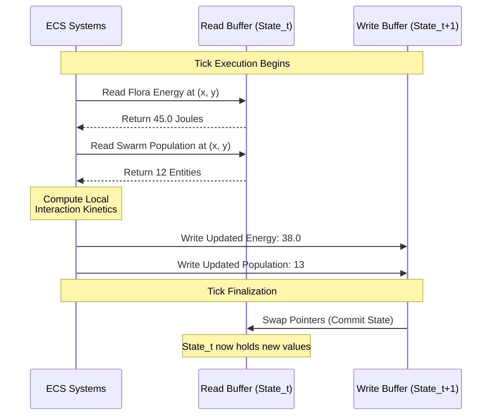
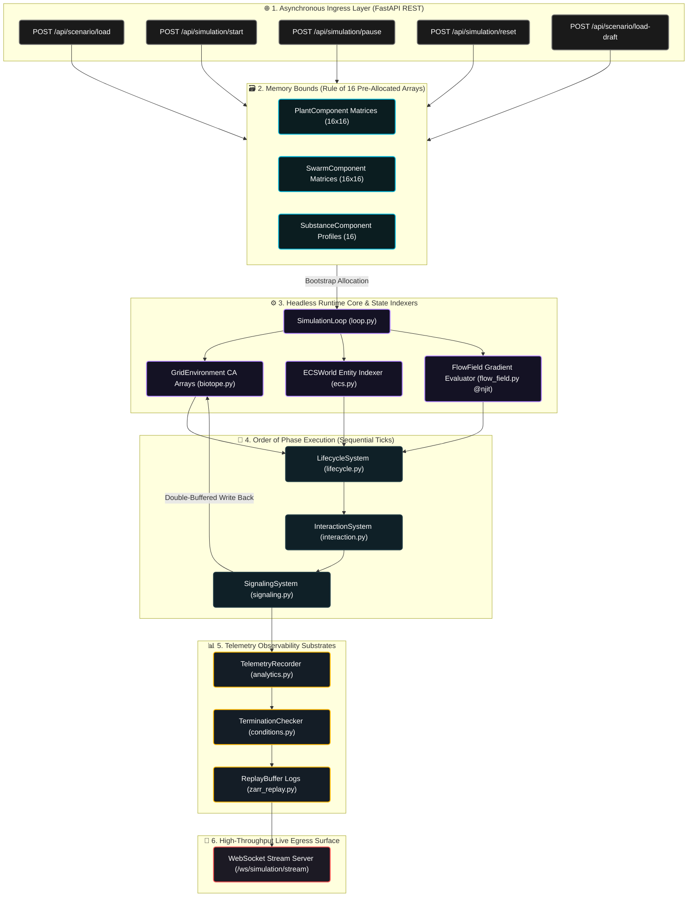

The PHIDS simulator is engineered as a headless, high-performance data-oriented system. It segregates logic from state to bypass the bottlenecks inherent in traditional Object-Oriented simulation frameworks. This document outlines the fundamental technical boundaries that ensure deterministic, reproducible simulation loops.

## Runtime Center of Gravity

The architectural nexus of the project is the `SimulationLoop` (`src/phids/engine/loop.py`). It coordinates the following independent stateful subsystems:

* **`GridEnvironment`**: Manages all vectorized 2D cellular automata fields using pre-allocated NumPy arrays.
* **`ECSWorld`**: Maintains the discrete biological entities and manages spatial locality indexing.
* **`TelemetryRecorder` & `ReplayBuffer`**: Handle data serialization and analytics observation at the conclusion of every tick.

## Layered Decomposition

1. **Schema & Ingress Layer**: Uses `pydantic` to enforce experimental bounds. Scenarios must be validated before the system initializes.
2. **Runtime Engine Layer**: A strict, unvarying sequence of phase operators.
3. **Interface Layer**: FastAPI provides asynchronous REST endpoints, WebSocket streaming, and manages the HTML presentation of `DraftState` versus live configurations.
4. **Persistence Layer**: Converts real-time system state into exported Polars DataFrames and Zarr replay logs for reproducibility.

## Double-Buffering Mechanics

To preclude race conditions during state mutation, PHIDS implements rigorous double-buffering for specific continuous fields (e.g., signal diffusion layers, plant energy arrays, and structural mass arrays).
When a system phase computes new values, it reads from the read-buffer (`State_Read`) and commits its mutations entirely to a write-buffer (`State_Write`). Only upon the conclusion of the phase are the buffer references swapped.

```mermaid
sequenceDiagram
    participant E as ECS Systems
    participant R as Read Buffer (State_t)
    participant W as Write Buffer (State_t+1)
    
    Note over E,W: Tick Execution Begins
    
    E->>R: Read Flora Energy at (x, y)
    R-->>E: Return 45.0 Joules
    
    E->>R: Read Swarm Population at (x, y)
    R-->>E: Return 12 Entities
    
    Note over E: Compute Local<br/>Interaction Kinetics
    
    E->>W: Write Updated Energy: 38.0
    E->>W: Write Updated Population: 13
    
    Note over E,W: Tick Finalization
    
    W->>R: Swap Pointers (Commit State)
    Note over R: State_t now holds new values
```

As illustrated above, during the tick, the Engine relies strictly on the `State_t` read buffer to retrieve localized information (such as Flora Energy or Swarm Population). All calculations of grazing, metabolic drain, and movement are processed using this frozen snapshot of the world. The resulting state changes are written independently to the `State_t+1` write buffer. Only after the entire tick concludes are the pointers swapped, instantly committing the new state. This guarantees that the order in which entities are processed during a tick never affects the outcome, preserving perfect mathematical determinism.

## Memory Bounding: The "Rule of 16"

Dynamic memory allocation during the hot simulation loop introduces prohibitive latency. The architecture imposes a strict upper bound constraint: the system accommodates a maximum of 16 distinct flora species, 16 herbivore species, and 16 substance mechanisms. Matrices (such as diet compatibility or trigger relationships) are pre-allocated at a fixed $(16 \times 16)$ scale during bootstrapping.

## 256-Bit AVX2 SIMD & Numba JIT Accelerated Kernels

To maximize CPU throughput across 256-bit AVX2 SIMD register architectures (YMM vector registers), hot-path simulation sub-routines are compiled into C via `@njit(cache=True)` or vectorized across contiguous memory blocks:

* **Numba JIT Swarm Anchoring (`_is_swarm_anchored_jit`)**: Pre-compiled 2D boolean diet matrix check in [movement.py](https://github.com/foersben/PHIDS/blob/main/src/phids/engine/systems/interaction/movement.py).
* **Dual-Proxy Layer Rebuild (`rebuild_energy_layer`)**: Two sequential C-level 256-bit AVX2 reductions in [biotope.py](https://github.com/foersben/PHIDS/blob/main/src/phids/engine/core/biotope.py): `vaddpd` (float64) for `E_current` and `vaddps` (float32, 2x throughput) for `M_structural`.
* **Photosynthetic Biomass Growth (`_grow_simd_jit`)**: Vectorized 168-hour stride growth scaling in [lifecycle.py](https://github.com/foersben/PHIDS/blob/main/src/phids/engine/systems/lifecycle.py).
* **Mycorrhizal Link Tax Deduction (`_apply_mycorrhizal_tax_jit`)**: 256-bit SIMD vector subtractions across root links in [lifecycle.py](https://github.com/foersben/PHIDS/blob/main/src/phids/engine/systems/lifecycle.py).
* **Airborne VOC Layer Decay (`_numba_decay_signal_layer`)**: In-place 256-bit YMM layer attenuation and epsilon clamping in [emission.py](https://github.com/foersben/PHIDS/blob/main/src/phids/engine/systems/signaling/emission.py).
* **Spatial Hash Query Buffer Reuse (`EMPTY_SET`)**: Singleton `frozenset` reuse for unoccupied cells in [ecs.py](https://github.com/foersben/PHIDS/blob/main/src/phids/engine/core/ecs.py) and [spatial.py](https://github.com/foersben/PHIDS/blob/main/src/phids/engine/systems/signaling/spatial.py).
* **Pre-Compiled Foraging Parameter Caching (`CachedFloraForagingParams` / `CachedHerbivoreForagingParams`)**: O(1) slot parameter resolution in [feeding.py](https://github.com/foersben/PHIDS/blob/main/src/phids/engine/systems/interaction/feeding.py).

## Structural Flow & Data Pipelines

To visualize how execution control and state flow traverse the system, we decompose the architecture into two primary perspectives: the high-level sequential pipeline and the detailed module mapping.

### High-Level Sequential Pipeline

The diagram below details the sequential phase flow, tracking how raw configuration inputs from the asynchronous API ingress are validated, bounded under structural constraints, processed in the engine core, and egressed as high-throughput compressed streams.

```mermaid
flowchart TD
    %% Base Styling & Theme Definitions
    classDef ingress fill:#1E293B, stroke:#3B82F6, stroke-width:2px, color:#F8FAFC, rx:8px, ry:8px
    classDef constraint fill:#1e1e1e, stroke:#94A3B8, stroke-width:2px, stroke-dasharray: 5 5, color:#F8FAFC, rx:8px, ry:8px
    classDef core fill:#312E81, stroke:#8B5CF6, stroke-width:2px, color:#F8FAFC, rx:8px, ry:8px
    classDef tick fill:#064E3B, stroke:#10B981, stroke-width:2px, color:#F8FAFC, rx:8px, ry:8px
    classDef telemetry fill:#78350F, stroke:#F59E0B, stroke-width:2px, color:#F8FAFC, rx:8px, ry:8px
    classDef egress fill:#4C1D95, stroke:#D946EF, stroke-width:2px, color:#F8FAFC, rx:8px, ry:8px

    %% 1. API INGRESS
    A["<b>🌐 1. Asynchronous Ingress Layer</b><br/><hr style='border:1px solid #3B82F6; margin: 4px 0;'/><br/><i>FastAPI REST Control Surface</i><br/>• POST /api/scenario/load<br/>• POST /api/simulation/start|pause<br/>• PUT /api/simulation/wind"]:::ingress

    %% 2. STRUCTURAL CONSTRAINTS
    B["<b>🗃️ 2. Structural Memory Bounding</b><br/><hr style='border:1px solid #94A3B8; margin: 4px 0;'/><br/><i>Strict Memory Bounding (Rule of 16)</i><br/>• [16x16] Diet Compatibility Matrix<br/>• [16x16] Substance Trigger Matrix<br/>• Pre-allocated NumPy Environment Arrays"]:::constraint

    %% 3. ENGINE CORE
    C["<b>⚙️ 3. Headless Engine Core</b><br/><hr style='border:1px solid #8B5CF6; margin: 4px 0;'/><br/><i>SimulationLoop (loop.py)</i><br/>• <b>ECSWorld:</b> O(1) Spatial Hash Entity Indexing<br/>• <b>GridEnvironment:</b> Double-Buffered CA Layers"]:::core

    %% 4. EXECUTION PIPELINE
    D["<b>🔄 4. Tick Execution Sequence</b><br/><hr style='border:1px solid #10B981; margin: 4px 0;'/><br/><i>Deterministic Phase Progression</i><br/>1. Flow-Field Generation (@njit)<br/>2. Camouflage Attenuation<br/>3. Lifecycle System (Growth, Seed Drops, Roots)<br/>4. Interaction System (Chemotaxis, Feeding, Mitosis)<br/>5. Signaling System (VOCs & Toxin Synthesis)<br/><i>* Ends with Active ECS Garbage Collection</i>"]:::tick

    %% 5. PERSISTENCE & ANALYTICS
    E["<b>📊 5. Persistence & Analytics</b><br/><hr style='border:1px solid #F59E0B; margin: 4px 0;'/><br/><i>TickMetrics Aggregation Payload</i><br/>• <b>TelemetryRecorder:</b> Lazy Polars DataFrames<br/>• <b>TerminationChecker:</b> Bound Limits (Z1 - Z7)<br/>• <b>ReplayBuffer:</b> Zarr Binary Checkpoints"]:::telemetry

    %% 6. EGRESS SURFACES
    F["<b>📡 6. High-Throughput Egress</b><br/><hr style='border:1px solid #D946EF; margin: 4px 0;'/><br/><i>WebSocket Transport</i><br/>• <b>/ws/simulation/stream:</b> 60fps zlib-compressed Arrays<br/>• <b>/ws/ui/stream:</b> Columnar JSON Diagnostics"]:::egress

    %% The Central Pipeline Spine
    A == Validated Pydantic Schema ==> B
    B == Structural Matrix Binding ==> C
    C == Trigger Continuous step() ==> D
    D == Commit Double-Buffer Swap ==> E
    E == Dispatch Frame Logs ==> F
```

### Module Mapping & State Transit

This diagram maps specific code modules (`loop.py`, `biotope.py`, `ecs.py`, `lifecycle.py`, etc.) and details how state, double-buffered writes, and telemetry frames traverse the operational system.

```mermaid
flowchart TD
    %% Style Definitions
    classDef ingressLayer fill:#1a1a1a,stroke:#707070,stroke-width:2px,color:#ffffff,rx:5px,ry:5px;
    classDef dataRegistry fill:#0b1d20,stroke:#00b4d8,stroke-width:2px,color:#ffffff,rx:5px,ry:5px;
    classDef coreEngine fill:#141224,stroke:#b388ff,stroke-width:2px,color:#ffffff,rx:5px,ry:5px;
    classDef pipelineSys fill:#0f2027,stroke:#203a43,stroke-width:2px,color:#ffffff,rx:5px,ry:5px;
    classDef storageTelemetry fill:#141d26,stroke:#ffb703,stroke-width:2px,color:#ffffff,rx:5px,ry:5px;
    classDef egressLayer fill:#1c1a24,stroke:#ff5555,stroke-width:2px,color:#ffffff,rx:5px,ry:5px;

    %% 1. Ingress Layer
    subgraph Ingress_Layer ["🌐 1. Asynchronous Ingress Layer (FastAPI REST)"]
        A1["POST /api/scenario/load"]
        A2["POST /api/simulation/start"]
        A3["POST /api/simulation/pause"]
        A4["POST /api/simulation/reset"]
        A5["POST /api/scenario/load-draft"]
    end

    %% 2. System Pre-Allocation Bounds (Rule of 16)
    subgraph Component_Registry ["🗃️ 2. Memory Bounds (Rule of 16 Pre-Allocated Arrays)"]
        PC["PlantComponent Matrices (16x16)"]
        SC["SwarmComponent Matrices (16x16)"]
        SUB["SubstanceComponent Profiles (16)"]
    end

    %% 3. Engine Core
    subgraph Engine_Core ["⚙️ 3. Headless Runtime Core & State Indexers"]
        L["SimulationLoop (loop.py)"]
        BIO["GridEnvironment CA Arrays (biotope.py)"]
        ECS["ECSWorld Entity Indexer (ecs.py)"]
        FF["FlowField Gradient Evaluator (flow_field.py @njit)"]
    end

    %% 4. Execution Pipeline Sequence
    subgraph Pipeline_Systems ["🔄 4. Order of Phase Execution (Sequential Ticks)"]
        LC["LifecycleSystem (lifecycle.py)"]
        INT["InteractionSystem (interaction.py)"]
        SIG["SignalingSystem (signaling.py)"]
        
        LC --> INT --> SIG
    end

    %% 5. Analytics & Checkpointing
    subgraph Data_Analytics ["📊 5. Telemetry Observability Substrates"]
        AN["TelemetryRecorder (analytics.py)"]
        COND["TerminationChecker (conditions.py)"]
        REP["ReplayBuffer Logs (zarr_replay.py)"]
    end

    %% 6. Output Egress
    subgraph Egress_Layer ["📡 6. High-Throughput Live Egress Surface"]
        A6["WebSocket Stream Server (/ws/simulation/stream)"]
    end

    %% Straight Vertical Pipeline Flows
    A1 & A2 & A3 & A4 & A5 --> Component_Registry
    Component_Registry -->|Bootstrap Allocation| L
    
    L --> BIO & ECS & FF
    BIO & ECS & FF --> LC
    
    SIG -->|Double-Buffered Write Back| BIO
    SIG --> AN
    
    AN --> COND --> REP --> A6

    %% Style Assignments
    class A1,A2,A3,A4,A5 ingressLayer;
    class PC,SC,SUB dataRegistry;
    class L,BIO,ECS,FF coreEngine;
    class LC,INT,SIG pipelineSys;
    class AN,COND,REP storageTelemetry;
    class A6 egressLayer;
```

In this detailed workflow:

* **Phase 1 (Ingress)** handles external control commands.
* **Phase 2 (Registry)** enforces the structural constraints (Rule of 16) and allocates the simulation world.
* **Phase 3 (Engine Core)** initializes the persistent state buffers and the high-performance spatial indexer.
* **Phase 4 (Pipeline)** represents the iterative tick.
* **Phase 5 (Data Analytics)** is where telemetry is lazily recorded and termination is checked. Crucially, the **Lifecycle** and **Interaction** systems modify the write buffer, which is then synchronized with the **Signaling** system and finally committed.
* **Phase 6 (Egress)** pushes the resulting visual state to the live dashboard.

## Component State Management

Component state is strictly partitioned into read and write buffers.
The Interaction System reads from the active `read_buffer` and writes new kinematic and metabolic data to the `write_buffer`.
The Signaling System reads from the active `read_buffer` and writes chemical concentrations to the `write_buffer`.

## Numba JIT Array Access

Spatial arrays rely on native 2D NumPy float arrays (e.g., `layer[x, y]`) inside Numba `@njit(parallel=True)` pre-compiled kernels. 

Rather than relying on abstract multi-dimensional indices or object-oriented coordinate classes, the engine evaluates ecological phenomena-like flow-field diffusion and reaction kinetics-using explicit, parallelized `prange` loops over these pre-allocated 2D matrices. This ensures optimal memory access patterns and L1/L3 cache coherence across the double-buffered layers without the massive allocation overhead of creating intermediate objects per grid cell.
