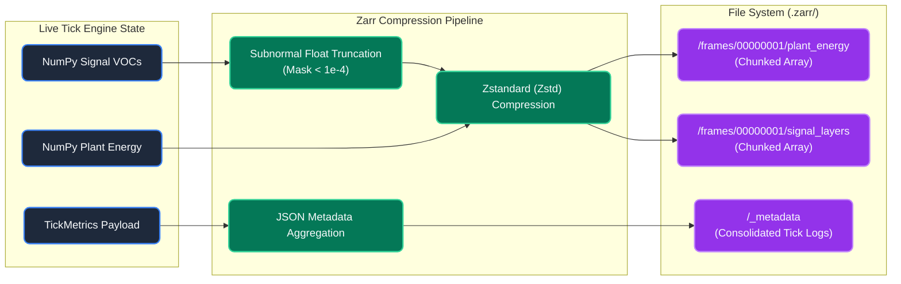

The true value of the PHIDS simulator rests on its capacity to log, analyze, and export ecological dynamics reproducibly. The system treats telemetry capture not as an afterthought, but as a primary mathematical constraint synchronized strictly to the conclusion of the simulation tick.

## The Tick Metrics Layer

After the completion of the `signaling` phase, the engine consolidates critical system markers into a discrete `TickMetrics` payload. This includes total flora energy, species extinction events, and precise tallies of immediate biological death causes:

* Reproduction exhaustion
* Mycorrhizal link construction cost
* Herbivory
* Toxin synthesis maintenance (Defense Economy)
* Natural metabolic deficit

## Polars Data Aggregation

To manage substantial longitudinal data streams gracefully without memory leaks, the `TelemetryRecorder` relies on the high-performance `polars` library.

Instead of actively concatenating multidimensional DataFrames per tick (which induces massive O(N^2) overhead on array resizing), the recorder appends raw Python dictionaries to a list. Upon request (for example, during a CSV export or UI polling event), it executes a lazy materialization into a statically typed Polars DataFrame. This flattened scalar table expands seamlessly as new species emerge or go extinct without requiring full grid scans.

## Replay Buffers & Teleplay Storage Backends

Simultaneous to metric tracking, PHIDS serializes continuous-field representations (plant energy per species, signal concentrations, toxin fields, and flow-field gradients) using one of two selectable replay backends depending on the configuration:

### 1. Zarr Replay Buffer (`ZarrReplayBuffer`)

When the `zarr` package is installed and `replay_backend = "zarr"` is requested, PHIDS leverages a high-performance chunked columnar storage model:

The flowchart demonstrates how PHIDS achieves its high-throughput logging. Rather than dumping raw memory to disk, the engine pipelines the data. Continuous float arrays (like plant energy and signals) are masked to prevent subnormal floats, compressed via Zstandard, and written to chunked directories. Concurrently, discrete scalar metrics (like populations and death causes) are aggregated into a single JSON metadata file. This ensures that when scientists later analyze the replay, they do not have to load the entire simulation into memory just to check a few frames or conditions.

* **Chunked Group Layout**: Frames are persisted directly to disk inside a `.zarr` directory structured as `frames/{frame_idx:08d}/{field_name}`.
* **Consolidated Metadata**: High-frequency metadata (tick, termination state, reason) is written in a single consolidated JSON array (`_metadata`) at the root, enabling rapid seeking and boundary checks without decompressing spatial field chunks.
* **Zstd Compression**: Field chunks are compressed using Zstandard, providing superior compression ratios and read/write speeds for dense floating-point grids.
* **Subnormal Float Truncation**: To maximize Zarr compression ratios without impacting simulation performance, the `signal_layers` array is selectively masked for subnormal values ($\varepsilon < 10^{-4}$) during serialization. Other continuous fields (like `flow_field` and `plant_energy`) rely exclusively on the engine's internal JIT optimizations (such as `chemotaxis_truncate_threshold`) to prevent hardware denormalization, as applying a global Python masking step would induce unacceptable memory allocation churn.

### 2. Legacy Replay Buffer (`ReplayBuffer`)

If `zarr` is unavailable or `replay_backend` is unset, the engine falls back to standard serialized dictionaries:

* **Serialization**: States are encoded using `msgpack` and compressed via `zlib` into an append-only, length-prefixed binary log file on disk.

Both backends implement a strict data-oriented design: snapshots are decomposed into structured arrays during checkpointing and reassembled into the unified state format for re-simulation, allowing deterministic post-hoc analysis and playback without executing active loop logic.

## Termination Protocol ($Z_1$ - $Z_7$)

The engine integrates continuous mathematical checks against operational boundaries. If any of these bounds are crossed, the loop immediately halts execution and logs the termination code into the telemetry output:

* **Max Duration ($Z_1$)**: A predetermined cap on simulation ticks. The scenario successfully ran its course without collapsing.
* **Extinctions ($Z_2, Z_3, Z_4, Z_5$)**: Target or global population collapse. A species was entirely wiped out by starvation, out-competition, or herbivory.
* **Runaway Growth ($Z_6, Z_7$)**: Exceeding specified energy/population carrying capacities. The biological parameters were unbalanced, causing a trophic explosion that would otherwise freeze the CPU.

Termination flags generated here provide vital context as to *why* a particular experimental model collapsed, allowing for deeper scientific comparison across scenario families and parameter sweeps.
