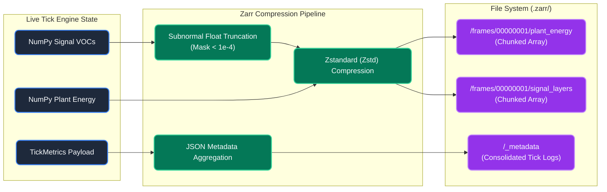
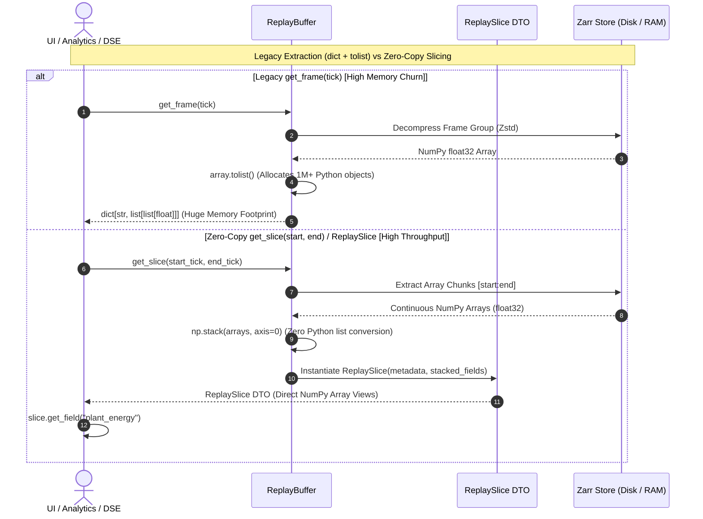

The true value of the PHIDS simulator rests on its capacity to log, analyze, and export ecological dynamics reproducibly. The system treats telemetry capture not as an afterthought, but as a primary mathematical constraint synchronized strictly to the conclusion of the simulation tick.

## The Tick Metrics Layer

After the completion of the `signaling` phase, the engine consolidates critical system markers into a discrete `TickMetrics` payload. This includes total flora energy, species extinction events, and precise tallies of immediate biological death causes:

* Reproduction exhaustion
* Mycorrhizal link construction cost
* Herbivory
* Toxin synthesis maintenance (Defense Economy)
* Natural metabolic deficit

### Telemetry Time-Series Continuity (Phase-Staggered Cohorts)

To ensure that telemetry charts, exported DataFrames, and UI line plots remain clean and scientifically interpretable:
- **Continuous $C^0$ Macro Curves**: Plant photosynthetic growth ($168\text{-tick}$ stride) and swarm metabolic rate ($24\text{-tick}$ stride) update via Phase-Staggered Cohorts (`(entity_id % S) == (tick % S)`). On each tick $t$, exactly $\frac{1}{S}$-th of all entities update their reserves.
- **No Sawtooth Artifacts**: Because biological updates are evenly staggered across every tick rather than dumped in a single bulk tick every 24 or 168 ticks, aggregate system metrics (such as total flora energy, total herbivore biomass, and active mycorrhizal links) advance smoothly without artificial sawtooth impulse spikes.

## Polars Data Aggregation

To manage substantial longitudinal data streams gracefully without memory leaks, the `TelemetryRecorder` relies on the high-performance `polars` library.

Instead of actively concatenating multidimensional DataFrames per tick (which induces massive O(N^2) overhead on array resizing), the recorder appends raw Python dictionaries to a list. Upon request (for example, during a CSV export or UI polling event), it executes a lazy materialization into a statically typed Polars DataFrame. This flattened scalar table expands seamlessly as new species emerge or go extinct without requiring full grid scans.

## Replay Buffers & Teleplay Storage Backends

Simultaneous to metric tracking, PHIDS serializes continuous-field representations (plant energy per species, signal concentrations, toxin fields, and flow-field gradients) using one of two selectable replay backends depending on the configuration:

### 1. Zarr Replay Buffer (`ZarrReplayBuffer`)

When the `zarr` package is installed and `replay_backend = "zarr"` is requested, PHIDS leverages a high-performance chunked columnar storage model:

The flowchart demonstrates how PHIDS achieves its high-throughput logging. Rather than dumping raw memory to disk, the engine pipelines the data. Continuous float arrays (like plant energy and signals) are masked to prevent subnormal floats, compressed via Zstandard, and written to chunked directories. Concurrently, discrete scalar metrics (like populations and death causes) are aggregated into a single JSON metadata file. This ensures that when scientists later analyze the replay, they do not have to load the entire simulation into memory just to check a few frames or conditions.

* **Chunked Group Layout**: Frames are persisted directly to disk inside a `.zarr` directory structured as `frames/{frame_idx:08d}/{field_name}`.
* **Consolidated Metadata**: High-frequency metadata (tick, termination state, reason) is written in a single consolidated JSON array (`_metadata`) at the root, enabling rapid seeking and boundary checks without decompressing spatial field chunks.
* **Zstd Compression**: Field chunks are compressed using Zstandard, providing superior compression ratios and read/write speeds for dense floating-point grids.
* **Subnormal Float Truncation**: To maximize Zarr compression ratios without impacting simulation performance, the `signal_layers` array is selectively masked for subnormal values ($\varepsilon < 10^{-4}$) during serialization. Other continuous fields (like `flow_field` and `plant_energy`) rely exclusively on the engine's internal JIT optimizations (such as `chemotaxis_truncate_threshold`) to prevent hardware denormalization, as applying a global Python masking step would induce unacceptable memory allocation churn.

### 2. Zero-Copy `ReplaySlice` Architecture

To prevent severe memory inflation and garbage collection churn during temporal playback, PHIDS provides a high-throughput, zero-copy slice extraction API via `ReplaySlice` and `get_slice(start_tick, end_tick)`:

* **Zero Python List Allocation**: Legacy frame retrieval (`get_frame()`) converts grid matrices into nested Python lists via `.tolist()`, instantiating over $1,000,000$ Python objects per grid frame. The `get_frame_arrays()` and `get_slice()` methods bypass `.tolist()` entirely, returning stacked NumPy arrays directly.
* **`ReplaySlice` DTO**: Encapsulates metadata slices and stacked multi-tick NumPy fields (e.g. shape `(T, W, H)` or `(T, C, W, H)`), making replay views directly compatible with Polars, NumPy memoryviews, or PyTorch tensors.

### 3. No-Op Replay Buffer (`NoOpReplayBuffer`)

If `zarr` is unavailable or `replay_backend` is unset, the engine falls back to a structural dummy endpoint (`NoOpReplayBuffer`):

* **Overhead Bypass**: Rather than serializing spatial arrays to disk, this backend completely intercepts and discards telemetry payloads. This ensures that headless environments running purely for Polars statistical generation (or Reinforcement Learning) do not incur massive disk I/O penalties.

Both backends share a unified interface (`ReplaySlice`, `get_slice`, `get_frame_arrays`), allowing the core `SimulationLoop` to remain entirely decoupled from the underlying storage logic.

## Termination Protocol ($Z_1$ - $Z_7$)

The engine integrates continuous mathematical checks against operational boundaries. If any of these bounds are crossed, the loop immediately halts execution and logs the termination code into the telemetry output:

* **Max Duration ($Z_1$)**: A predetermined cap on simulation ticks. The scenario successfully ran its course without collapsing.
* **Extinctions ($Z_2, Z_3, Z_4, Z_5$)**: Target or global population collapse. A species was entirely wiped out by starvation, out-competition, or herbivory.
* **Runaway Growth ($Z_6, Z_7$)**: Exceeding specified energy/population carrying capacities. The biological parameters were unbalanced, causing a trophic explosion that would otherwise freeze the CPU.

Termination flags generated here provide vital context as to *why* a particular experimental model collapsed, allowing for deeper scientific comparison across scenario families and parameter sweeps.
