# Testing Architecture

This document aggregates PHIDS test suite topography, taxonomy, system mapping, quality analysis, and strategic recommendations for improving the testing rig.

## Test Suite Taxonomy & Execution Topography

The PHIDS testing rig is architecturally partitioned into seven distinct lanes, mapping the flow of data from property-invariant validation to live transport stream resilience. This layered defense ensures that computational rules align with the biological model, data structures gracefully serialize, and the engine correctly protects constraints (e.g., the Rule of 16).

* **Unit Telemetry and Data Engineering:** Found in `tests/unit/telemetry/`, tests here ensure that Polars DataFrames correctly reflect cross-tick invariants. E.g., handling zeros correctly for absent species, preserving flat column paradigms over nested dicts, and maintaining data correctness.
* **Unit Analytics (DSE):** Found in `tests/unit/analytics/`, tests verify the Differential Stability Explorer optimizer (`test_dse_optimizer.py`) and candidate-pruning logic (`test_dse_pruning.py`) using deterministic fixture parameter sets.
* **Unit Engine Systems (Numba Helpers):** Found in `tests/unit/engine/systems/`, tests isolate low-level interaction helper contracts (`test_interaction_py_helpers.py`) using plain Python stubs that bypass the JIT boundary so branch semantics can be asserted without Numba's compilation overhead.
* **Integration API and HTTP Boundaries:** Defined largely within `tests/integration/api/`, these tests enforce the outer perimeter. They ensure malformed payloads return specific (400, 422, 404) explicit HTTP codes before polluting internal state, validate type-coercion behaviors on builder routes, and protect hard limits like the maximum of 16 branches (Rule of 16).
* **Property Invariants and Mathematics:** Managed within `tests/integration/systems/test_interaction_property_invariants.py`. These run deterministic, bounded parameterized loops enforcing exact closed-form solutions for metabolic attrition, reproduction bounds, and monotonic behaviors regarding populations and baseline energy.
* **Hypothesis and Mutation Pilot Lanes:** Found in `tests/integration/systems/test_interaction_mutation_pilot.py` and `test_interaction_hypothesis_pilot.py`. These pilots use random-walk crowding boundaries, test edge cases (like 0 velocity floors or precise survival boundaries), and use Hypothesis-generated sequences to ensure constraints hold unconditionally under bounded inputs.
* **Performance Budgets and Websockets Transport:** Asserted under `tests/benchmarks/` and `tests/integration/api/test_websocket_manager.py`. These bounds verify deterministic, environment-overridable millisecond limits for specific hotspots (like diffusion flow fields or websocket payload generation) using `pytest-benchmark`. In addition, WebSockets verify graceful teardown, snapshot cache reuse for unchanged ticks, and resilience to client disconnection.

## System Mapping & Test Relations

```mermaid
graph TD
    %% Source Modules
    subgraph Engine["Core Simulation Engine"]
        Interaction["Interaction System"]
        Signaling["Signaling & Diffusion"]
        Lifecycle["Lifecycle & Mitosis"]
        NumbaHelpers["Numba Interaction Helpers"]
    end

    subgraph Analytics["Analytics & Optimisation"]
        DSEOpt["DSE Optimizer"]
        DSEPrune["DSE Candidate Pruning"]
    end

    subgraph Boundaries["API & Transport Layers"]
        API["FastAPI Routes & UI Config"]
        WebSockets["WebSocket Managers"]
    end

    subgraph Telemetry["Data & Export"]
        DF["Polars DataFrame Gen"]
        Export["CSV / NDJSON Export"]
    end

    %% Test Paths
    subgraph Mathematical_Validation["Property Validation (Math Invariants)"]
        PropTests["Parametrized Invariants (test_interaction_property_invariants.py)"]
    end

    subgraph Pilot_Lanes["Pilot Lanes (Stochastic & Mutation)"]
        Hypothesis["Hypothesis Sweeps (test_interaction_hypothesis_pilot.py)"]
        Mutation["Edge-Case Sentinels (test_interaction_mutation_pilot.py)"]
    end

    subgraph Transport_Validation["API & Contract Testing"]
        APITests["Route Type & Reject (test_api_builder_and_helpers.py)"]
        WSTests["Stream Resilience (test_websocket_manager.py)"]
        MCPTests["MCP Command Loop (test_cli_main.py)"]
    end

    subgraph Unit_Analytics["Unit Analytics"]
        DSEOptTests["DSE Optimizer (test_dse_optimizer.py)"]
        DSEPruneTests["DSE Pruning (test_dse_pruning.py)"]
    end

    subgraph Unit_Engine_Systems["Unit Engine Systems"]
        PyHelpersTests["Interaction Helpers (test_interaction_py_helpers.py)"]
    end

    subgraph Benchmarks["Performance Budgets"]
        Bench["Millisecond Execution Budgets (tests/benchmarks)"]
    end

    subgraph Data_Validation["Telemetry Integration"]
        TelemetryTests["Zero-Fill & Schema (test_telemetry_per_species.py)"]
    end

    %% Wiring
    Interaction -.-> PropTests
    Interaction -.-> Hypothesis
    Interaction -.-> Mutation
    Lifecycle -.-> PropTests
    Lifecycle -.-> Hypothesis
    Signaling -.-> Bench
    NumbaHelpers -.-> PyHelpersTests

    DSEOpt -.-> DSEOptTests
    DSEPrune -.-> DSEPruneTests

    API -.-> APITests
    WebSockets -.-> WSTests
    API -.-> MCPTests

    DF -.-> TelemetryTests
    Export -.-> Bench
```



## Deep-Dive Quality Analysis

### Mathematical & Trophic Invariant Correctness

**Current Status:** Excellent.

The math checks found in `test_interaction_property_invariants.py` verify that attrition and reproduction mathematically map strictly to closed-form calculations under varying bounds. This guarantees exact conservation logic (especially via `test_mitosis_threshold_and_partition_invariants`) when partitions happen.

**Masked Detail:** The current configuration heavily tests exact equality (`==`) or tight bounds (via `pytest.approx`), but it rarely exposes the explicit mathematical boundaries of floating-point arithmetic (specifically related to the `SIGNAL_EPSILON` truncation). While some unit tests do check this, larger trophic networks might conceal slow compounding truncation drift.

### Functional & Behavioral Completeness

**Current Status:** Good, but isolated.

The test rig effectively validates API constraints (malformed JSON, 422 triggers, Rule of 16 boundaries). The mutation pilot effectively ensures branch coverage for isolated systems (random-walk triggers, crowding caps, feeding rules).

**Masked Detail:** There is a distinct lack of deep system interaction testing representing long-term runaway ecological scenarios or long tail chain reactions (e.g., continuous multi-generational evolutionary loops or directional wind-dispersal vectors leading to permanent biotope dominance).

### Performance Regressions & Resource Budgets

**Current Status:** Budgeted but lacking Memory Tracking.

Latency throughput tests (`tests/benchmarks/`) are robustly constrained with clear median and $p_{95}$ failing/warning thresholds explicitly configurable via environment variables (e.g., `PHIDS_DIFFUSION_SPARSE_WARN_MEAN_MS`). Tests effectively isolate specific Numba algorithms or export logic.

**Masked Detail:** There is zero instrumentation measuring memory allocation churn, `gc` impact, or deep object instantiation within inner simulation loops. The focus is entirely on runtime latency (`wall-clock`), which masks potential multi-tick memory blowups that slow down execution due to garbage collection over time.

### Simulation Comparison Benchmarking (Cross-Commit & JIT)

To protect the simulation engine from performance regressions across refactorings, a custom comparison script is provided in [run_sim_benchmark.py](file:///home/benni/Documents/antigravity_workspace/PHIDS/scripts/run_sim_benchmark.py). This utility compares the ticks-per-second throughput of the simulation across different JIT compilation states and Git commits/branches.

#### Features

* **No Workspace Intrusion:** Uses a temporary local repository clone (`.cache/bench_clone`) to perform all checkouts. Your active branch and uncommitted modifications remain completely untouched.
* **Warmup Phase:** Simulates 10 warmup ticks prior to starting the timer to allow JIT compilation to complete, ensuring the JIT measurements track execution throughput, not compiling latency.
* **Statistical Averaging:** Supports repeating the benchmark runs multiple times to compute average durations, reducing measurement noise.

#### Usage via Justfile

Run the comparison benchmark directly using:

```bash
just bench-compare <ref1> <ref2> <scenario_path> [ticks] [repeats] [warmup]
```

Example comparing two commit hashes with 500 ticks repeated 3 times:

```bash
just bench-compare 17d6980299102e5259fd752ade5ab2f1430b0e17 f3d066a886e994934066fafd6be4ba12899e772e examples/rectangular_crossfire_extended.json 500 3
```

### Concurrency, WebSockets, & State Pollution

**Current Status:** Verified.

Stream durability is verified nicely via `test_websocket_manager.py`. It explicitly verifies missing/terminated loops behave correctly, snapshot caching limits redundant work for unchanged ticks, and tests resilience around `WebSocketDisconnect` handling.

**Masked Detail:** The integration lacks tests around actual network stress concurrent to ongoing ticks. The stream test validates explicit disconnects but does not cover race conditions when a simulation loop executes heavy writes synchronously with thousands of client subscriptions.

## Testing Gaps & Recommendations

### Testing Gaps & Vulnerabilities Register

| Area / Target Sub-system | Functional Behavior / Invariant Expected | Current Testing Limitation | Severity / Risk |
| :--- | :--- | :--- | :--- |
| **GridEnvironment & Math** | Floating Point `SIGNAL_EPSILON` precision in Trophic layers | Tightly managed in isolated units but under-asserted across massive multi-tick trophic loops where truncation compounds. | `[CRITICAL COMPLIANCE]` |
| **Simulation Core Dynamics** | Multi-Generational Sub-System Reactions | Missing tests for long-term runaway cascade reactions (e.g., irreversible defense synthesis cascading across biomes). | `[CRITICAL COMPLIANCE]` |
| **Performance Benchmarks** | Memory Allocation Churn & GC Monitoring | Benchmarks explicitly track wall-clock execution limits but lack `tracemalloc` to track allocations, masking internal memory leaks. | `[STRUCTURAL ARCHITECTURE]` |
| **API WebSockets** | Network Stalls & Asynchronous Race Conditions | No validation for transport durability when thousands of reconnections happen mid-tick, missing active stress testing. | `[STRUCTURAL ARCHITECTURE]` |
| **API Integration** | Mock System Pollution | Hardcoded UI configurations or states modified in tests may not reliably clean themselves up if not strictly guarded by fixtures, occasionally relying on default drafts. | `[QUALITY-OF-LIFE / DEVEX]` |

### Ranked Strategic Recommendations

#### `[CRITICAL COMPLIANCE]`

1. **Implement Multi-Generational Trophic Cascade Assertions:** Build new integration tests that run for thousands of ticks testing compound network reactions (e.g., continuous unidirectional wind leading to complete grid colonization, ensuring mass and energy conservation holds perfectly).
2. **Global Precision Analysis:** Audit and inject specific mathematical failure thresholds testing for compounding `SIGNAL_EPSILON` drifts inside massive environment grids across large tick durations.

#### `[STRUCTURAL ARCHITECTURE]`

1. **Integrate Memory Profiling into Benchmarks:** Integrate `pytest-memray` or `tracemalloc` assertions into the current latency benchmarks to measure memory allocations strictly per-tick.
2. **WebSocket Stress Scenarios:** Implement tests simulating violent connection loss, massive concurrent connections, and network saturation during active simulation writes to protect against async loop blocking.

#### `[QUALITY-OF-LIFE / DEVEX]`

1. **Fixture & Mock System Isolation:** Move all hardcoded payload configurations inside API integration tests into centralized reusable Pytest fixtures.
