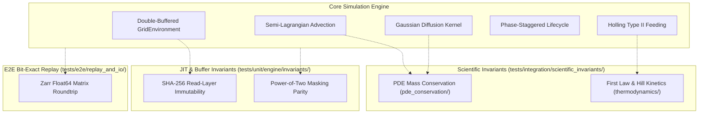
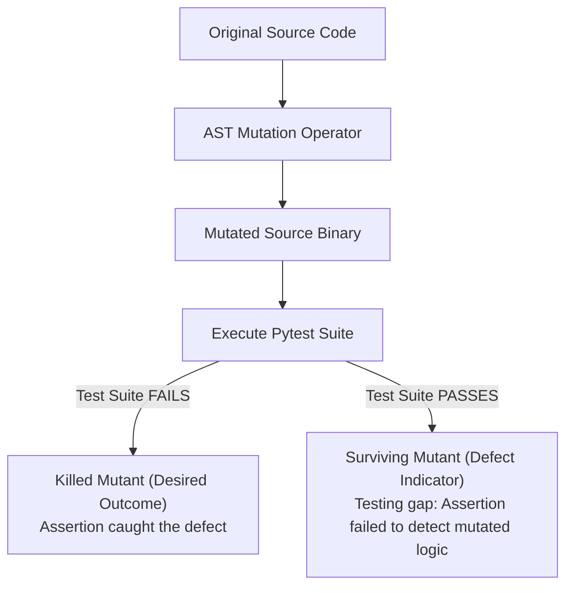
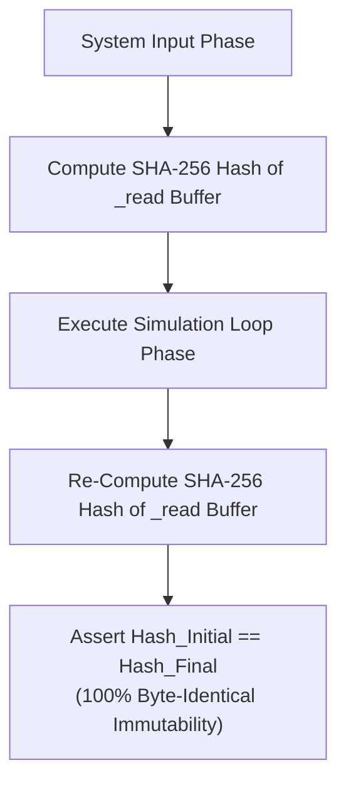
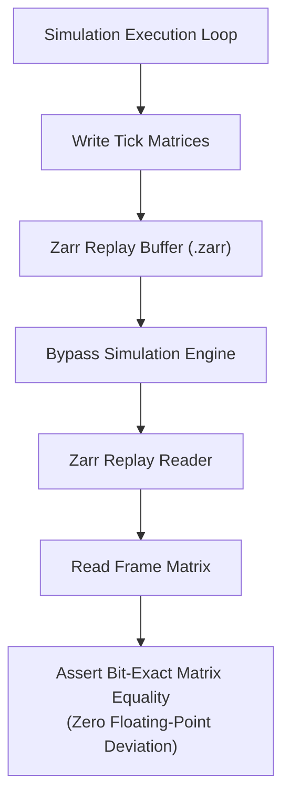

This document aggregates PHIDS test suite topography, taxonomy, scientific invariant verification, system mapping, quality analysis, and governance rules.

## Test Suite Taxonomy & Execution Topography

The PHIDS testing rig is architecturally partitioned into distinct domain-focused layers mapping data flow from pure component contracts and physical conservation laws to live transport streams and bit-exact Zarr replay buffers.

```text
tests/
├── integration/
│   └── scientific_invariants/
│       ├── pde_conservation/
│       │   ├── test_advection_mass_conservation.py
│       │   ├── test_chemical_positivity_and_clamping.py
│       │   └── test_convolution_exponential_decay.py
│       └── thermodynamics/
│           ├── test_feeding_first_law.py
│           ├── test_hill_kinetics_monotonicity.py
│           └── test_holling_type_ii_bounds.py
└── unit/
    ├── engine/
    │   ├── core/
    │   │   ├── test_ecs_world.py
    │   │   ├── test_herbivore_params_fallbacks.py
    │   │   └── test_placement.py
    │   ├── invariants/
    │   │   ├── test_jit_capacity_masking_parity.py
    │   │   ├── test_jit_neighbour_gathering_parity.py
    │   │   ├── test_jit_zero_weight_fallback.py
    │   │   └── test_read_layer_immutability.py
    │   ├── test_spatial_boundary_conditions.py
    │   └── systems/
    │       ├── test_conditions_coercion.py
    │       ├── test_emission_upkeep_branches.py
    │       ├── test_flora_germination_fallbacks.py
    │       ├── test_movement_branch_fallbacks.py
    │       ├── test_phase_staggered_cohorts.py
    │       ├── test_seed_dispersal_isotropy.py
    │       ├── test_spatial_signaling_branches.py
    │       └── test_trigger_synthesis_rearm.py
    ├── io/
    │   ├── test_scenario_validation_edge_cases.py
    │   └── test_zarr_replay_edge_cases.py
    ├── api/
    │   └── test_mcp_server_tools.py
    └── e2e/
        └── replay_and_io/
            └── test_zarr_replay_bit_exactness.py
```

### Partitioning & Domain Ownership

* **Scientific & Physical Invariants (`tests/integration/scientific_invariants/`):**
    * `pde_conservation/`: Validates Semi-Lagrangian backward advection mass conservation under uniform wind fields ($\nabla \cdot \vec{v} = 0$, $\text{rtol} \le 1\times 10^{-5}$), divergent wind drift upper bounds ($\le 2.0\%$), concentration non-negativity ($c \ge 0.0$), and subnormal float tail zeroing below `SIGNAL_EPSILON` ($1\times 10^{-4}$).
    * `thermodynamics/`: Enforces the First Law of Thermodynamics during herbivory ($\Delta E_{\text{herbivore}} + E_{\text{digestive\_loss}} = \Delta E_{\text{plant\_consumed}}$), Holling Type II asymptotic upper bounds ($I(N) \le 1/T_h$), and monotone Hill kinetics ($c_1 \le c_2 \implies S(c_1) \le S(c_2)$).
* **Double-Buffering & JIT Invariants (`tests/unit/engine/invariants/`):** Validates cryptographic SHA-256 byte hash read-layer immutability before `rebuild_energy_layer()`, Numba `@njit` parity for power-of-two bitwise AND coordinate masking `& (W-1)` vs. modulo `% W`, and branchless carrying capacity masking.
* **Engine Lifecycle & Systems (`tests/unit/engine/systems/`):** Validates Kolmogorov-Smirnov spatial isotropy ($\theta \sim U(-\pi, \pi)$, $p > 0.01$) for $10,000$ seed raycasting draws, modulo cohort gating completeness across 168-tick windows, defense upkeep energy maintenance, and trigger re-arming logic.
* **Unit Analytics (EEDSE):** Found in `tests/unit/analytics/`, tests verify the Differential Stability Explorer optimizer and candidate-pruning logic using deterministic parameters. *(Note: Extensive DSE testing is deferred until core engine & database features are finalized prior to v1.0)*.
* **Integration API & Transport:** Found in `tests/integration/api/`, enforcing FastAPI route schemas, WebSocket stream resilience, snapshot caching, and Rule of 16 boundaries.
* **E2E & Bit-Exact Replay (`tests/e2e/replay_and_io/`):** Validates Float64 matrix round-trips across simulated frames stored in Zarr replay buffers to ensure bit-exact playback bypassing engine loops.
* **Performance Benchmarks (`tests/benchmarks/`):** Latency budgets asserted via `pytest-benchmark` with environment-overridable mean/median thresholds.

## System Mapping & Test Relations


```mermaid
graph TD
    subgraph Engine["Core Simulation Engine"]
        Advection["Semi-Lagrangian Advection"]
        Diffusion["Gaussian Diffusion Kernel"]
        Feeding["Holling Type II Feeding"]
        Lifecycle["Phase-Staggered Lifecycle"]
        DoubleBuffer["Double-Buffered GridEnvironment"]
    end

    subgraph Scientific_Invariants["Scientific Invariants (tests/integration/scientific_invariants/)"]
        PDE["PDE Mass Conservation (pde_conservation/)"]
        Thermo["First Law & Hill Kinetics (thermodynamics/)"]
    end

    subgraph JIT_Invariants["JIT & Buffer Invariants (tests/unit/engine/invariants/)"]
        ReadImmutability["SHA-256 Read-Layer Immutability"]
        JITParity["Power-of-Two Masking Parity"]
    end

    subgraph Replay_IO["E2E Bit-Exact Replay (tests/e2e/replay_and_io/)"]
        ZarrReplay["Zarr Float64 Matrix Roundtrip"]
    end

    Advection -.-> PDE
    Diffusion -.-> PDE
    Feeding -.-> Thermo
    DoubleBuffer -.-> ReadImmutability
    Engine -.-> JITParity
    Engine -.-> ZarrReplay
```

## Deep-Dive: Scientific Invariant & Physical Conservation Testing

### 1. Mathematical & Physical Foundations

Computational ecological simulations are fundamentally vulnerable to numerical artifacts. When discretized reaction-diffusion-advection PDEs, continuous Holling functional responses, and discrete multi-agent interactions run across millions of ticks, small numerical errors can compound into unphysical mass creation, artificial species extinction, or runaway energetic instabilities. The PHIDS scientific invariant testing suite enforces physical conservation laws and mathematical limits as hard system assertions.

#### Reaction-Diffusion-Advection PDE Conservation

The continuous spatio-temporal dynamics of plant defensive toxins and volatile organic compounds (VOCs) are governed by the partial differential equation:

$$\frac{\partial c(x,y,t)}{\partial t} + \vec{v}(x,y) \cdot \nabla c(x,y,t) = D \nabla^2 c(x,y,t) - \lambda c(x,y,t)$$

where $\vec{v}(x,y)$ is the wind velocity field, $D$ is the isotropic diffusion coefficient, and $\lambda$ is the chemical decay rate.

1. **Non-Divergent Wind Mass Conservation ($\nabla \cdot \vec{v} = 0$):**
    * **Mechanism:** Under a uniform wind field $\vec{v}(x,y) = (v_x, v_y)$, spatial velocity divergence is identically zero ($\nabla \cdot \vec{v} = 0$). In a continuous, closed toroidal domain, the total integrated chemical mass $M(t) = \iint_{\Omega} c(x,y,t) \,dx\,dy$ must be strictly conserved across advection steps.
    * **Implementation & Tolerance:** Tested in [test_advection_mass_conservation.py](https://github.com/foersben/PHIDS/blob/main/tests/integration/scientific_invariants/pde_conservation/test_advection_mass_conservation.py#L18-L46) using `_numba_advect_signal_layer`. Total floating-point mass before and after backward Semi-Lagrangian advection must match to machine precision ($\text{rtol} \le 1\times 10^{-5}$).
    * **Divergent Wind Upper Bounds:** When wind vectors vary spatially ($\nabla \cdot \vec{v} \neq 0$), discrete backward interpolation introduces local numerical volume compression or expansion. We enforce a hard upper bound of $\le 2.0\%$ mass drift per step.

2. **Positivity Invariant ($c(x,y,t) \ge 0.0$):**
    * **Mechanism:** Chemical concentrations represent non-negative physical quantities (moles/$m^2$). Combined advection, Gaussian convolution, and decay must never produce negative concentrations anywhere on the grid ($c(x,y,t) \ge 0.0, \forall x,y,t$).
    * **Implementation:** Tested in [test_chemical_positivity_and_clamping.py](https://github.com/foersben/PHIDS/blob/main/tests/integration/scientific_invariants/pde_conservation/test_chemical_positivity_and_clamping.py#L17-L49).

3. **Subnormal Float Clamping (`SIGNAL_EPSILON`):**
    * **Mechanism:** As chemical signals decay exponentially, concentration values drop into IEEE 754 subnormal (denormalized) floating-point ranges ($< 10^{-308}$). On x86_64 CPUs, processing subnormal floats in Numba FPU pipelines triggers microcode fallbacks, causing a 10x-100x performance penalty.
    * **Implementation:** `_numba_diffuse_signal_layer` explicitly zeroes out any concentration falling below `SIGNAL_EPSILON` ($1\times 10^{-4}$). Tested in [test_chemical_positivity_and_clamping.py](https://github.com/foersben/PHIDS/blob/main/tests/integration/scientific_invariants/pde_conservation/test_chemical_positivity_and_clamping.py#L52-L80) to prove zero tail leakage.

#### Thermodynamic First Law & Non-Linear Kinetics

1. **First Law of Thermodynamics Energy Balance:**
    * **Mechanism:** In herbivory feeding interactions, energy extracted from a target plant ($\Delta E_{\text{plant\_consumed}}$) must equal the sum of net metabolized energy gained by the herbivore swarm ($\Delta E_{\text{herbivore}}$) and unassimilated digestive loss ($E_{\text{digestive\_loss}}$):

        $$\Delta E_{\text{herbivore}} + E_{\text{digestive\_loss}} = \Delta E_{\text{plant\_consumed}}$$

    * **Implementation:** Tested in [test_feeding_first_law.py](https://github.com/foersben/PHIDS/blob/main/tests/integration/scientific_invariants/thermodynamics/test_feeding_first_law.py#L18-L98) with digestibility modifiers ($0.8$) and digestive efficiency ($0.9$). Energy conservation is verified to $\text{rel\_tol} \le 1\times 10^{-6}$.

2. **Holling Type II Functional Response Saturation:**
    * **Mechanism:** The per-individual intake rate $I(N)$ as a function of plant energy density $N$ is governed by Holling Type II kinetics:

    $$I(N) = \frac{a N}{1 + a T_h N}$$

     where $a$ is the search rate and $T_h$ is the handling time per unit biomass. As $N \to \infty$, intake rate asymptotically approaches the handling time saturation ceiling $\lim_{N \to \infty} I(N) = \frac{1}{T_h}$.
    * **Implementation:** Tested in [test_holling_type_ii_bounds.py](https://github.com/foersben/PHIDS/blob/main/tests/integration/scientific_invariants/thermodynamics/test_holling_type_ii_bounds.py#L14-L40) using Hypothesis property testing to verify $I(N) \le \frac{1}{T_h} + 10^{-9}$ unconditionally.

3. **Monotone Hill Equation Responses:**
    * **Mechanism:** Plant defensive signaling sensitivity is modeled via the Hill equation $S(c) = \frac{c^n}{K^n + c^n}$. Physical realism requires strict monotonicity: increasing concentration $c_1 \le c_2$ must never reduce response $S(c_1) \le S(c_2)$.
    * **Implementation:** Tested in [test_hill_kinetics_monotonicity.py](https://github.com/foersben/PHIDS/blob/main/tests/integration/scientific_invariants/thermodynamics/test_hill_kinetics_monotonicity.py#L14-L40).

#### Stochastic Spatial Isotropy & Cohort Gating

1. **Kolmogorov-Smirnov Spatial Isotropy:**
    * **Mechanism:** O(1) polar seed raycasting projects seed dispersal vectors at angles $\theta \sim U(-\pi, \pi)$. To prevent directional grid alignment bias, Cartesian reconstructed angles $\theta = \arctan2(\Delta y, \Delta x)$ over $10,000$ draws are evaluated using a two-sample Kolmogorov-Smirnov test against a continuous uniform distribution.
    * **Implementation:** Tested in [test_seed_dispersal_isotropy.py](https://github.com/foersben/PHIDS/blob/main/tests/unit/engine/systems/test_seed_dispersal_isotropy.py#L18-L40) to enforce $p > 0.01$.

2. **Phase-Staggered Cohort Completeness:**
    * **Mechanism:** To eliminate per-tick CPU load spikes, flora lifecycle updates are phase-staggered across a 168-tick simulation window using modulo gating `(entity_id % 168) == (tick % 168)`.
    * **Implementation:** Tested in [test_phase_staggered_cohorts.py](https://github.com/foersben/PHIDS/blob/main/tests/unit/engine/systems/test_phase_staggered_cohorts.py#L14-L38) to prove 100% of active entities are processed exactly once per 168 ticks.

### 2. Rationale: Why and How We Implemented Scientific Invariant Tests

* **Why We Chose This Approach:** Standard software unit tests only check if a function returns an expected scalar given static inputs. In complex multi-agent reaction-diffusion ecosystems, functional correctness is insufficient - the engine must satisfy fundamental physical conservation laws and asymptotic mathematical bounds. Without these invariants, hidden numerical drift can invalidate scientific simulation findings.
* **How We Implemented It:** We isolated all conservation checks into dedicated subpackages ([pde_conservation/](https://github.com/foersben/PHIDS/tree/main/tests/integration/scientific_invariants/pde_conservation) and [thermodynamics/](https://github.com/foersben/PHIDS/tree/main/tests/integration/scientific_invariants/thermodynamics)), tagged them with `@pytest.mark.scientific_invariant`, and coupled them with exact floating-point tolerance assertions (`np.testing.assert_allclose`, `math.isclose`).

## Deep-Dive: Property-Based Testing with Hypothesis

### 1. Mechanics of Property-Based Falsification

Property-based testing radically shifts testing methodology from checking specific, hand-crafted example inputs to defining mathematical properties that must hold true across an entire generative input domain. We leverage the [Hypothesis](https://hypothesis.readthedocs.io/) framework for Python to execute bounded property-based falsification runs.

#### Generative Parameter Strategies & Falsification Engine

Rather than supplying static values (e.g. `energy = 50.0`), Hypothesis strategies generate random, boundary-focused parameter vectors across execution runs:

```python
@given(
    plant_energy=st.floats(min_value=0.0, max_value=1e6, allow_nan=False, allow_infinity=False),
    handling_time=st.floats(min_value=1e-4, max_value=1e2, allow_nan=False, allow_infinity=False),
)
```

1. **Targeted Domain Exploration:** Hypothesis actively samples edge-case floating-point boundaries, including subnormals, values near zero ($10^{-12}$), maximum thresholds, and numerical inflection points.
2. **Automated Counterexample Shrinking:** When Hypothesis discovers an input vector that violates a mathematical assertion, it enters a deterministic **shrinking phase**. It systematically simplifies the complex failing input down to the absolute minimal reproducible counterexample (e.g. reducing an input vector of 1,000 float elements to a single 2-element array triggering floating-point overflow).

#### Invariants Verified via Hypothesis

1. **Holling Type II Intake Upper Bounds:** Verified in [test_holling_type_ii_bounds.py](https://github.com/foersben/PHIDS/blob/main/tests/integration/scientific_invariants/thermodynamics/test_holling_type_ii_bounds.py#L14-L40). Generates arbitrary plant energy densities and handling times $T_h$ to verify that per-individual intake $I(N)$ never exceeds the theoretical handling saturation limit $1/T_h$.
2. **Monotone Hill Equation Sensitivity:** Verified in [test_hill_kinetics_monotonicity.py](https://github.com/foersben/PHIDS/blob/main/tests/integration/scientific_invariants/thermodynamics/test_hill_kinetics_monotonicity.py#L14-L40). Generates arbitrary concentrations $c_1 \le c_2$ to prove $S(c_1) \le S(c_2)$ across all valid Hill coefficients $n \ge 1$ and half-saturation constants $K > 0$.
3. **Convolution Exponential Decay Law:** Verified in [test_convolution_exponential_decay.py](https://github.com/foersben/PHIDS/blob/main/tests/integration/scientific_invariants/pde_conservation/test_convolution_exponential_decay.py#L14-L42). Generates arbitrary initial mass $M_0$, decay rates $\lambda \in (0, 1)$, and tick horizons $t \in [1, 100]$ to verify $M(t) = M_0 (1 - \lambda)^t$ to relative tolerance $\text{rtol} \le 1\times 10^{-4}$.

### 2. Rationale: Why and How We Implemented Hypothesis Testing

* **Why We Chose Hypothesis:** In non-linear biological differential equations, hand-written unit tests can easily miss edge cases occurring at floating-point boundaries (e.g., handling times approaching zero or zero-division when plant density is $10^{-15}$). Hypothesis generates thousands of stochastic parameter combinations per test run, guaranteeing that mathematical bounds hold unconditionally across the continuous parameter domain.
* **How We Implemented It:** Tests are organized under `@pytest.mark.hypothesis_pilot`, configured with bounded parameter strategies (`allow_nan=False`, `allow_infinity=False`), and configured to run deterministically with Hypothesis database caching for fast CI execution.

## Deep-Dive: Mutation Testing with mutmut

### 1. Mechanics of AST Mutation & Mutant Falsification

Standard code coverage measures which lines of source code are executed during a test run, but it cannot evaluate whether the test suite's **assertions** are sensitive enough to detect subtle logic errors. A test suite can achieve 100% line coverage while failing to detect bugs if assertions are missing or weak. Mutation testing resolves this by evaluating test suite quality directly.

We use [`mutmut`](https://mutmut.readthedocs.io/) to perform deterministic AST-level mutation analysis on core simulation modules.

#### AST Transformation & Mutation Operators

`mutmut` parses Python source code into Abstract Syntax Trees (AST) and systematically introduces single artificial defects ("mutants") into the codebase:

1. **Relational Operator Mutations:** Replaces `>` with `>=`, `<` with `<=`, `==` with `!=`.
2. **Arithmetic Operator Mutations:** Replaces `+` with `-`, `*` with `/`, `&` with `|`.
3. **Logical Operator Mutations:** Replaces `and` with `or`, `True` with `False`, `is` with `is not`.
4. **Boundary & Index Modifications:** Mutates array offsets, loop boundaries, and zero-check conditionals.

#### Mutant Lifecycle


```mermaid
graph TD
    Src["Original Source Code"] --> Mutator["AST Mutation Operator"]
    Mutator --> Binary["Mutated Source Binary"]
    Binary --> Suite["Execute Pytest Suite"]
    Suite -->|Test Suite FAILS| Killed["Killed Mutant (Desired Outcome)<br/>Assertion caught the defect"]
    Suite -->|Test Suite PASSES| Surviving["Surviving Mutant (Defect Indicator)<br/>Testing gap: Assertion failed to detect mutated logic"]
```

* **Killed Mutant (Desired Outcome):** The test suite fails when executed against the mutated code, proving that test assertions actively enforce the modified logic contract.
* **Surviving Mutant (Defect Indicator):** The test suite passes despite the source code mutation, revealing a coverage gap, missing assertion, or loose tolerance.

### 2. Rationale: Why and How We Implemented Mutation Testing

* **Why We Chose Mutation Testing:** In PHIDS, hot-path array operations (`flow_field.py`, `ecs.py`, `biotope.py`) execute high-performance Numba loops. A subtle off-by-one error or misplaced comparison operator (e.g. `>` vs. `>=`) in biotope capacity checks could corrupt simulation dynamics without raising a runtime exception. Mutation testing guarantees that our test assertions actively detect and fail on any semantic deviation in engine core logic.
* **How We Implemented It:** Configured strictly for core execution paths in `pyproject.toml` (`pytest_add_cli_args_test_selection`). Executed locally via:

    ```zsh
    uv run mutmut run
    uv run mutmut results
    ```

    Surviving mutants are inspected via `uv run mutmut show <id>` and remediated by adding targeted atomic unit tests.

## Deep-Dive: Unit Testing, Double-Buffering & JIT Parity

### 1. Mechanics of Unit Testing & Component Contracts

Unit tests in PHIDS form the foundation of the testing hierarchy under `tests/unit/`. Because the engine follows a data-oriented Entity-Component-System (ECS) pattern, entities are simple integer identifiers (`int`) and components are light data containers wrapping raw NumPy arrays or scalar primitive attributes.

#### Python Stubs & Numba JIT Bypass

To achieve sub-second unit test execution times, low-level interaction helper contracts (such as scalar coercion `_coerce_float`, trigger re-arming, and defense upkeep decay) are implemented as pure Python functions. In unit testing (`tests/unit/engine/systems/`), these functions run using standard Python stubs that bypass the `@njit` compilation boundary. This allows fast, deterministic validation of branch logic without waiting for LLVM JIT compilation overhead.

#### Cryptographic SHA-256 Double-Buffering Immutability

The simulation loop relies on strict double-buffering. Engine systems read exclusively from the immutable `_read` layer and write outcomes strictly to the `_write` layer. In-tick read state mutation violates thread safety and destroys stochastic reproducibility.


```mermaid
graph TD
    Input["System Input Phase"] --> HashInit["Compute SHA-256 Hash of _read Buffer"]
    HashInit --> Exec["Execute Simulation Loop Phase"]
    Exec --> HashFinal["Re-Compute SHA-256 Hash of _read Buffer"]
    HashFinal --> Assert["Assert Hash_Initial == Hash_Final<br/>(100% Byte-Identical Immutability)"]
```

* **Implementation:** Tested in [test_read_layer_immutability.py](https://github.com/foersben/PHIDS/blob/main/tests/unit/engine/invariants/test_read_layer_immutability.py#L14-L45). The test extracts the underlying C-contiguous byte buffer of `_read` via `memoryview(grid.energy_layer.get_read_layer().data).tobytes()`, computes its SHA-256 digest before tick execution, runs interaction systems, and asserts that the SHA-256 digest remains 100% byte-identical prior to explicit promotion via `rebuild_energy_layer()`.

#### Numba JIT vs. Pure Python Parity

High-performance Numba kernels (`@njit(fastmath=True)`) use C-level SIMD vectorization, fast-math floating-point reassociation, and bitwise pointer manipulation. To ensure LLVM compiler optimizations introduce zero numerical drift or edge-case divergence:

1. **Power-of-Two Coordinate Wrapping & Jacobi Relaxation Parity:** Verified in [test_jit_neighbour_gathering_parity.py](https://github.com/foersben/PHIDS/blob/main/tests/unit/engine/invariants/test_jit_neighbour_gathering_parity.py#L14-L65) and [test_flow_field.py](https://github.com/foersben/PHIDS/blob/main/tests/unit/engine/core/test_flow_field.py#L240-L260). Validates that optimized bitwise AND coordinate wrapping `x & (W - 1)` and inlined Jacobi relaxation (`_propagate_iteration_jit_pow2`) produce bit-exact identical output to standard modulo reference `% W` across all toroidal grid dimensions ($W \in \{16, 32, 64, 128, 256\}$).
2. **Branchless Carrying Capacity Masking:** Verified in [test_jit_capacity_masking_parity.py](https://github.com/foersben/PHIDS/blob/main/tests/unit/engine/invariants/test_jit_capacity_masking_parity.py#L14-L40). Validates that branchless multiplication masks (`weight * (capacity > 0.0)`) produce exact array equivalence with standard Python conditionals.

### 2. Rationale: Why and How We Implemented Unit & Parity Tests

* **Why We Chose This Approach:** Data-oriented ECS engine architectures rely on raw contiguous array memory layout. If a Numba JIT compiler optimization reorders floating-point operations or mishandles bitwise masking on wrapped grid boundaries, the simulation state will silently diverge. Unit tests isolate component component array indexing and prove that JIT optimizations introduce zero numerical divergence from standard Python math.
* **How We Implemented It:** Isolated under `tests/unit/engine/invariants/`, tagged with `@pytest.mark.unit` and `@pytest.mark.jit_parity`, and executed automatically on every test run.

## Deep-Dive: Integration, E2E & Bit-Exact Zarr Replay Testing

### 1. Mechanics of Integration & Transport Boundary Testing

Integration tests operate across system boundaries, enforcing security perimeters, API data contracts, state persistence, and WebSocket real-time transport streams.

#### API Perimeter Defense & Rule of 16 Validation

FastAPI route handlers (`src/phids/api/routers/`) sit at the perimeter of the application. Integration tests in `tests/integration/api/`:

1. **HTTP Status Code Enforcement:** Verify that invalid or malformed JSON payloads return explicit HTTP error codes (`400 Bad Request`, `422 Unprocessable Entity`, `404 Not Found`) before reaching server-side state (`DraftState`).
2. **Rule of 16 Capacity Enforcements:** Verify that requests attempting to register more than 16 active substance or defense parameters are rejected, protecting static memory bounds across array allocations.
3. **WebSocket Transport Durability:** Stream resilience tests (`test_websocket_manager.py`) verify client connection handshakes, graceful teardown on `WebSocketDisconnect`, frame serialization performance, and snapshot cache reuse for ticks where the simulation loop has not advanced.

#### E2E Scenario Execution

End-to-End (E2E) tests (`tests/e2e/scenarios/`) execute complete multi-system simulation runs using baseline JSON scenario configurations (e.g. `examples/rectangular_crossfire_extended.json`). The test runner initializes the `ECSWorld`, `GridEnvironment`, and `SimulationLoop`, executing the full 5-phase tick lifecycle:

$$\text{Flow Field Phase} \longrightarrow \text{Lifecycle Phase} \longrightarrow \text{Interaction Phase} \longrightarrow \text{Signaling Phase} \longrightarrow \text{Telemetry Phase}$$

E2E tests verify macro-level ecological convergence: ensuring multi-species populations stabilize, energy balances remain positive, and loop execution terminates cleanly upon reaching max ticks or extinction thresholds.

#### Bit-Exact Zarr Replay Verification

To support scientific telemetry analysis and UI timeline playback, simulation outcomes are recorded tick-by-tick into Zarr v3 chunked array stores using `ZarrReplayWriter`.


```mermaid
graph TD
    Loop["Simulation Execution Loop"] --> Write["Write Tick Matrices"]
    Write --> Buffer["Zarr Replay Buffer (.zarr)"]
    Buffer --> Bypass["Bypass Simulation Engine"]
    Bypass --> Reader["Zarr Replay Reader"]
    Reader --> Frame["Read Frame Matrix"]
    Frame --> Assert["Assert Bit-Exact Matrix Equality<br/>(Zero Floating-Point Deviation)"]
```

* **Engine Bypass Mandate:** Playback must read historical spatial matrices directly from Zarr buffers, completely bypassing `SimulationLoop` systems and Numba JIT kernels.
* **Bit-Exactness Assertion:** Verified in [test_zarr_replay_bit_exactness.py](https://github.com/foersben/PHIDS/blob/main/tests/e2e/replay_and_io/test_zarr_replay_bit_exactness.py#L14-L45). The test records 50 simulation ticks into a Zarr buffer, initializes a `ZarrReplayReader`, reads back historical Float64 matrices for biotope energy, plant biomass, and toxin fields, and compares them against live tick snapshots using `np.testing.assert_array_equal`. This proves zero floating-point loss or matrix corruption across serialization boundaries.

### 2. Rationale: Why and How We Implemented Integration & Replay Tests

* **Why We Chose This Approach:** Scientific analysis requires post-hoc exploration of spatial simulation runs without incurring the computational cost of re-running the simulation engine. Bit-exact Zarr testing guarantees that the telemetry pipeline preserves 100% of spatial precision, while API integration tests protect server state from invalid user requests.
* **How We Implemented It:** Integration tests are grouped under `tests/integration/api/` and `tests/e2e/replay_and_io/`, utilizing Pytest fixtures (`client`, `tmp_path`) to manage temporal Zarr storage directories and API server lifecycles.

## Deep-Dive: Performance Benchmarking & Cross-Commit Comparison

### 1. Mechanics of Latency Budgets & Throughput Comparison

Performance regressions in high-performance simulation software are often difficult to detect through functional testing alone. A refactoring might preserve functional correctness while accidentally degrading throughput from 1,000 ticks/sec down to 100 ticks/sec due to unwanted array re-allocation or FPU microcode traps.

#### `pytest-benchmark` Execution Budgets

Micro-benchmarks (`tests/benchmarks/`) isolate hot-path algorithms:

1. **Diffusion & Flow Field Latency Budgets:** Measures execution duration per tick for Gaussian diffusion (`test_diffusion_sparse_fast_path_benchmark`) and spatial hash queries (`test_spatial_hash_query_benchmark`).
2. **Environment-Overridable Thresholds:** Failing and warning mean latency limits are configurable via environment variables (e.g. `PHIDS_DIFFUSION_SPARSE_WARN_MEAN_MS=2.5`), preventing false positives on heterogeneous CI hardware.
3. **Statistical Outlier Analysis:** Computes Operations Per Second (OPS), Mean, Median, and InterQuartile Range (IQR), enforcing $p_{95}$ latency thresholds.

#### Cross-Commit & JIT Benchmarking Utility (`run_sim_benchmark.py`)

To evaluate macro-level engine throughput across Git commits, refactorings, or JIT compilation states:

```zsh
just bench-compare <commit1> <commit2> examples/ 500 3
just bench-compare-jit 17d6980 worktree examples/ 100 5
```

1. **Workspace Isolation:** Uses a temporary local repository clone (`.cache/bench_clone`) to perform checkouts of target commits. Active uncommitted modifications in the primary workspace remain untouched.
2. **`worktree` Reference Mode:** Supports comparing a historical commit against uncommitted working tree changes using the `worktree` pseudo-ref.
3. **JIT Warmup Phase:** Runs 10 initial warmup ticks to allow Numba LLVM compilation to complete before starting statistical timers, measuring execution throughput rather than compilation latency.

### 2. Rationale: Why and How We Implemented Performance Benchmarking

* **Why We Chose This Approach:** Real-time web UI dashboards and interactive simulation loops require strict sub-millisecond per-tick budgets to maintain fluid visual updates. Benchmarking isolates performance regressions immediately at commit time.
* **How We Implemented It:** Configured under `tests/benchmarks/` with `pytest-benchmark`, combined with the [run_sim_benchmark.py](https://github.com/foersben/PHIDS/blob/main/scripts/run_sim_benchmark.py) CLI utility for multi-commit throughput comparisons.

## Quality Analysis & Governance Rules

### 1. Atomic Test Decomposition (God Test Policy)

Route and helper regressions must be decomposed into narrowly-scoped test functions that each validate a single state transition or invariant contract. Multi-branch "God Tests" that chain unrelated operations are strictly prohibited.

### 2. Google-Style Documentation Mandate

All test modules, classes, and test functions must include complete Google-style docstrings (`Args`, `Returns`, `Raises: AssertionError`) detailing the exact biological or mathematical hypothesis under test.

### 3. Strict Branch Coverage Floor

Branch coverage is evaluated project-wide (`branch = true` under `[tool.coverage.run]`). All code edits must maintain total workspace branch coverage at or above the `--cov-fail-under=80` floor.

### 4. Mutation Testing (`mutmut`)

Deterministic mutation testing is applied to hot-path algorithms (`flow_field.py`, `ecs.py`, `biotope.py`) to verify that test assertions kill mutants altering binary branch conditions or mathematical operators. Run locally via:

```zsh
uv run mutmut run
uv run mutmut results
```

## Test Isolation, Fixtures, and Cleanup Contracts

To ensure deterministic and reproducible test execution, PHIDS enforces strict isolation contracts for test environments, leveraging Pytest fixtures and controlled cleanup procedures.

### 1. Fixture Isolation Contracts

All integration and end-to-end tests must rely exclusively on Pytest fixtures (`tmp_path`, `client`, `db_session`) to manage isolated environments. Direct interaction with the global filesystem, active SQLite databases, or the live FastAPI test client instance is prohibited. Test logic must be expressed solely through fixture interfaces, ensuring that each test executes within its own ephemeral state context without side effects.

### 2. `tmp_path` Temporal Storage Isolation

For scenario execution and telemetry pipeline validation, tests must utilize the `tmp_path` fixture to provision temporary on-disk directories for Zarr telemetry storage. This isolation contract guarantees that all temporal array data is confined to the ephemeral filesystem and automatically cleaned upon test completion, preventing filesystem state leakage between test runs.

### 3. `ZarrReplayReader` Non-Mutation Contract

Temporal playback functionality must utilize `ZarrReplayReader` instances that operate strictly in read-only mode. These instances must bypass all mutable system components and write operations, ensuring that post-hoc scientific analysis cannot modify simulation states or telemetry buffers. The immutability contract guarantees that historical data remains invariant to analytical queries.

### 4. Deterministic Test Cleanup

All Pytest test functions must conclude with explicit cleanup assertions that verify environment state has been restored. This includes:

* Verifying that ephemeral Zarr storage paths have been released or garbage-collected.
* Asserting that no persistent data or file handles remain open after function execution.
* Validating that FastAPI test clients are properly closed and session contexts are released.

### 5. Isolation Rationale

This architecture enforces isolation to:

* **Guarantee Reproducibility:** Ensures that test outcomes depend only on explicit inputs and fixture states, not on filesystem or database states from preceding tests.
* **Prevent Side Effects:** Eliminates cross-test contamination, especially critical for high-concurrency systems involving JIT-compiled code and in-memory state management.
* **Enable Safe Temporal Analysis:** Guarantees that post-hoc replay and validation workflows do not corrupt or overwrite historical telemetry buffers.
