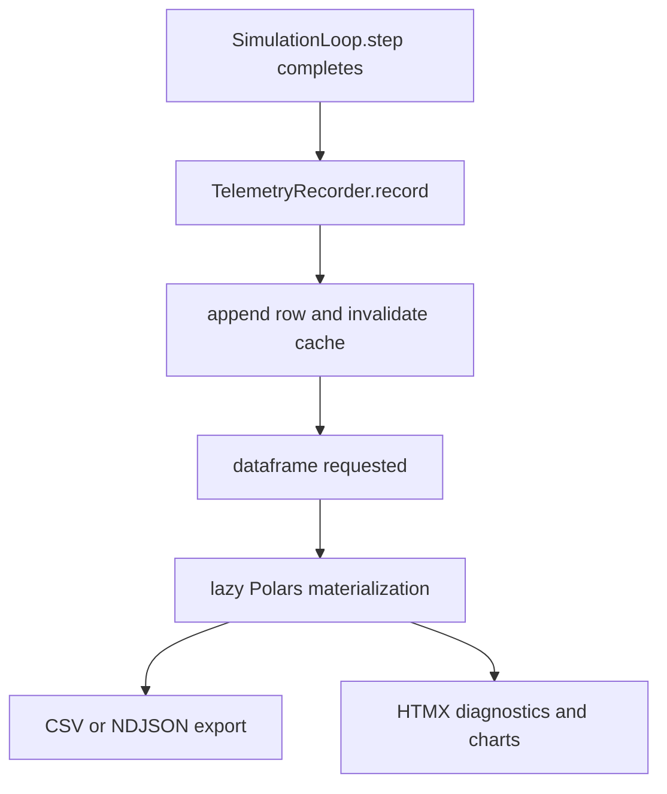
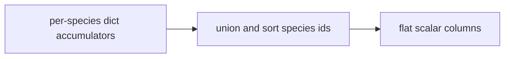

# Analytics and Export Formats

PHIDS telemetry converts each completed simulation tick into a compact tabular observation suitable for comparative analysis, diagnostics, and export. The implementation in `src/phids/telemetry/analytics.py` is centered on `TelemetryRecorder`, which samples post-phase ECS state, aggregates canonical ecological metrics, and exposes the result as a lazily materialized Polars dataframe.

Within `SimulationLoop.step()`, recording occurs after flow-field generation, lifecycle, interaction, and signaling. Consequently, telemetry row $t$ describes the ecological state after all system operators for that tick have committed their effects.

## Metric Model and Interpretation

The aggregate metrics include tick index, total flora energy, flora entity count, herbivore cluster count, and total herbivore population. The same row also carries immediate per-tick plant death diagnostics (`death_reproduction`, `death_mycorrhiza`, `death_defense_maintenance`, `death_herbivore_feeding`, `death_background_deficit`) accumulated across lifecycle, interaction, and signaling.

In compact notation, the recorder computes a map

$$
\mathbf{m}_t = \mathcal{R}(\mathcal{E}_t, \Delta_t),
$$

where $\mathcal{E}_t$ is the post-phase ECS state and $\Delta_t$ is the per-tick death-cause accumulator. This dual structure provides both abundance-scale and mechanism-scale observability for scenario comparison.

## In-Memory Semantics and Bounded Retention

`TelemetryRecorder` appends row dictionaries and invalidates a cached dataframe representation. The cache is rebuilt on demand when `dataframe` is accessed. Retention is bounded by `MAX_TELEMETRY_TICKS = 10000`, so long-running sessions expose a rolling analysis window rather than unbounded backend growth.

When no rows are present, `dataframe` still returns a typed aggregate schema so downstream UI and export code can rely on stable column presence. Once observations exist, per-species columns are flattened into deterministic scalar columns (`plant_{id}_pop`, `plant_{id}_energy`, `swarm_{id}_pop`, `defense_cost_{id}`), with zero fill for species absent at a given tick.

## Export Surfaces and Formats

The export layer in `src/phids/telemetry/export.py` provides file and bytes helpers for CSV and NDJSON representations. API routes under `src/phids/api/routers/telemetry.py` expose these artifacts through `GET /api/telemetry/export/csv` and `GET /api/telemetry/export/json`, with download-oriented response headers and content types aligned to tabular transfer workflows.

PHIDS intentionally distinguishes external export from UI polling. Export routes provide analysis artifacts; `GET /api/telemetry` provides rendered dashboard fragments and summary context suitable for incremental HTMX refresh.

The per-species flattening strategy ensures that exported datasets remain rectangular and deterministic even as species appear, disappear, or go extinct during a run. Species identifiers are unioned across retained rows and ordered numerically before column emission.

The following schematic illustrates species flattening from nested accumulators to tabular columns.

## Validation Anchors and Current Limits

Behavior is corroborated by `tests/test_termination_and_loop.py`, `tests/test_telemetry_per_species.py`, `tests/test_additional_coverage.py`, and `tests/test_ui_routes.py`. The current analytics layer is intentionally compact: it favors scenario-level comparability over exhaustive derived statistics, uses immediate-cause death attribution rather than full causal graphs, and exports JSON as NDJSON rather than nested experiment schemas.

For complementary semantics, see `docs/telemetry/replay-and-termination-semantics.md`, `docs/telemetry/index.md`, and `docs/interfaces/rest-and-websocket-surfaces.md`.
