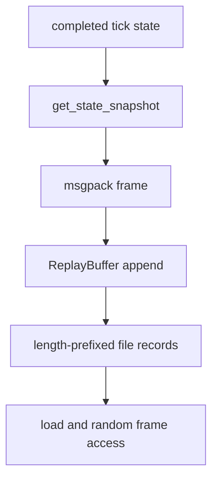
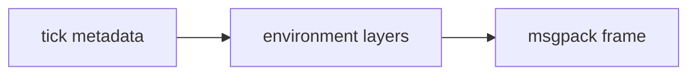

# Replay and Termination Semantics

PHIDS preserves deterministic run history through a replay channel that complements, rather than replaces, summary telemetry. The replay subsystem in `src/phids/io/replay.py` stores one serialized state frame per completed tick, enabling post hoc reinspection of environmental trajectories and termination context.

## Replay Artifact Semantics

After ecological systems complete and telemetry is recorded, `SimulationLoop.step()` appends `get_state_snapshot()` output to `ReplayBuffer`. Snapshot payloads currently include tick index, termination flags, termination reason, and the environment projection returned by `GridEnvironment.to_dict()`. The artifact is therefore environment-centered and intentionally does not persist every ECS component field.

Frame serialization uses msgpack (`serialise_state`/`deserialise_state`). On disk, `ReplayBuffer.save(path)` writes an append-only record stream where each frame is prefixed by a 4-byte little-endian length. `ReplayBuffer.load(path)` replays the same envelope and gracefully stops on incomplete trailing records, retaining successfully decoded prior frames.

The distinction between replay and `WS /ws/simulation/stream` remains critical. Both use msgpack-compatible structures, but replay is an indexed persistence artifact, while the WebSocket surface is a live transport stream with independent lifecycle and closure semantics.

## Termination Logic and Experimental Meaning

Termination evaluation is implemented in `src/phids/telemetry/conditions.py` through `check_termination()` and `TerminationResult`. The active condition family spans `Z1` through `Z7`, covering max-tick completion, targeted or global species extinction, and upper-bound threshold crossings for aggregate flora energy or herbivore population.

Let $\tau(\mathcal{X}_t)$ denote the termination predicate family over state $\mathcal{X}_t$. The loop applies

$$
	ext{if } \tau(\mathcal{X}_t)=\text{true} \Rightarrow
	exttt{terminated}=\texttt{True},\ \texttt{running}=\texttt{False},\ \texttt{termination\_reason}=r_t.
$$

Because termination metadata is embedded in replay snapshots and status surfaces, the reason string is analytically meaningful when comparing scenario outcomes such as bounded completion (`Z1`), flora collapse (`Z3`), herbivore collapse (`Z5`), or runaway overshoot regimes (`Z6`, `Z7`).

## Snapshot Geometry and Field Coverage

`GridEnvironment.to_dict()` currently exports `plant_energy_layer`, `signal_layers`, `toxin_layers`, `flow_field`, `wind_vector_x`, and `wind_vector_y`, with NumPy arrays converted to list-backed structures. This projection provides sufficient context for inspecting field dynamics and guide-surface evolution over time.

## Validation Anchors and Current Limits

Behavior is corroborated by `tests/test_replay_roundtrip.py`, `tests/test_termination_and_loop.py`, and `tests/test_additional_coverage.py`, including roundtrip integrity, file envelope handling, truncation robustness, and condition-path coverage for `Z1`–`Z7`.

Current limits are explicit: replay stores frame snapshots rather than diffs, uses a simple length-prefixed envelope rather than a rich container format, and prioritizes deterministic inspection and implementation clarity over maximal compression or arbitrary query indexing.

For complementary telemetry semantics, see `docs/telemetry/analytics-and-export-formats.md` and interface-level transport behavior in `docs/interfaces/rest-and-websocket-surfaces.md`.
