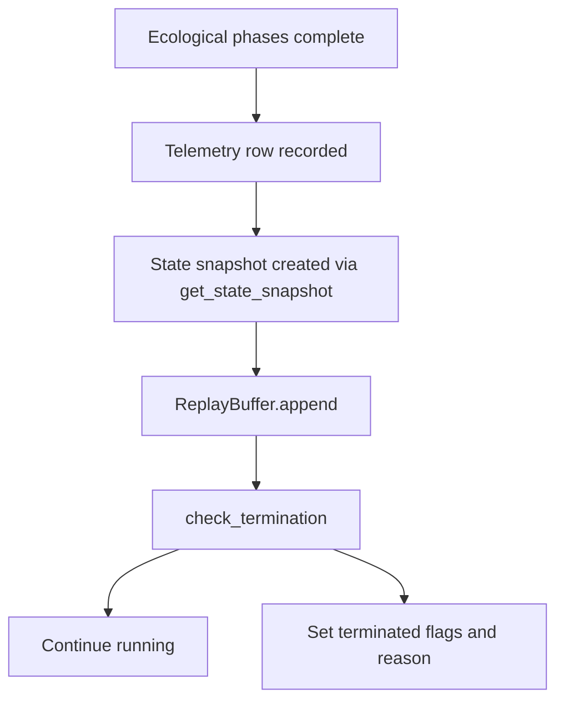

# Replay and Termination Semantics

PHIDS preserves more than summary telemetry. It also records discrete state snapshots suitable for
reinspection and provides a formal termination layer that explains why a run stopped. This chapter
documents the current replay-file model, snapshot contents, and `Z1`–`Z7` termination semantics.

## Replay as a Deterministic Artifact

The replay subsystem is implemented in `src/phids/io/replay.py` through `ReplayBuffer` and the
helper functions `serialise_state()` and `deserialise_state()`.

Its purpose is to preserve one state frame per completed tick so that a run can be re-inspected as a
sequence of discrete states rather than only as aggregated telemetry.

## Current Snapshot Source

`SimulationLoop.step()` currently appends:

- `self.get_state_snapshot()`

to the replay buffer after telemetry recording.

`SimulationLoop.get_state_snapshot()` packages:

- `tick`
- `terminated`
- `termination_reason`
- the environment snapshot returned by `GridEnvironment.to_dict()`

This means replay is currently **environment-centered** rather than a raw dump of all ECS
components.

## `GridEnvironment.to_dict()`

The environment snapshot currently includes:

- `plant_energy_layer`
- `signal_layers`
- `toxin_layers`
- `flow_field`
- `wind_vector_x`
- `wind_vector_y`

All of these are converted from NumPy arrays to nested Python lists so they can be serialized with
msgpack and streamed or written to disk.

## ReplayBuffer Model

`ReplayBuffer` is currently an append-only container of binary msgpack frames.

### Append behavior

`append(state)` serializes the supplied mapping and stores the resulting bytes frame.

### Random access behavior

`get_frame(tick)` deserializes and returns the stored frame for the given index.

### Length semantics

`len(replay_buffer)` returns the number of stored frames.

This makes replay a simple indexed timeline of tick states.

## Serialization Format

PHIDS currently serializes replay frames with msgpack.

### Individual frame encoding

`serialise_state(state)` uses `msgpack.packb(state, use_bin_type=True)`.

### Frame decoding

`deserialise_state(data)` uses `msgpack.unpackb(data, raw=False)`.

This format choice gives PHIDS a compact, structured, language-portable binary representation for
state snapshots.

## Replay File Format

When written to disk via `ReplayBuffer.save(path)`, frames are stored as a sequence of records.

Each record has the form:

1. a 4-byte little-endian unsigned integer frame length,
2. the corresponding msgpack frame bytes.

This produces a simple append-only binary replay file with explicit frame boundaries.

## Replay Loading Semantics

`ReplayBuffer.load(path)` reads the same record structure back into memory.

Current behavior includes graceful handling of truncated files:

- if fewer than 4 bytes remain, loading stops,
- if a frame ends mid-record, a warning is logged and loading stops,
- successfully read prior frames remain available.

This makes the replay format robust to incomplete trailing writes.

## Replay vs WebSocket Simulation Stream

It is important not to confuse disk replay with the live binary simulation WebSocket stream.

Both currently use msgpack-compatible state structures, but they serve different purposes:

- replay stores append-only frames for later inspection,
- `WS /ws/simulation/stream` sends compressed state over the network as the simulation runs.

Replay is therefore a persistence artifact, not simply a mirror of the socket API.

## Termination Layer

Termination logic is implemented in `src/phids/telemetry/conditions.py` through
`check_termination()` and `TerminationResult`.

`TerminationResult` currently contains:

- `terminated: bool`
- `reason: str`

This small structure is important because it carries the analytical interpretation of run completion
forward into logs, APIs, and snapshots.

## Current `Z1`–`Z7` Conditions

### `Z1` — Maximum tick limit

The run halts when `tick >= max_ticks`.

### `Z2` — Configured flora species extinction

The run halts when a requested flora species ID is no longer present among live plants.

### `Z3` — All flora extinct

The run halts when no live flora remain.

### `Z4` — Configured predator species extinction

The run halts when a requested predator species ID is no longer present among live swarms.

### `Z5` — All predators extinct

The run halts when no live predator swarms remain.

### `Z6` — Aggregate flora energy exceeds a threshold

The run halts when total flora energy rises above a configured upper bound.

### `Z7` — Aggregate predator population exceeds a threshold

The run halts when total predator population rises above a configured upper bound.

## Runtime Consequences of Termination

Within `SimulationLoop.step()`, once `check_termination()` returns a terminating result:

- `self.terminated` is set to `True`,
- `self.running` is set to `False`,
- `self.termination_reason` is recorded,
- an informational log entry is emitted.

The tick is incremented before this state is finalized, so termination should be interpreted in the
context of a completed tick transition.

## Scientific Interpretation of Termination

Termination is not only a runtime control signal. In PHIDS it is part of the experiment outcome.

Examples:

- `Z1` indicates a deliberately time-bounded run,
- `Z3` indicates flora collapse,
- `Z5` indicates predator extinction,
- `Z6` and `Z7` indicate overshoot or runaway regimes.

The reason string is therefore analytically meaningful when comparing scenarios.

## Artifact Lifecycle

The current replay-and-termination lifecycle can be summarized as follows:

This ordering matters: replay frames are appended before termination flags are updated for the next
control-state transition.

## Evidence from Tests

The current tests verify several important properties.

### Msgpack roundtrip

`tests/test_replay_roundtrip.py` verifies that replay state can be serialized and deserialized
without loss for representative state mappings.

### File save/load and truncation handling

`tests/test_additional_coverage.py` verifies replay save/load behavior and warning emission on
truncated replay files.

### Loop integration

`tests/test_termination_and_loop.py` verifies that stepping a simulation increases replay length and
updates termination state when `Z1` is reached.

### Condition semantics

`tests/test_termination_and_loop.py` directly exercises `Z1`, `Z2`, `Z3`, `Z4`, `Z5`, `Z6`, and
`Z7` condition paths.

## Methodological Limits of the Current Replay Layer

The current replay system should be described precisely.

- it stores environment-centered snapshots rather than every component field,
- it is frame-oriented rather than diff-oriented,
- it uses a simple custom framing envelope around msgpack rather than a complex container format,
- it is optimized for deterministic inspection and persistence simplicity, not for maximal
  compression or arbitrary random metadata queries.

These are part of the current PHIDS design.

## Verified Current-State Evidence

- `src/phids/io/replay.py`
- `src/phids/engine/loop.py`
- `src/phids/engine/core/biotope.py`
- `src/phids/telemetry/conditions.py`
- `tests/test_replay_roundtrip.py`
- `tests/test_termination_and_loop.py`
- `tests/test_additional_coverage.py`

## Where to Read Next

- For tabular analytics and CSV/NDJSON exports: [`analytics-and-export-formats.md`](analytics-and-export-formats.md)
- For the interface-level export endpoints: [`../interfaces/rest-and-websocket-surfaces.md`](../interfaces/rest-and-websocket-surfaces.md)
- For the high-level telemetry overview: [`index.md`](index.md)
