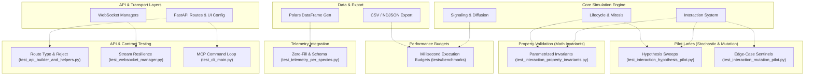

# System Mapping & Test Relations

```mermaid
graph TD
    %% Source Modules
    subgraph Engine["Core Simulation Engine"]
        Interaction["Interaction System"]
        Signaling["Signaling & Diffusion"]
        Lifecycle["Lifecycle & Mitosis"]
    end

    subgraph Boundaries["API & Transport Layers"]
        API["FastAPI Routes & UI Config"]
        WebSockets["WebSocket Managers"]
    end

    subgraph Telemetry["Data & Export"]
        DF["Polars DataFrame Gen"]
        Export["CSV / NDJSON Export"]
    end

    %% Test Paths
    subgraph Mathematical_Validation["Property Validation (Math Invariants)"]
        PropTests["Parametrized Invariants (test_interaction_property_invariants.py)"]
    end

    subgraph Pilot_Lanes["Pilot Lanes (Stochastic & Mutation)"]
        Hypothesis["Hypothesis Sweeps (test_interaction_hypothesis_pilot.py)"]
        Mutation["Edge-Case Sentinels (test_interaction_mutation_pilot.py)"]
    end

    subgraph Transport_Validation["API & Contract Testing"]
        APITests["Route Type & Reject (test_api_builder_and_helpers.py)"]
        WSTests["Stream Resilience (test_websocket_manager.py)"]
        MCPTests["MCP Command Loop (test_cli_main.py)"]
    end

    subgraph Benchmarks["Performance Budgets"]
        Bench["Millisecond Execution Budgets (tests/benchmarks)"]
    end

    subgraph Data_Validation["Telemetry Integration"]
        TelemetryTests["Zero-Fill & Schema (test_telemetry_per_species.py)"]
    end

    %% Wiring
    Interaction -.-> PropTests
    Interaction -.-> Hypothesis
    Interaction -.-> Mutation
    Lifecycle -.-> PropTests
    Lifecycle -.-> Hypothesis
    Signaling -.-> Bench

    API -.-> APITests
    WebSockets -.-> WSTests
    API -.-> MCPTests

    DF -.-> TelemetryTests
    Export -.-> Bench
```
