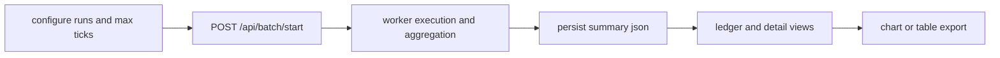

# Batch Runner and Aggregate Analysis

The PHIDS batch runner provides a repeatable route from one draft scenario to many seeded executions and one persisted aggregate artifact. The feature is designed for robustness analysis, comparative reporting, and post hoc interpretation of variability across runs, not for replacing single-run live observation. In practical terms, it gives the operator a way to ask whether a scenario is merely plausible in one trajectory or resilient across a controlled family of trajectories.

This page documents the batch runner as an operational workflow rather than only as an endpoint list. It explains how jobs are launched, how aggregate summaries are persisted and later reloaded, how chart and table settings affect export artifacts, and how to interpret the resulting outputs without confusing exploratory UI state with the underlying stored batch summary.

Execution and presentation are intentionally separated. Batch jobs are executed in worker processes (`ProcessPoolExecutor`), aggregated into aligned summary arrays, and persisted to `data/batches/{job_id}_summary.json`. The UI reads those persisted summaries to render charts, data-grid previews, and exports without rerunning the simulation.

Before writing summary files, payloads are sanitized to strict JSON-safe values. Non-finite floats are converted to `null`, and files are written with `allow_nan=False`, which prevents downstream parsing failures in browser and export workflows.

## Operator Workflow

The practical path is to configure run count and horizon in the Batch Runner tab, submit a job, and monitor progress through ledger and detail routes. Completed summaries are automatically persisted and can be reloaded into active UI state with `POST /api/batch/load-persisted`.

Detail pages expose two analysis surfaces: chart view for trajectory interpretation and data-grid view for tabular inspection. Both surfaces use explicit apply actions so edits can be staged before they affect rendering and export links.

## Detail Customization

Chart controls support predefined interpretation presets plus title and axis metadata. Data-grid controls support decimation stride (`tick_interval`) and column projection. This explicit-apply model reduces accidental redraw churn during exploratory work and keeps generated exports aligned with confirmed UI settings.

## Export Behavior

`GET /api/batch/export/{job_id}` supports CSV, LaTeX table, and TikZ export modes with parameters for chart type, decimation interval, column projection, and chart labels. Projection and decimation are applied before serialization, so exported artifacts match the current analysis context rather than raw unfiltered aggregates.

Fixed-precision float formatting in table exports keeps output widths stable for manuscript-oriented workflows. Telemetry retention and UI table previews remain bounded to prevent backend and browser overload on large runs.

## Interpreting Aggregate Outputs

Timeseries outputs combine mean trajectories for flora and predators with standard-deviation envelopes. Survival outputs represent per-tick persistence probability and are best interpreted as time-local collapse risk, not only terminal extinction count. This distinction helps differentiate early fragile regimes from late-run instability under the same final outcome class.

## Verification Anchors

Current behavior is grounded in `src/phids/api/routers/batch.py`, persisted summaries in `data/batches/`, and route-level coverage in `tests/test_api_routes.py` and `tests/test_ui_routes.py`. For telemetry semantics used in aggregate computation, see `docs/telemetry/analytics-and-export-formats.md`.
