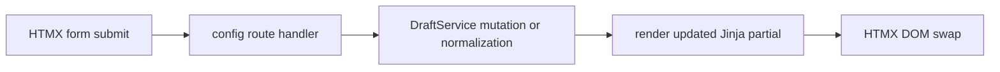

# HTMX Partials and Builder Routes

PHIDS uses HTMX and Jinja to deliver an interactive control center without shifting authoritative state into browser-managed stores. The browser requests partial HTML updates, the backend mutates `DraftState` through `DraftService`, and the response returns a freshly rendered fragment from canonical server state.

This chapter documents the current route-and-partial workflow implemented across `src/phids/api/routers/config.py`, `src/phids/api/routers/ui.py`, `src/phids/api/main.py`, and template partials under `src/phids/api/templates/partials/`.

## Builder Request Cycle

Most builder interactions follow the same operational cycle: receive form payload, mutate or normalize draft data through `DraftService`, re-render the affected partial, and return HTML for HTMX swap. The same cycle applies to biotope edits, species CRUD, matrix updates, trigger-rule updates, and placement operations.

## View Partials and Route Families

UI view routes expose server-rendered fragments for dashboard, biotope, flora, herbivores, substances, diet matrix, trigger rules, placements, diagnostics tabs, and telemetry chart surfaces. The operational model is intentionally split between view routes that render fragments and config routes that mutate draft state before returning those fragments.

This split keeps responsibility boundaries clear: UI routes manage presentation composition, while config routes enforce mutation rules and invariants through service-layer logic.

## Biotope and Species Editing

`POST /api/config/biotope` updates global draft parameters such as grid dimensions, tick settings, wind values, substance counts, and mycorrhizal controls. The route delegates normalization and clamping to `DraftService`, so invalid values are handled centrally before the fragment is re-rendered.

The same biotope surface now exposes draft-level termination controls for `Z2`, `Z4`, `Z6`, and `Z7`. These values are edited in the builder and compiled into `SimulationConfig` when the draft is loaded. The disabled sentinel remains `-1`, preserving previous default behavior unless an operator explicitly enables a threshold.

Flora and herbivore routes apply CRUD operations while preserving dependent structures such as matrix dimensions and compact species identifiers. Substance routes similarly maintain registry consistency and dependent trigger references, including precursor remapping and activation-condition updates for surviving rules.

## Matrix and Trigger Editors

Diet-matrix edits update herbivore-flora compatibility through service-layer cell mutation, which centralizes out-of-range handling and prevents ad hoc route-level mutation logic. Trigger-rule editing is intentionally more expressive than the legacy one-cell trigger model: multiple rules per `(flora, herbivore)` pair are supported, and activation conditions can be expressed as nested condition trees.

## Placement and Preview Workflows

Placement editing combines HTML partials and JSON payload routes. CRUD operations stage draft plants and swarms in `DraftState`, while `/api/config/placements/data` provides canvas-ready preview payloads that include inferred root-link overlays for draft inspection. This allows placement design and structural review before loading any live simulation.

## Diagnostics and Canvas Boundary

Diagnostics tabs are server-rendered and separated into model, frontend, and backend views. High-frequency canvas updates are handled through a narrow client-side boundary supplied by `/ws/ui/stream`, `/api/config/placements/data`, and `/api/ui/cell-details`. This preserves responsive visualization without converting the control center into a client-owned state application.

The top toolbar also exposes a live speed control wired to `/api/simulation/tick-rate`, allowing operators to adjust simulation cadence directly in the live grid view without reloading the scenario.

## Operational Consequences

The HTMX/Jinja architecture keeps server state authoritative, shares validation pathways between UI and API interactions, and allows incremental migration of builder behavior while preserving deterministic draft semantics. The same control surface can therefore support scenario authoring, diagnostics, and pre-run inspection in one coherent server-authored workflow.

## Verification Anchors

Current behavior is corroborated by `src/phids/api/routers/config.py`, `src/phids/api/routers/ui.py`, `src/phids/api/main.py`, `src/phids/api/ui_state.py`, `src/phids/api/templates/partials/`, `tests/test_ui_routes.py`, and `tests/test_api_builder_and_helpers.py`. Historical provenance remains available in `docs/legacy/2026-03-11/PHIDS_htmx_ui_design_specification.md`.
