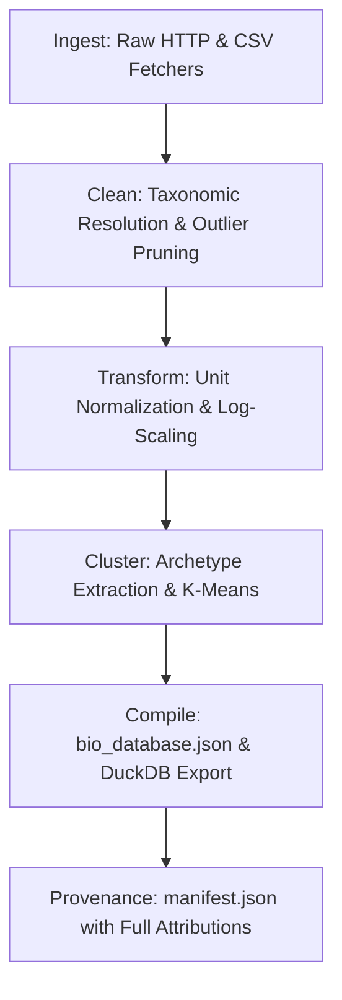

# PHIDS Empirical Trait Extraction & Normalization Pipeline (`src/data_pipeline/`)

This package implements the automated Extract, Transform, Load (ETL) pipeline that ingests biological and chemical trait records from open-access scientific databases, harmonizes taxonomy, normalizes units into engine-compatible float bounds, and compiles validated DuckDB and JSON database payloads (`bio_database.duckdb`, `bio_database.json`).

---

## 1. Primary Databases & Licensing Boundaries

The pipeline strictly enforces copyright and intellectual property boundaries to ensure the core PHIDS simulation engine remains free of non-commercial (NC) license contaminations:

### A. Core Permissive Sources (Redistributable)

* **TRY Plant Trait Database:** CC-BY 4.0 (<https://www.try-db.org>)
* **Global Biotic Interactions (GLoBI):** CC-BY 4.0 (<https://globalbioticinteractions.org>)
* **PanTHERIA (Mammalian Life History & Ecology):** CC0 / Public Domain (<https://doi.org/10.1890/08-1494.1>)
* **Dr. Duke's Phytochemical DB:** CC0 / Public Domain (USDA ARS)
* **ToxValDB:** CC0 / Open Government Data (EPA)
* **Global Biodiversity Information Facility (GBIF):** CC0 (<https://www.gbif.org>)

### B. Extended Non-Commercial (NC) Sources (Protected)

* **BIEN, LEDA, GIFT:** Licensed under CC-BY-NC or ShareAlike restrictions.
* **Legal Invariant:** Data from these sources is strictly cached under `src/data_pipeline/cache/extended/` and compiled into `bio_database_extended.duckdb`. These assets are **never** committed or published to the core repository, and the guard in `src/data_pipeline/db/export.py` programmatically aborts export if contamination is detected.

---

## 2. Pipeline Architecture & Execution Flow



* **`ingest/`:** API fetchers and CSV parsers with local disk caching in `cache/`.
* **`cleaning/`:** Standardizes taxonomic names via GBIF backbones and prunes unphysical outliers.
* **`transform.py`:** Converts empirical units (e.g., $mg/g$ leaf nitrogen, $\mu m$ stomatal conductance) into dimensionless $[0.0, 1.0]$ simulation float arrays.
* **`archetype_extractor.py`:** Clusters species traits into canonical ecological archetypes (e.g., *Fast-Growing Grass*, *Lignified Shrub*, *Toxin Specialist*).
* **`provenance.py`:** Emits cryptographic checksums and citation metadata into `manifest.json`.

---

## 3. Running the Pipeline

Execute the full ETL pipeline via `just` or `uv run`:

```bash
# Run the complete standard ETL pipeline:
uv run python -m data_pipeline.run_all

# Run the extended dataset pipeline (requires local NC-source credentials):
uv run python -m data_pipeline.run_extended
```
