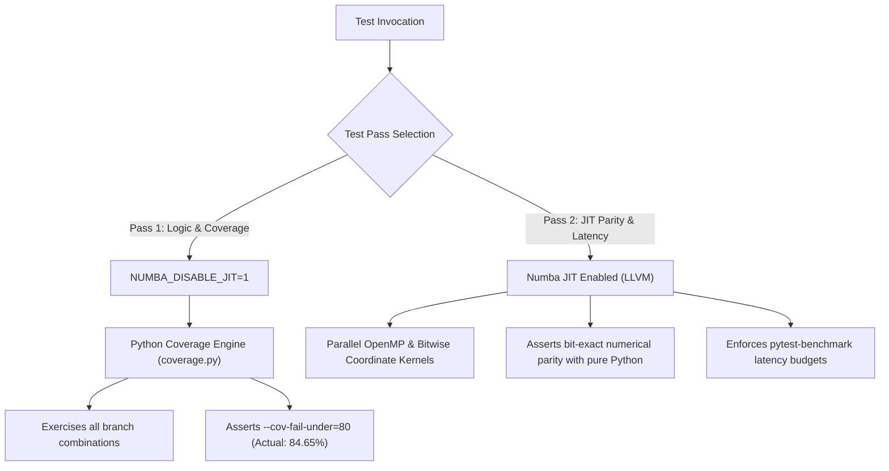

# PHIDS Test Suite & Verification Architecture

The Plant-Herbivore Interaction & Defense Simulator (PHIDS) testing architecture is engineered around mathematical rigor, physical conservation laws, strict branch coverage, and deterministic execution. Rather than treating tests merely as regression shields, PHIDS treats test specifications as executable mathematical proofs of biological and physical invariants.

The testing framework is partitioned into distinct domain-focused packages so that fast unit contracts, scientific invariants, property-based exploration, and latency benchmarks evolve independently without coupling simulation physics to transport or presentation layers.

---

## 1. Test Suite Taxonomy & Directory Catalog

```text
tests/
├── unit/                                  # Isolated component contracts & algorithm helpers
│   ├── analytics/                         # Design Space Exploration (DSE) & EEDSE optimizer
│   ├── api/                               # Pydantic schemas, DraftState transitions, presenter logic
│   ├── cli/                               # Command-line interface entrypoints & argument parsers
│   ├── engine/
│   │   ├── core/                          # ECSWorld, GridEnvironment, SpatialHashGrid, placement
│   │   ├── invariants/                    # Double-buffering immutability, JIT parity, coordinate masks
│   │   └── systems/                       # Movement, feeding, metabolism, mitosis, signaling, triggers
│   ├── io/                                # Scenario JSON validation, draft state serialization
│   ├── shared/                            # Logging, constants, concurrency guards
│   └── telemetry/                         # Per-species accumulation, Polars metrics, exports (CSV/PNG/LaTeX/TikZ)
├── integration/                           # Multi-system loop interaction & physical invariants
│   ├── api/                               # FastAPI endpoints, WebSocket streams, batch workers
│   ├── scientific_invariants/             # PDE conservation, thermodynamics, Data-Flow Matrices
│   │   ├── pde_conservation/             # Advection mass conservation, non-negativity, tail clamping
│   │   └── thermodynamics/                # First Law of Thermodynamics, Holling Type II, Hill kinetics
│   └── systems/                           # Five-phase loop ordering, batch orchestration
├── e2e/                                   # Full simulation runs & data persistence
│   ├── replay_and_io/                     # Zarr telemetry buffers & bit-exact replay playback
│   └── scenarios/                         # Curated ecosystem scenarios (baseline, collapse, defense)
└── benchmarks/                            # Latency budgets & micro-benchmarks (pytest-benchmark)
```

### Detailed Package Catalog

### A. Unit Tests (`tests/unit/`)
Isolated component contracts, data structures, and mathematical helper logic that execute without spinning up the full simulation loop:

* **`analytics/`**: Validates the Design Space Exploration (DSE) and Evolutionary Encapsulated DSE (EEDSE) subsystem:
  * `test_dse_pruning.py`: Analytical pre-pruner (`AnalyticalPruner`) asserting mathematical bounds (caloric deficits, seed costs, disconnected diet bipartite graphs) prior to expensive simulation runs.
  * `test_dse_optimizer.py`: NSGA-II multi-objective genetic algorithm optimizer (`DSEOptimizer`) sorting, Pareto front calculation, and JIT cache pre-warming on miniature grids.
  * `test_tuning.py`: Parameter sensitivity and empirical trait-mapping logic.
  * *(Note: Extensive DSE testing is deferred until core engine & database features are finalized prior to v1.0)*.
* **`api/`**: Verifies HTTP/WebSocket interface schemas, presenter functions, and state machines:
  * Validates Pydantic schema coercion, biological parameter bounds, and JSON schema compatibility.
  * Asserts atomic draft state transitions (`DraftState` $\to$ `DraftService` $\to$ Live commit).
  * Validates UI presenter components (cell inspection tooltips, badge renderers, Chart.js payload structures).
* **`cli/`**: Asserts CLI entrypoints, command-line arguments, headless execution switches, and environment variable overrides.
* **`engine/core/`**: Tests the core ECS foundation, biotope layers, and spatial indexing:
  * `test_ecs_world.py`: Verifies zero-allocation entity creation, archetypal component registration, single-writer invariants, and garbage collection (`collect_garbage`).
  * `test_placement.py`: Asserts density guarantees, boundary padding, and non-overlapping invariants for uniform, patchy, and Poisson-disc placement algorithms.
  * `test_herbivore_params_fallbacks.py`: Validates fallback parameter resolution and configuration defaults.
  * Spatial Hash Grid: Validates $O(1)$ spatial cell lookups, wrapping boundary queries, and entity relocation updates.
* **`engine/invariants/`**: Low-level computational and hardware invariant verification:
  * `test_read_layer_immutability.py`: Verifies that the `_read` layer of all biotope grids is cryptographically immutable (SHA-256 byte hashing) throughout an entire simulation step.
  * `test_numba_jit_parity.py`: Verifies numerical identity between Numba `@njit` kernels and pure-Python reference implementations.
  * `test_toroidal_topological_invariants.py`: Asserts bitwise coordinate masking (`x & (W - 1)`) parity against modular arithmetic (`x % W`) on power-of-two grids.
  * `test_jit_neighbour_gathering_parity.py`: Verifies Von-Neumann 4-neighbourhood gathering and coordinate wrapping.
  * `test_jit_capacity_masking_parity.py`: Asserts branchless float SIMD masking for carrying capacity thresholds.
  * `test_jit_zero_weight_fallback.py`: Validates numerical stability and uniform random fallback under chemically flat flow-field gradients.
* **`engine/systems/`**: Micro-contracts for individual simulation systems:
  * `test_movement_softmax.py`: Validates temperature-scaled Softmax probability distribution calculations, klinokinetic persistence vectors, and stochastic MVT departure curves.
  * `test_phase_staggered_cohorts.py`: Verifies modulo cohort gating completeness across 168-tick simulation windows.
  * `test_seed_dispersal_isotropy.py`: Validates polar seed raycasting spatial isotropy using Kolmogorov-Smirnov statistical tests.
  * Feeding & Metabolism: Asserts per-individual maintenance upkeep deductions, caloric deficit conversions into population casualties, and net-assimilation reproduction thresholds.
  * Signaling & Synthesis: Verifies plant defense volatile organic compound (VOC) synthesis, airborne emission rates, and spatial signal decay.
* **`io/`**: Verifies scenario serialization, JSON schema validation, migration edge cases, and Zarr metadata encoding.
* **`shared/`**: Tests structured logging formats, shared constants, thread-safety primitives, and exception hierarchies.
* **`telemetry/`**: Validates telemetry accumulation, Polars DataFrame conversion, metric decimation, condition alarms, and multi-format exporters (CSV, PNG, LaTeX tabular, and TikZ vector code).

---

### B. Integration Tests (`tests/integration/`)
Multi-system loop interactions, boundary crossings, and overarching physical conservation laws:

* **`api/`**: Verifies FastAPI routes, WebSocket telemetry streaming, SSE connection lifecycles, and batch processing worker thread governance (`test_batch_processing_thread_governance`).
* **`systems/`**: Asserts deterministic phase ordering across the complete 5-phase loop execution cycle:
  1. **Flow Field Phase**: Dynamic gradient derivation, Jacobi relaxation, and chemical advection.
  2. **Lifecycle Phase**: Plant growth, seed dispersal, root mycorrhizal signal propagation, and culling.
  3. **Interaction Phase**: Swarm chemotaxis, incidental grazing, feeding, metabolic taxation, and clonal fission.
  4. **Signaling Phase**: Trigger evaluation, defense synthesis, volatile organic compound (VOC) emission, and airborne diffusion.
  5. **Telemetry & Termination Phase**: Replay buffer commits, WebSocket dispatch, and condition threshold evaluation.
* **`scientific_invariants/`**:
  * **`pde_conservation/`**: Reaction-diffusion-advection conservation laws:
    * `test_advection_mass_conservation.py`: Semi-Lagrangian mass conservation ($\nabla \cdot \vec{v} = 0$, $\text{rtol} \le 1\times 10^{-5}$) and divergent wind mass drift upper bounds ($\le 2.0\%$).
    * `test_chemical_positivity_and_clamping.py`: Chemical concentration non-negativity ($c \ge 0.0$) and subnormal float tail zeroing below `SIGNAL_EPSILON` ($1\times 10^{-4}$).
    * `test_convolution_exponential_decay.py`: Exponential spatial and temporal decay rates for diffused signals.
  * **`thermodynamics/`**: First Law of Thermodynamics and non-linear ingestion kinetics:
    * `test_feeding_first_law.py`: Energy conservation balance ($\Delta E_{\text{herbivore}} + E_{\text{digestive\_loss}} = \Delta E_{\text{plant\_consumed}}$).
    * `test_holling_type_ii_bounds.py`: Asymptotic saturation upper bounds ($I(N) \le 1/T_h$) under high resource densities.
    * `test_hill_kinetics_monotonicity.py`: Monotone increasing response curves for chemical defense induction.
  * **`test_causal_data_flow_matrices.py`**: Automated Table-to-Trace Parity tests enforcing exact 1:1 correspondence between documented OKF Data-Flow Matrices and runtime simulation traces.
  * **`test_double_buffering_isolation.py`**: Enforces strict read/write layer isolation across multi-tick loop transitions.
  * **`test_phloem_translocation_stability.py`**: Verifies rate-limited nutrient translocation stability and post-grazing apparent nutrition recovery kinetics.
  * **`test_zarr_replay_live_parity.py`**: Verifies that live simulation outputs and telemetry buffers strictly match recorded Zarr matrices.

---

### C. End-to-End Tests (`tests/e2e/`)
Full-system scenario execution from initial state load to final termination:

* **`scenarios/`**: Executes complete ecosystem scenarios across varying temporal horizons (100 to 1,000+ ticks), asserting non-degeneracy, trophic stability, and population persistence.
* **`replay_and_io/`**:
  * `test_zarr_replay_bit_exactness.py`: Serializes multi-tick simulation runs into compressed Zarr replay buffers and verifies bit-exact numerical round-trip playback completely bypassing the engine loop.

---

### D. Performance Benchmarks (`tests/benchmarks/`)
Deterministic latency benchmarks asserted via `pytest-benchmark` against pre-defined performance budgets:

* Spatial hash grid query throughput ($O(1)$ neighbour discovery).
* Sparse vs. dense Gaussian diffusion kernel execution latency.
* OpenMP multi-threaded vs. serial Jacobi flow-field relaxation.
* Power-of-two bitwise AND coordinate wrapping vs. modulo operations.
* WebSocket binary frame and JSON payload encoding throughput.
* Zarr chunk write and telemetry export serialization speeds.

---

## 2. Two-Pass Testing Methodology

PHIDS employs a two-pass testing strategy to resolve the fundamental conflict between Numba JIT acceleration and Python test coverage instrumentation:



### Pass 1: Logic & Branch Coverage (`NUMBA_DISABLE_JIT=1`)
* **Rationale**: Numba compiles decorated `@njit` kernels into optimized LLVM machine instructions. During execution, the CPU jumps directly into native machine code, completely bypassing the Python virtual machine's tracing hooks. As a result, standard Python coverage tools (`coverage.py`, `pytest-cov`) report 0% execution across compiled kernels.
* **Mechanism**: By launching the test suite with `NUMBA_DISABLE_JIT=1`, Numba decorators execute as standard Python functions. This exposes every branch, boundary clamp, and fallback branch to `coverage.py`, ensuring strict branch coverage measurement.
* **Execution**:
  ```bash
  NUMBA_DISABLE_JIT=1 uv run pytest --cov=src/phids --cov-fail-under=80
  ```

### Pass 2: High-Performance Parity & Latency (JIT Enabled)
* **Rationale**: Disabling JIT proves logic correctness, but cannot verify compiler semantics, memory layout compatibility (e.g. C-contiguous NumPy arrays, explicit `int32`/`float64` types), or parallel OpenMP race conditions.
* **Mechanism**: Tests tagged with `@pytest.mark.jit_parity` and `@pytest.mark.benchmark` run with full Numba JIT compilation active. These tests execute both the pure-Python reference implementation and the compiled JIT kernel, asserting point-by-point numerical identity within floating-point tolerance ($\text{atol} \le 1\times 10^{-12}$).
* **Execution**:
  ```bash
  just test-parity
  just benchmark
  ```

---

## 3. Data-Flow Matrix Synchronization Protocol (Rule 05)

Every dynamic ecological cascade and temporal state transition in PHIDS must adhere to the **Data-Flow Invariant Architecture (Rule 05)**:

1. **Table-to-Trace Parity (Rule 05-A)**:
   Every documented Data-Flow Matrix in `docs/scientific_model/` must have a corresponding, dedicated Pytest trace test in `tests/integration/scientific_invariants/test_causal_data_flow_matrices.py`. Discrepancies between documented Markdown table rows and live simulation traces fail the build.
2. **Branchless SIMD Mask Mandate (Rule 05-B)**:
   JIT kernels implementing Data-Flow Matrix rules must execute state transfers via scalar/vector float multiplication (`delta * alive_mask`). `if/else` conditionals on entity states in inner JIT loops are strictly prohibited in the hot path.
3. **Bilateral Resource Mapping (Rule 05-C)**:
   OKF frontmatter `sources:` for any scientific model doc containing a Data-Flow Matrix must explicitly declare both the underlying system file (e.g. `src/phids/engine/systems/signaling/emission.py`) and the corresponding trace test file (`tests/integration/scientific_invariants/test_causal_data_flow_matrices.py`).
4. **Continuous Agentic Synchronization Gate (Rule 05-D)**:
   Automated verification scripts enforce compliance in local development and CI:
   * `scripts/audit_matrix_coverage.py`: Verifies that all dynamic concept documents contain valid matrix specifications and bilateral OKF links.
   * `scripts/verify_matrix_trace_parity.py --all`: Extracts Markdown tables, runs canonical simulation traces, and asserts 1:1 numerical parity.

---

## 4. Scientific & Physical Invariant Rigor

Computational simulation logic must mirror physical laws and biological equations to exact floating-point precision:

* **Mass Conservation (Advection)**:
  For a scalar concentration field $c(x, y)$ transported by wind velocity field $\vec{v} = (u, v)$ under zero divergence ($\nabla \cdot \vec{v} = 0$), total mass is conserved across toroidal boundaries:
  $$\iint_{\Omega} c(x, y, t + \Delta t) \, dx \, dy = \iint_{\Omega} c(x, y, t) \, dx \, dy \quad (\text{rtol} \le 1\times 10^{-5})$$
  Under divergent wind fields, maximum numerical mass dissipation is strictly bounded ($\le 2.0\%$).
* **Thermodynamic Energy Balance**:
  Herbivore feeding events strictly obey the First Law of Thermodynamics:
  $$\Delta E_{\text{herbivore}} + E_{\text{digestive\_loss}} = \Delta E_{\text{plant\_consumed}} \quad (\text{rel\_tol} \le 1\times 10^{-6})$$
  Energy converted into individual casualties during starvation satisfies $\lceil \text{deficit} / E_{\text{min}} \rceil$.
* **Non-Linear Feeding Kinetics (Holling Type II)**:
  Ingestion rate $I(N)$ as a function of resource density $N$, search rate $a$, and handling time $T_h$ satisfies:
  $$I(N) = \frac{a N}{1 + a T_h N}, \quad \lim_{N \to \infty} I(N) = \frac{1}{T_h}$$
  Tests assert asymptotic saturation and strictly positive handling times.
* **Monotone Hill Kinetics**:
  Plant defense synthesis and trigger responses governed by the Hill equation:
  $$S(c) = \frac{c^n}{K_A^n + c^n}$$
  are proven monotonic: $c_1 \le c_2 \implies S(c_1) \le S(c_2)$ across all operational concentrations.
* **Stochastic Spatial Isotropy**:
  Seed dispersal raycasting draws random orientation angles $\theta \sim U(-\pi, \pi)$. Dispersal distributions across $10,000$ draws are evaluated via two-sample Kolmogorov-Smirnov statistical tests ($p > 0.01$) to eliminate spatial directional bias.
* **Phase-Staggered Cohort Completeness**:
  Modulo cohort gating:
  $$(\text{entity\_id} \pmod{168}) = (\text{tick} \pmod{168})$$
  guarantees that across any 168-tick simulation window, every active plant entity is updated exactly once, with zero redundant executions or skipped entities.
* **Toroidal Coordinate Wrapping**:
  For power-of-two grid dimensions ($W = 2^k$), bitwise AND coordinate masking is mathematically identical to modular arithmetic:
  $$x \ \& \ (W - 1) \equiv x \pmod{W} \quad \forall x \in [-2W, 3W]$$
  Tests assert equivalence for all integer positions, including negative boundary crossings.

---

## 5. Property-Based Testing (Hypothesis)

PHIDS integrates Hypothesis property-based testing (`@pytest.mark.hypothesis_pilot`) to stress-test mathematical invariants across thousands of pseudo-randomly generated parameter combinations:

* **Exponential Decay Laws**: Asserts that discrete-time half-life degradation $M(t) = M_0 (1 - \lambda)^t$ strictly maintains monotonicity, non-negativity, and asymptotic convergence towards zero across arbitrary decay rates $\lambda \in (0, 1)$.
* **Functional Response Invariants**: Generates random plant densities, herbivore consumption rates, and digestibility modifiers to prove that nutritional intake never exceeds theoretical physical maxima.
* **Bit-Level Immutability**: Generates arbitrary ECS component arrays, runs read-only queries, and asserts that memory addresses and array hashes remain completely unmodified.

---

## 6. Mutation Testing (`mutmut`)

Mutation testing validates test-suite efficacy by programmatically introducing deliberate faults (mutations) into production code—such as changing arithmetic operators (`+` to `-`), relational operators (`<` to `<=`), or constant values—and asserting that the test suite detects and kills the mutant.

Run mutation testing locally on engine kernels:

```bash
# Run mutmut across interaction and movement kernels
just mutate

# Inspect mutation testing results
uv run mutmut results

# View a specific mutation diff
uv run mutmut show <mutation_id>
```

---

## 7. Code Quality & Coverage Governance

### Strict Branch Coverage Floor ($\ge 80.0\%$)
Branch coverage is enabled project-wide via `branch = true` in `pyproject.toml`. All pull requests and test runs must satisfy two independent coverage gates:
1. **Global Branch Coverage**: $\ge 80.0\%$ across the entire `src/phids/` codebase (currently **84.65%**).
2. **Diff Coverage**: $\ge 80.0\%$ branch coverage on modified lines compared against `origin/main` (currently **89.0%**).

Target specific test slices during local development:
```bash
scripts/target_cov.zsh tests/unit/engine/core/test_ecs_world.py phids.engine.core.ecs
```

### Cognitive Complexity Budget ($\le 15$)
All test and production functions must respect a cognitive complexity budget $\le 15$ measured via Complexipy. Complex multi-branch tests must be decomposed into atomic, single-assertion functions:

```bash
# Run repository-wide cognitive complexity check
just complexity
```

### Atomic Test Decomposition & God Test Policy
* **Prohibition**: Multi-branch "God Tests" that chain multiple state transitions or unrelated subsystem checks into a monolithic test function are strictly prohibited.
* **Requirement**: Tests must be decomposed into narrowly-scoped atomic functions targeting a single state transition, error condition, or invariant.

### Google-Style Documentation Mandate
Every test module, class, and test function must include Google-style docstrings declaring:
* The specific biological or mathematical invariant under test.
* Governing physical formulas, mathematical equations, or conservation laws.
* `Args` (for fixtures and Hypothesis strategies).
* `Raises: AssertionError` documenting the failure condition.

### Registered Pytest Custom Markers

| Marker | Description | Typical Invocation |
| :--- | :--- | :--- |
| `unit` | Isolated component, presenter, and helper tests | `uv run pytest -m unit` |
| `scientific_invariant` | High-level scientific, thermodynamic, and PDE conservation tests | `just test-scientific` |
| `hypothesis_pilot` | Property-based invariant tests using Hypothesis | `uv run pytest -m hypothesis_pilot` |
| `jit_parity` | Equivalence checks comparing compiled Numba kernels with pure Python | `just test-parity` |
| `benchmark` | Micro-benchmarks measuring latency against predefined budgets | `just benchmark` |
| `mutation_pilot` | Mutation resistance validation tests | `uv run pytest -m mutation_pilot` |

---

## 8. Common Developer Recipes & Command Reference

| Goal | Command / Recipe | Environment & Flags |
| :--- | :--- | :--- |
| **Run Full Test Suite** | `just test` | Standard pytest with benchmarks enabled |
| **Full Coverage Pass** | `NUMBA_DISABLE_JIT=1 uv run pytest --cov=src/phids --cov-fail-under=80` | Disables JIT for 100% Python branch tracing |
| **Diff Coverage Check** | `just test-diff-cover` | Evaluates branch coverage against `origin/main` |
| **Scientific Invariants** | `just test-scientific` | Runs `-m scientific_invariant` with `--no-cov` |
| **JIT Parity Checks** | `just test-parity` | Runs `-m jit_parity` with compiled Numba kernels |
| **Data-Flow Matrix Audit** | `just audit-matrix` | Verifies OKF coverage across scientific concepts |
| **Table-to-Trace Parity** | `just verify-matrix` | Asserts 1:1 numerical parity against doc tables |
| **Zarr Replay Parity** | `just test-replay` | Tests bit-exact Zarr matrix round-trip playback |
| **Performance Benchmarks**| `just benchmark` | Runs latency micro-benchmarks via pytest-benchmark |
| **Cognitive Complexity** | `just complexity` | Evaluates Complexipy cognitive complexity ($\le 15$) |
| **Code Formatting & Lint**| `just lint` | Runs `ruff check --fix`, `ruff format`, and strict `mypy` |
| **Full Pre-Commit Suite** | `uv run pre-commit run --all-files` | Executes all 18 pre-commit quality gates |
